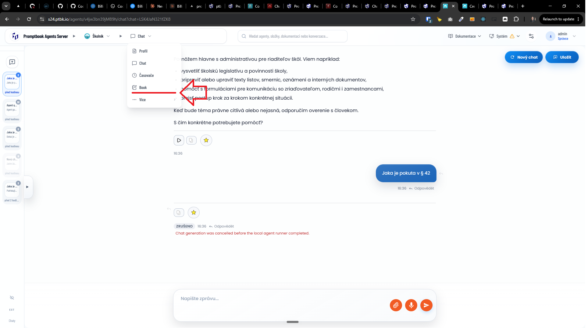
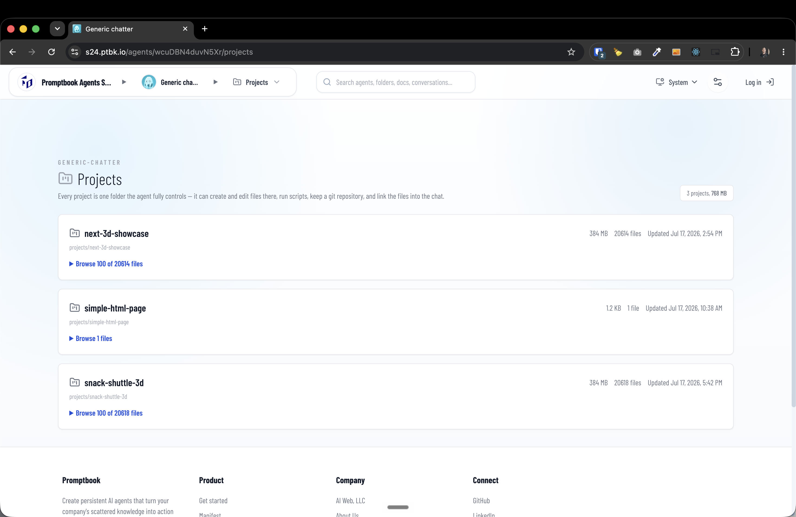
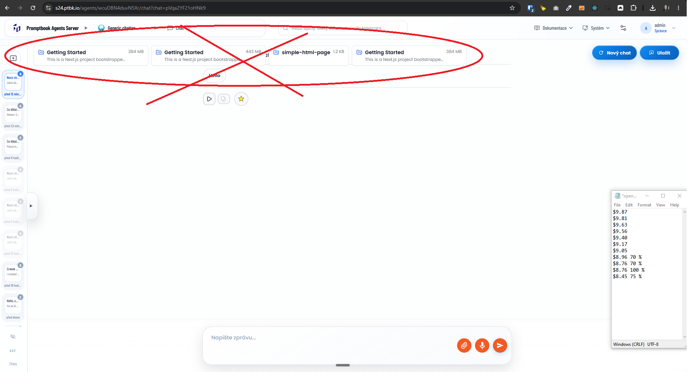

[x] (2 attempts) $3.92 4 hours by Claude Code `fable`

---

[x] $14.51 3 hours by Claude Code `fable`

[✨🏖] Every agent should have its own folder for his projects.

-   Purpose of this change is to give every agent its own isolated environment where they can do their work and have their own persistent data, like files, scripts, and other project-related information.
-   Agent server can have multiple agents, each agent can have multiple projects, and each project has its own directory on the agent server
-   Projects are linked to the Agent, not to the entire Agent server or user. Every Agent can have multiple projects.
-   The project is based on one folder which the agent has access to and has 100% control over. The agent can read and write files in this folder, run batch scripts, and do whatever he wants with the files in this folder.
-   The agent can have multiple projects
-   Allow admin to see all the projects of all the agents and their folders.
-   The instructions how the projects work should have every harness in its prompt
-   Purpose of this is to be able to tell the agent to make some website or do some work, and the agent can create or modify a project for it.
-   Agent can also link the project or any file from any project into the chat.
-   Each project can be a git repository.
-   The agent should be able to reference the project in the chat
-   Add "Projects" dashboard for each agent in the context menu of the agent 
-   There should be a "Projects" dashboard for the particular agent
-   Also create a dashboard for the admin to see all the projects of all the agents and their folders.
-   Reuse the components and code of theese two dashboards and interlink them
-   Also, add to the resource monitor the size of projects of each agent and the total size of all projects of each agent alongside the disk space of the agent server.
-   Keep in mind the DRY _(don't repeat yourself)_ principle.
-   Do a proper analysis of the current functionality before you start implementing.
-   You are working with the [Agents Server](apps/agents-server)
-   Add the changes into the [changelog](changelog/_current-preversion.md)

---

[x] ~$0.5366 an hour by OpenAI Codex `gpt-5.5` (ChatGPT account)

[✨🏖] Showing projects should be available only for logged-in users on the agent server.

-   Anonymous user should see only the name of the project and the readme of the project, not the files or details.
-   When the agent is private, an anonymous user should not see the projects at all.
-   When there is no project or the user cannot see any project because he is anonymous, do not show the "Projects" in the agent context menu at all.
-   Keep in mind the DRY _(don't repeat yourself)_ principle.
-   Do a proper analysis of the current functionality of agent projects before you start implementing.
-   You are working with the [Agents Server](apps/agents-server) with agent projects (`/agents/<agentId>/projects`)
-   Add the changes into the [changelog](changelog/_current-preversion.md)

---

[x] ~$1.15 3 hours by OpenAI Codex `gpt-5.5` (ChatGPT account)

[✨🏖] Display projects in some better way.

-   When showing the projects in the list, they should be shown in a similar way to agents in a folder.
-   In the Projects list, show just the basic profile. You can click on this project and go to the project profile page.
-   Logic of the Agents server is
    -   Agents server Can have multiple agents organized in folders and subfolders
    -   Each agent can have multiple projects organized in flat structure (no subfolders for projects)
-   There is a page with all the projects of the agent (`/agents/<agentId>/projects`), but there should also be a page with every project (`/agents/<agentId>/projects/<projectId>`).
-   In the component which is shown in the agent list, do not show the number of the files of the project, just the size of the project, the name, and an icon and description of the project
-   Name of the project is taken from the folder name, or if README exists, it's the heading of the README.
-   For parsing the Markdown, use the functions which exist here in the repositorty
-   The description of the project is taken from the README file and is the first paragraph of the README file. If there is no README, then the description is empty.
-   If the first paragraph of the README is too long, truncate it to 200 characters and add "..." at the end.
-   On the project profile page, show the full README file and all the files of the project in a list.
-   It should have Github-like style like a repository
-   Allow to browse folders and click deeper and deeper, show only files in a folder you are currently looking at
-   The pages should be interlinked.
    -   Also do interlinking from other admin pages which are referencing the project, for example, the resource monitor.
    -   Interlink pages where it makes sense.
    -   The projects should be also linked from the agent profile page if the agent has a project.
-   When the agent is referencing the project from the chat, use the same component as the project item when listing the projects.
    -   Maybe create some variant of a bigger and larger component:
        1. Full which will look like an agent in a list - when listing the projects in the list of projects of the agent
        2. Small which will look like a knowledge chip - when referencing the project in the chat or referencing the project in the resource monitor, agent profile, or other places where the project is referenced
-   Keep in mind the DRY _(don't repeat yourself)_ principle.
-   Do a proper analysis of the current functionality of agent projects before you start implementing.
-   You are working with the [Agents Server](apps/agents-server) with agent projects (`/agents/<agentId>/projects`)
-   Add the changes into the [changelog](changelog/_current-preversion.md)

---

[x] ~$1.01 an hour by OpenAI Codex `gpt-5.5` (ChatGPT account)

[✨🏖] Agent projects should be runnable.

-   Every agent can start the `dev` of its projects and expose it to the user
-   Or run the static server to serve the project files to the user
-   Agent server should be able to provide a free port when the agents ask for the free port.
-   The agent server can assign ports to the agent to run its own dev server for the project
-   Add these assigned ports to the resource monitor. Also allow killing each port from the resource monitor.
    -   Also link the port in the resource monitor to the project.
    -   Also, on the project page, show if the project is running and on what port, and allow terminating it as well from this page.
-   Keep in mind the DRY _(don't repeat yourself)_ principle.
-   Do a proper analysis of the current functionality of agent projects before you start implementing.
-   You are working with the [Agents Server](apps/agents-server) with agent projects (`/agents/<agentId>/projects`)
-   Add the changes into the [changelog](changelog/_current-preversion.md)

---

[x] ~$0.9917 an hour by OpenAI Codex `gpt-5.5` (ChatGPT account)

[✨🏖] Allow to show project in browser VSCode.

-   The Vscode should be opened in a browser similarly, for example, as the Vscode which can be run from GitHub by pressing "."
-   implement the function so that when you press "." when you are looking at the project, it will automatically open the built-in VS Code same as the GitHub does
-   The VS Code should be able to edit the files and do the git operations on the project files.
-   Also, if the user is super admin, the terminal of the VScode should be the full admin terminal of the server with CWD on the root of the viewed project.
-   The theme light/dark of the VSCode should be the same as the theme of the agent server user is having
-   Keep in mind the DRY _(don't repeat yourself)_ principle.
-   Do a proper analysis of the current functionality of agent projects before you start implementing.
-   You are working with the [Agents Server](apps/agents-server) with agent projects (`/agents/<agentId>/projects`)
-   Add the changes into the [changelog](changelog/_current-preversion.md)

---

[x] ~$1.33 3 hours by OpenAI Codex `gpt-5.5` (ChatGPT account)

[✨🏖] Agent should be able to reference its projects in chat

-   Do not show the projects chips hovering in every chat on top
-   Instead 
-   The agent should be able to reference the project in the chat actively by writing the name of the project in the message markdown like this: `[[project-name]]` and the agent server should automatically convert this into a project chip with the link to the project profile page.
-   Keep in mind the DRY _(don't repeat yourself)_ principle.
-   Do a proper analysis of the current functionality of agent projects before you start implementing.
-   You are working with the [Agents Server](apps/agents-server) with agent projects (`/agents/<agentId>/projects`) and agent chat (`/agents/<agentId>/chat`)
-   Add the changes into the [changelog](changelog/_current-preversion.md)

---

[ ]

[✨🏖] Agent projects should be runnable and externally aviable

-   Every agent can start the `dev` of its projects and expose it to the user
-   Every project that can be run either by the will of the agent or from the project profile page by the user
-   Every project should run as its pm2 process on the agents server
-   For every project shoudld be assigned a domain, for example when the server has domain `agents.example.com` and the agent has project `my-project`, the project should be available on `my-project.agents.example.com`
-   Following logic should be handled by the Agents server and the agent or user just triggers it:
    -   Managing the ports and assigning them to the projects
    -   Managing the pm2 processes and starting/stopping them
    -   Managing the static server if static server is used for the project
    -   Managing the reverse proxy and assigning the domain to the project
    -   Managing the SSL certificates for the project domain
-   In the `/admin/servers` also show the subdomains if the server has any subdomains assigned to the projects
-   Keep in mind the DRY _(don't repeat yourself)_ principle.
-   Do a proper analysis of the current functionality of agent projects before you start implementing.
-   You are working with the [Agents Server](apps/agents-server) with agent projects (`/agents/<agentId>/projects`)
-   Add the changes into the [changelog](changelog/_current-preversion.md)

---

[ ]

[✨🏖]

-   @@@
-   Keep in mind the DRY _(don't repeat yourself)_ principle.
-   Do a proper analysis of the current functionality of agent projects before you start implementing.
-   You are working with the [Agents Server](apps/agents-server) with agent projects (`/agents/<agentId>/projects`)
-   Add the changes into the [changelog](changelog/_current-preversion.md)

---

[ ]

[✨🏖]

-   @@@
-   Keep in mind the DRY _(don't repeat yourself)_ principle.
-   Do a proper analysis of the current functionality of agent projects before you start implementing.
-   You are working with the [Agents Server](apps/agents-server) with agent projects (`/agents/<agentId>/projects`)
-   Add the changes into the [changelog](changelog/_current-preversion.md)

