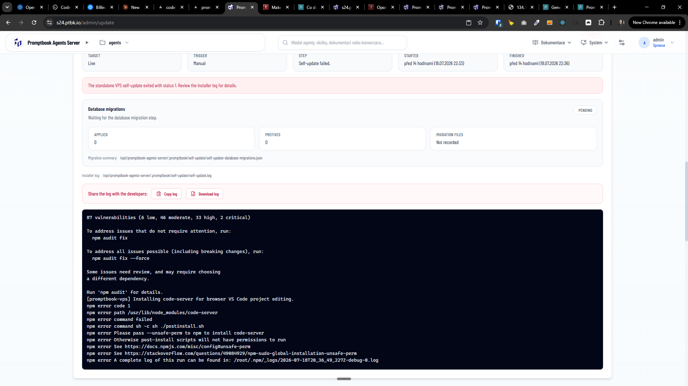

[ ]

[✨🏖] Fix the self-update

-   Keep in mind the DRY _(don't repeat yourself)_ principle.
-   Do a proper analysis of the current functionality of agent projects before you start implementing.
-   You are working with the [Agents Server](apps/agents-server)
-   Add the changes into the [changelog](changelog/_current-preversion.md)
-   When you install any software on the VPS, for example `code-server` keep in mind that software on the server can be installed either via VPS [`install.sh` script](other/vps/install.sh) from scratch on fresh VPS or via the self-update (`/admin/update`).
-   Do not duplicate code and logic in the repository for these two ways, update and `install.sh` script should share similar code and logic for installing the software on the server.
-   When running `install.sh` script on already installed VPS, it should effectively do same as the update from the superadmin panel
-   When some dependencies are added in new version of the software, the update should install these dependencies on the server if they are not installed yet. This should be a pattern for now and for the future. Now you are fixing this for the `code-server` software, but in the future, it should be done for every software which is installed on the server.

```console
[promptbook-vps] Continuing self-update from /opt/promptbook-agents-server/.promptbook/self-update/install.sh so the repository checkout can be refreshed safely.
[promptbook-vps] Publishing Agents Server Next static assets to /opt/promptbook-agents-server/.promptbook/next-static/_next/static.
[promptbook-vps] Installing Promptbook from https://github.com/webgptorg/promptbook.git (main) into /opt/promptbook-agents-server/bin/e0a23a2.
HEAD is now at e0a23a2 Merge branch 'main' of https://github.com/webgptorg/promptbook
[promptbook-vps] Installing Promptbook repository dependencies.
npm warn ERESOLVE overriding peer dependency
npm warn While resolving: react-copy-to-clipboard@5.1.0
npm warn Found: react@19.1.2
...
added 2173 packages, and audited 2174 packages in 2m

315 packages are looking for funding
  run `npm fund` for details

87 vulnerabilities (6 low, 46 moderate, 33 high, 2 critical)

To address issues that do not require attention, run:
  npm audit fix

To address all issues possible (including breaking changes), run:
  npm audit fix --force

Some issues need review, and may require choosing
a different dependency.

Run `npm audit` for details.
[promptbook-vps] Installing code-server for browser VS Code project editing.
npm error code 1
npm error path /usr/lib/node_modules/code-server
npm error command failed
npm error command sh -c sh ./postinstall.sh
npm error Please pass --unsafe-perm to npm to install code-server
npm error Otherwise post-install scripts will not have permissions to run
npm error See https://docs.npmjs.com/misc/config#unsafe-perm
npm error See https://stackoverflow.com/questions/49084929/npm-sudo-global-installation-unsafe-perm
npm error A complete log of this run can be found in: /root/.npm/_logs/2026-07-18T20_36_49_227Z-debug-0.log
```

