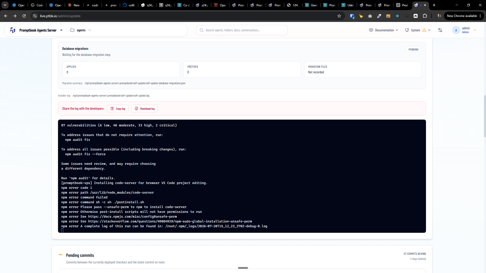

[x] done by `opus-4.8` but probably not working correctly, committed manually
[x] ~$0.7984 an hour by OpenAI Codex `gpt-5.5` (ChatGPT account)

---

[x] $14.17 33 minutes by Claude Code `fable`

[✨🏖] Fix failing self-update

-   Keep in mind the DRY _(don't repeat yourself)_ principle.
-   Do a proper analysis of the current functionality of agent projects before you start implementing.
-   You are working with the [Agents Server](apps/agents-server) with page `/admin/update`
-   Add the changes into the [changelog](changelog/_current-preversion.md)
-   When you install any software on the VPS, for example `code-server` keep in mind that software on the server can be installed either via VPS [`install.sh` script](other/vps/install.sh) from scratch on fresh VPS or via the self-update (`/admin/update`).
-   Do not duplicate code and logic in the repository for these two ways, update and `install.sh` script should share similar code and logic for installing the software on the server.
-   When running `install.sh` script on already installed VPS, it should effectively do same as the update from the superadmin panel
-   When some dependencies are added in new version of the software, the update should install these dependencies on the server if they are not installed yet. This should be a pattern for now and for the future. Now you are fixing this for the `code-server` software, but in the future, it should be done for every software which is installed on the server.

```console
87 vulnerabilities (6 low, 46 moderate, 33 high, 2 critical)

To address issues that do not require attention, run:
  npm audit fix

To address all issues possible (including breaking changes), run:
  npm audit fix --force

Some issues need review, and may require choosing
a different dependency.

Run `npm audit` for details.
[promptbook-vps] Installing code-server for browser VS Code project editing.
npm error code 1
npm error path /usr/lib/node_modules/code-server
npm error command failed
npm error command sh -c sh ./postinstall.sh
npm error Please pass --unsafe-perm to npm to install code-server
npm error Otherwise post-install scripts will not have permissions to run
npm error See https://docs.npmjs.com/misc/config#unsafe-perm
npm error See https://stackoverflow.com/questions/49084929/npm-sudo-global-installation-unsafe-perm
npm error A complete log of this run can be found in: /root/.npm/_logs/2026-07-20T15_12_23_370Z-debug-0.log
```



**This is the `/root/.npm/_logs/2026-07-20T15_12_23_370Z-debug-0.log` log file:**

```log
0 verbose cli /usr/bin/node /usr/bin/npm
1 info using npm@10.9.8
2 info using node@v22.23.1
3 silly config load:file:/usr/lib/node_modules/npm/npmrc
4 silly config load:file:/root/.npmrc
5 silly config load:file:/usr/etc/npmrc
6 verbose title npm install code-server@4.117.0
7 verbose argv "install" "--global" "code-server@4.117.0"
8 verbose logfile logs-max:10 dir:/root/.npm/_logs/2026-07-20T15_12_23_370Z-
9 verbose logfile /root/.npm/_logs/2026-07-20T15_12_23_370Z-debug-0.log
10 silly packumentCache heap:1056964608 maxSize:264241152 maxEntrySize:132120576
11 silly logfile start cleaning logs, removing 1 files
12 silly idealTree buildDeps
13 silly fetch manifest code-server@4.117.0
14 silly packumentCache full:https://registry.npmjs.org/code-server cache-miss
15 silly logfile done cleaning log files
16 http fetch GET 200 https://registry.npmjs.org/code-server 290ms (cache revalidated)
17 silly packumentCache full:https://registry.npmjs.org/code-server set size:2462927 disposed:false
18 silly placeDep ROOT code-server@4.117.0 OK for:  want: 4.117.0
19 silly fetch manifest qs@^6.15.0
20 silly packumentCache full:https://registry.npmjs.org/qs cache-miss
21 http fetch GET 200 https://registry.npmjs.org/qs 36ms (cache revalidated)
22 silly packumentCache full:https://registry.npmjs.org/qs set size:360318 disposed:false
23 silly fetch manifest ws@^8.14.2
24 silly packumentCache full:https://registry.npmjs.org/ws cache-miss
25 http fetch GET 200 https://registry.npmjs.org/ws 41ms (cache revalidated)
26 silly packumentCache full:https://registry.npmjs.org/ws set size:426890 disposed:false
27 silly fetch manifest pem@^1.14.8
28 silly packumentCache full:https://registry.npmjs.org/pem cache-miss
29 http fetch GET 200 https://registry.npmjs.org/pem 34ms (cache revalidated)
30 silly packumentCache full:https://registry.npmjs.org/pem set size:157263 disposed:false
31 silly fetch manifest argon2@^0.44.0
32 silly packumentCache full:https://registry.npmjs.org/argon2 cache-miss
33 http fetch GET 200 https://registry.npmjs.org/argon2 34ms (cache revalidated)
34 silly packumentCache full:https://registry.npmjs.org/argon2 set size:251872 disposed:false
35 silly fetch manifest semver@^7.5.4
36 silly packumentCache full:https://registry.npmjs.org/semver cache-miss
37 http fetch GET 200 https://registry.npmjs.org/semver 30ms (cache revalidated)
38 silly packumentCache full:https://registry.npmjs.org/semver set size:246069 disposed:false
39 silly fetch manifest express@^5.0.1
40 silly packumentCache full:https://registry.npmjs.org/express cache-miss
41 http fetch GET 200 https://registry.npmjs.org/express 32ms (cache revalidated)
42 silly packumentCache full:https://registry.npmjs.org/express set size:804956 disposed:false
43 silly fetch manifest i18next@^25.8.3
44 silly packumentCache full:https://registry.npmjs.org/i18next cache-miss
45 http fetch GET 200 https://registry.npmjs.org/i18next 123ms (cache revalidated)
46 silly packumentCache full:https://registry.npmjs.org/i18next set size:2562052 disposed:false
47 silly fetch manifest js-yaml@^4.1.0
48 silly packumentCache full:https://registry.npmjs.org/js-yaml cache-miss
49 http fetch GET 200 https://registry.npmjs.org/js-yaml 28ms (cache revalidated)
50 silly packumentCache full:https://registry.npmjs.org/js-yaml set size:171743 disposed:false
51 silly fetch manifest limiter@^2.1.0
52 silly packumentCache full:https://registry.npmjs.org/limiter cache-miss
53 http fetch GET 200 https://registry.npmjs.org/limiter 102ms (cache revalidated)
54 silly packumentCache full:https://registry.npmjs.org/limiter set size:39581 disposed:false
55 silly fetch manifest env-paths@^2.2.1
56 silly packumentCache full:https://registry.npmjs.org/env-paths cache-miss
57 http fetch GET 200 https://registry.npmjs.org/env-paths 27ms (cache revalidated)
58 silly packumentCache full:https://registry.npmjs.org/env-paths set size:26913 disposed:false
59 silly fetch manifest http-proxy@^1.18.1
60 silly packumentCache full:https://registry.npmjs.org/http-proxy cache-miss
61 http fetch GET 200 https://registry.npmjs.org/http-proxy 28ms (cache revalidated)
62 silly packumentCache full:https://registry.npmjs.org/http-proxy set size:183156 disposed:false
63 silly fetch manifest compression@^1.7.4
64 silly packumentCache full:https://registry.npmjs.org/compression cache-miss
65 http fetch GET 200 https://registry.npmjs.org/compression 32ms (cache revalidated)
66 silly packumentCache full:https://registry.npmjs.org/compression set size:98424 disposed:false
67 silly fetch manifest httpolyglot@^0.1.2
68 silly packumentCache full:https://registry.npmjs.org/httpolyglot cache-miss
69 http fetch GET 200 https://registry.npmjs.org/httpolyglot 86ms (cache revalidated)
70 silly packumentCache full:https://registry.npmjs.org/httpolyglot set size:9989 disposed:false
71 silly fetch manifest proxy-agent@^6.3.1
72 silly packumentCache full:https://registry.npmjs.org/proxy-agent cache-miss
73 http fetch GET 200 https://registry.npmjs.org/proxy-agent 23ms (cache revalidated)
74 silly packumentCache full:https://registry.npmjs.org/proxy-agent set size:81277 disposed:false
75 silly fetch manifest xdg-basedir@^4.0.0
76 silly packumentCache full:https://registry.npmjs.org/xdg-basedir cache-miss
77 http fetch GET 200 https://registry.npmjs.org/xdg-basedir 24ms (cache revalidated)
78 silly packumentCache full:https://registry.npmjs.org/xdg-basedir set size:19771 disposed:false
79 silly fetch manifest safe-compare@^1.1.4
80 silly packumentCache full:https://registry.npmjs.org/safe-compare cache-miss
81 http fetch GET 200 https://registry.npmjs.org/safe-compare 26ms (cache revalidated)
82 silly packumentCache full:https://registry.npmjs.org/safe-compare set size:22988 disposed:false
83 silly fetch manifest @coder/logger@^3.0.1
84 silly packumentCache full:https://registry.npmjs.org/@coder%2flogger cache-miss
85 http fetch GET 200 https://registry.npmjs.org/@coder%2flogger 188ms (cache revalidated)
86 silly packumentCache full:https://registry.npmjs.org/@coder%2flogger set size:54884 disposed:false
87 silly fetch manifest cookie-parser@^1.4.6
88 silly packumentCache full:https://registry.npmjs.org/cookie-parser cache-miss
89 http fetch GET 200 https://registry.npmjs.org/cookie-parser 24ms (cache revalidated)
90 silly packumentCache full:https://registry.npmjs.org/cookie-parser set size:44731 disposed:false
91 silly fetch manifest rotating-file-stream@^3.1.1
92 silly packumentCache full:https://registry.npmjs.org/rotating-file-stream cache-miss
93 http fetch GET 200 https://registry.npmjs.org/rotating-file-stream 90ms (cache revalidated)
94 silly packumentCache full:https://registry.npmjs.org/rotating-file-stream set size:225041 disposed:false
95 silly reify moves {}
96 http cache code-server@https://registry.npmjs.org/code-server/-/code-server-4.117.0.tgz 1ms (cache hit)
97 http cache xdg-basedir@https://registry.npmjs.org/xdg-basedir/-/xdg-basedir-4.0.0.tgz 0ms (cache hit)
98 http cache ws@https://registry.npmjs.org/ws/-/ws-8.19.0.tgz 0ms (cache hit)
99 http cache wrappy@https://registry.npmjs.org/wrappy/-/wrappy-1.0.2.tgz 0ms (cache hit)
100 http cache which@https://registry.npmjs.org/which/-/which-2.0.2.tgz 0ms (cache hit)
101 http cache vary@https://registry.npmjs.org/vary/-/vary-1.1.2.tgz 0ms (cache hit)
102 http cache unpipe@https://registry.npmjs.org/unpipe/-/unpipe-1.0.0.tgz 0ms (cache hit)
103 http cache typescript@https://registry.npmjs.org/typescript/-/typescript-5.9.3.tgz 0ms (cache hit)
104 http cache type-is@https://registry.npmjs.org/type-is/-/type-is-2.0.1.tgz 0ms (cache hit)
105 http cache tslib@https://registry.npmjs.org/tslib/-/tslib-2.8.1.tgz 0ms (cache hit)
106 http cache toidentifier@https://registry.npmjs.org/toidentifier/-/toidentifier-1.0.1.tgz 0ms (cache hit)
107 http cache statuses@https://registry.npmjs.org/statuses/-/statuses-2.0.2.tgz 0ms (cache hit)
108 http cache source-map@https://registry.npmjs.org/source-map/-/source-map-0.6.1.tgz 0ms (cache hit)
109 http cache socks-proxy-agent@https://registry.npmjs.org/socks-proxy-agent/-/socks-proxy-agent-8.0.5.tgz 0ms (cache hit)
110 http cache socks@https://registry.npmjs.org/socks/-/socks-2.8.7.tgz 0ms (cache hit)
111 http cache smart-buffer@https://registry.npmjs.org/smart-buffer/-/smart-buffer-4.2.0.tgz 0ms (cache hit)
112 http cache side-channel-weakmap@https://registry.npmjs.org/side-channel-weakmap/-/side-channel-weakmap-1.0.2.tgz 0ms (cache hit)
113 http cache side-channel-map@https://registry.npmjs.org/side-channel-map/-/side-channel-map-1.0.1.tgz 0ms (cache hit)
114 http cache side-channel-list@https://registry.npmjs.org/side-channel-list/-/side-channel-list-1.0.0.tgz 0ms (cache hit)
115 http cache side-channel@https://registry.npmjs.org/side-channel/-/side-channel-1.1.0.tgz 0ms (cache hit)
116 http cache shebang-command@https://registry.npmjs.org/shebang-command/-/shebang-command-2.0.0.tgz 0ms (cache hit)
117 http cache shebang-regex@https://registry.npmjs.org/shebang-regex/-/shebang-regex-3.0.0.tgz 0ms (cache hit)
118 http cache setprototypeof@https://registry.npmjs.org/setprototypeof/-/setprototypeof-1.2.0.tgz 0ms (cache hit)
119 http cache serve-static@https://registry.npmjs.org/serve-static/-/serve-static-2.2.1.tgz 0ms (cache hit)
120 http cache send@https://registry.npmjs.org/send/-/send-1.2.1.tgz 0ms (cache hit)
121 http cache semver@https://registry.npmjs.org/semver/-/semver-7.7.4.tgz 0ms (cache hit)
122 http cache safer-buffer@https://registry.npmjs.org/safer-buffer/-/safer-buffer-2.1.2.tgz 0ms (cache hit)
123 http cache safe-compare@https://registry.npmjs.org/safe-compare/-/safe-compare-1.1.4.tgz 0ms (cache hit)
124 http cache safe-buffer@https://registry.npmjs.org/safe-buffer/-/safe-buffer-5.2.1.tgz 0ms (cache hit)
125 http cache router@https://registry.npmjs.org/router/-/router-2.2.0.tgz 0ms (cache hit)
126 http cache rotating-file-stream@https://registry.npmjs.org/rotating-file-stream/-/rotating-file-stream-3.2.9.tgz 0ms (cache hit)
127 http cache requires-port@https://registry.npmjs.org/requires-port/-/requires-port-1.0.0.tgz 0ms (cache hit)
128 http cache raw-body@https://registry.npmjs.org/raw-body/-/raw-body-3.0.2.tgz 0ms (cache hit)
129 http cache range-parser@https://registry.npmjs.org/range-parser/-/range-parser-1.2.1.tgz 0ms (cache hit)
130 http cache qs@https://registry.npmjs.org/qs/-/qs-6.15.0.tgz 0ms (cache hit)
131 http cache proxy-from-env@https://registry.npmjs.org/proxy-from-env/-/proxy-from-env-1.1.0.tgz 0ms (cache hit)
132 http cache proxy-agent@https://registry.npmjs.org/proxy-agent/-/proxy-agent-6.5.0.tgz 0ms (cache hit)
133 http cache proxy-addr@https://registry.npmjs.org/proxy-addr/-/proxy-addr-2.0.7.tgz 0ms (cache hit)
134 http cache pem@https://registry.npmjs.org/pem/-/pem-1.14.8.tgz 1ms (cache hit)
135 http cache path-to-regexp@https://registry.npmjs.org/path-to-regexp/-/path-to-regexp-8.4.2.tgz 0ms (cache hit)
136 http cache path-key@https://registry.npmjs.org/path-key/-/path-key-3.1.1.tgz 0ms (cache hit)
137 http cache parseurl@https://registry.npmjs.org/parseurl/-/parseurl-1.3.3.tgz 0ms (cache hit)
138 http cache pac-resolver@https://registry.npmjs.org/pac-resolver/-/pac-resolver-7.0.1.tgz 0ms (cache hit)
139 http cache pac-proxy-agent@https://registry.npmjs.org/pac-proxy-agent/-/pac-proxy-agent-7.2.0.tgz 0ms (cache hit)
140 http cache os-tmpdir@https://registry.npmjs.org/os-tmpdir/-/os-tmpdir-1.0.2.tgz 1ms (cache hit)
141 http cache once@https://registry.npmjs.org/once/-/once-1.4.0.tgz 0ms (cache hit)
142 http cache on-headers@https://registry.npmjs.org/on-headers/-/on-headers-1.1.0.tgz 0ms (cache hit)
143 http cache on-finished@https://registry.npmjs.org/on-finished/-/on-finished-2.4.1.tgz 0ms (cache hit)
144 http cache object-inspect@https://registry.npmjs.org/object-inspect/-/object-inspect-1.13.4.tgz 0ms (cache hit)
145 http cache node-gyp-build@https://registry.npmjs.org/node-gyp-build/-/node-gyp-build-4.8.4.tgz 0ms (cache hit)
146 http cache node-addon-api@https://registry.npmjs.org/node-addon-api/-/node-addon-api-8.6.0.tgz 0ms (cache hit)
147 http cache netmask@https://registry.npmjs.org/netmask/-/netmask-2.0.2.tgz 0ms (cache hit)
148 http cache negotiator@https://registry.npmjs.org/negotiator/-/negotiator-0.6.4.tgz 0ms (cache hit)
149 http cache ms@https://registry.npmjs.org/ms/-/ms-2.1.3.tgz 0ms (cache hit)
150 http cache mime-types@https://registry.npmjs.org/mime-types/-/mime-types-3.0.2.tgz 0ms (cache hit)
151 http cache mime-db@https://registry.npmjs.org/mime-db/-/mime-db-1.54.0.tgz 0ms (cache hit)
152 http cache merge-descriptors@https://registry.npmjs.org/merge-descriptors/-/merge-descriptors-2.0.0.tgz 0ms (cache hit)
153 http cache media-typer@https://registry.npmjs.org/media-typer/-/media-typer-1.1.0.tgz 0ms (cache hit)
154 http cache md5@https://registry.npmjs.org/md5/-/md5-2.3.0.tgz 0ms (cache hit)
155 http cache math-intrinsics@https://registry.npmjs.org/math-intrinsics/-/math-intrinsics-1.1.0.tgz 0ms (cache hit)
156 http cache lru-cache@https://registry.npmjs.org/lru-cache/-/lru-cache-7.18.3.tgz 0ms (cache hit)
157 http cache limiter@https://registry.npmjs.org/limiter/-/limiter-2.1.0.tgz 0ms (cache hit)
158 http cache just-performance@https://registry.npmjs.org/just-performance/-/just-performance-4.3.0.tgz 0ms (cache hit)
159 http cache js-yaml@https://registry.npmjs.org/js-yaml/-/js-yaml-4.1.1.tgz 0ms (cache hit)
160 http cache isexe@https://registry.npmjs.org/isexe/-/isexe-2.0.0.tgz 0ms (cache hit)
161 http cache is-promise@https://registry.npmjs.org/is-promise/-/is-promise-4.0.0.tgz 0ms (cache hit)
162 http cache is-buffer@https://registry.npmjs.org/is-buffer/-/is-buffer-1.1.6.tgz 0ms (cache hit)
163 http cache ipaddr.js@https://registry.npmjs.org/ipaddr.js/-/ipaddr.js-1.9.1.tgz 0ms (cache hit)
164 http cache ip-address@https://registry.npmjs.org/ip-address/-/ip-address-10.1.0.tgz 0ms (cache hit)
165 http cache inherits@https://registry.npmjs.org/inherits/-/inherits-2.0.4.tgz 0ms (cache hit)
166 http cache iconv-lite@https://registry.npmjs.org/iconv-lite/-/iconv-lite-0.7.2.tgz 0ms (cache hit)
167 http cache i18next@https://registry.npmjs.org/i18next/-/i18next-25.8.13.tgz 0ms (cache hit)
168 http cache https-proxy-agent@https://registry.npmjs.org/https-proxy-agent/-/https-proxy-agent-7.0.6.tgz 0ms (cache hit)
169 http cache httpolyglot@https://registry.npmjs.org/httpolyglot/-/httpolyglot-0.1.2.tgz 0ms (cache hit)
170 http cache http-proxy-agent@https://registry.npmjs.org/http-proxy-agent/-/http-proxy-agent-7.0.2.tgz 0ms (cache hit)
171 http cache http-proxy@https://registry.npmjs.org/http-proxy/-/http-proxy-1.18.1.tgz 0ms (cache hit)
172 http cache http-errors@https://registry.npmjs.org/http-errors/-/http-errors-2.0.1.tgz 0ms (cache hit)
173 http cache hasown@https://registry.npmjs.org/hasown/-/hasown-2.0.2.tgz 0ms (cache hit)
174 http cache has-symbols@https://registry.npmjs.org/has-symbols/-/has-symbols-1.1.0.tgz 0ms (cache hit)
175 http cache gopd@https://registry.npmjs.org/gopd/-/gopd-1.2.0.tgz 0ms (cache hit)
176 http cache get-uri@https://registry.npmjs.org/get-uri/-/get-uri-6.0.5.tgz 0ms (cache hit)
177 http cache get-proto@https://registry.npmjs.org/get-proto/-/get-proto-1.0.1.tgz 0ms (cache hit)
178 http cache get-intrinsic@https://registry.npmjs.org/get-intrinsic/-/get-intrinsic-1.3.0.tgz 0ms (cache hit)
179 http cache function-bind@https://registry.npmjs.org/function-bind/-/function-bind-1.1.2.tgz 0ms (cache hit)
180 http cache fresh@https://registry.npmjs.org/fresh/-/fresh-2.0.0.tgz 0ms (cache hit)
181 http cache forwarded@https://registry.npmjs.org/forwarded/-/forwarded-0.2.0.tgz 0ms (cache hit)
182 http cache follow-redirects@https://registry.npmjs.org/follow-redirects/-/follow-redirects-1.16.0.tgz 0ms (cache hit)
183 http cache finalhandler@https://registry.npmjs.org/finalhandler/-/finalhandler-2.1.1.tgz 0ms (cache hit)
184 http cache express@https://registry.npmjs.org/express/-/express-5.2.1.tgz 0ms (cache hit)
185 http cache cookie-signature@https://registry.npmjs.org/cookie-signature/-/cookie-signature-1.2.2.tgz 0ms (cache hit)
186 http cache eventemitter3@https://registry.npmjs.org/eventemitter3/-/eventemitter3-4.0.7.tgz 0ms (cache hit)
187 http cache etag@https://registry.npmjs.org/etag/-/etag-1.8.1.tgz 0ms (cache hit)
188 http cache esutils@https://registry.npmjs.org/esutils/-/esutils-2.0.3.tgz 0ms (cache hit)
189 http cache estraverse@https://registry.npmjs.org/estraverse/-/estraverse-5.3.0.tgz 0ms (cache hit)
190 http cache esprima@https://registry.npmjs.org/esprima/-/esprima-4.0.1.tgz 0ms (cache hit)
191 http cache escodegen@https://registry.npmjs.org/escodegen/-/escodegen-2.1.0.tgz 0ms (cache hit)
192 http cache escape-html@https://registry.npmjs.org/escape-html/-/escape-html-1.0.3.tgz 0ms (cache hit)
193 http cache es6-promisify@https://registry.npmjs.org/es6-promisify/-/es6-promisify-7.0.0.tgz 1ms (cache hit)
194 http cache es-object-atoms@https://registry.npmjs.org/es-object-atoms/-/es-object-atoms-1.1.1.tgz 0ms (cache hit)
195 http cache es-errors@https://registry.npmjs.org/es-errors/-/es-errors-1.3.0.tgz 0ms (cache hit)
196 http cache es-define-property@https://registry.npmjs.org/es-define-property/-/es-define-property-1.0.1.tgz 0ms (cache hit)
197 http cache env-paths@https://registry.npmjs.org/env-paths/-/env-paths-2.2.1.tgz 0ms (cache hit)
198 http cache encodeurl@https://registry.npmjs.org/encodeurl/-/encodeurl-2.0.0.tgz 0ms (cache hit)
199 http cache ee-first@https://registry.npmjs.org/ee-first/-/ee-first-1.1.1.tgz 0ms (cache hit)
200 http cache dunder-proto@https://registry.npmjs.org/dunder-proto/-/dunder-proto-1.0.1.tgz 0ms (cache hit)
201 http cache depd@https://registry.npmjs.org/depd/-/depd-2.0.0.tgz 0ms (cache hit)
202 http cache degenerator@https://registry.npmjs.org/degenerator/-/degenerator-5.0.1.tgz 0ms (cache hit)
203 http cache debug@https://registry.npmjs.org/debug/-/debug-4.4.3.tgz 0ms (cache hit)
204 http cache data-uri-to-buffer@https://registry.npmjs.org/data-uri-to-buffer/-/data-uri-to-buffer-6.0.2.tgz 0ms (cache hit)
205 http cache crypt@https://registry.npmjs.org/crypt/-/crypt-0.0.2.tgz 0ms (cache hit)
206 http cache cross-spawn@https://registry.npmjs.org/cross-spawn/-/cross-spawn-7.0.6.tgz 0ms (cache hit)
207 http cache cross-env@https://registry.npmjs.org/cross-env/-/cross-env-10.1.0.tgz 0ms (cache hit)
208 http cache cookie-signature@https://registry.npmjs.org/cookie-signature/-/cookie-signature-1.0.6.tgz 0ms (cache hit)
209 http cache cookie-parser@https://registry.npmjs.org/cookie-parser/-/cookie-parser-1.4.7.tgz 0ms (cache hit)
210 http cache cookie@https://registry.npmjs.org/cookie/-/cookie-0.7.2.tgz 0ms (cache hit)
211 http cache content-type@https://registry.npmjs.org/content-type/-/content-type-1.0.5.tgz 0ms (cache hit)
212 http cache content-disposition@https://registry.npmjs.org/content-disposition/-/content-disposition-1.0.1.tgz 0ms (cache hit)
213 http cache compression@https://registry.npmjs.org/compression/-/compression-1.8.1.tgz 0ms (cache hit)
214 http cache ms@https://registry.npmjs.org/ms/-/ms-2.0.0.tgz 0ms (cache hit)
215 http cache debug@https://registry.npmjs.org/debug/-/debug-2.6.9.tgz 0ms (cache hit)
216 http cache compressible@https://registry.npmjs.org/compressible/-/compressible-2.0.18.tgz 0ms (cache hit)
217 http cache charenc@https://registry.npmjs.org/charenc/-/charenc-0.0.2.tgz 0ms (cache hit)
218 http cache call-bound@https://registry.npmjs.org/call-bound/-/call-bound-1.0.4.tgz 0ms (cache hit)
219 http cache call-bind-apply-helpers@https://registry.npmjs.org/call-bind-apply-helpers/-/call-bind-apply-helpers-1.0.2.tgz 0ms (cache hit)
220 http cache bytes@https://registry.npmjs.org/bytes/-/bytes-3.1.2.tgz 0ms (cache hit)
221 http cache buffer-fill@https://registry.npmjs.org/buffer-fill/-/buffer-fill-1.0.0.tgz 0ms (cache hit)
222 http cache buffer-alloc-unsafe@https://registry.npmjs.org/buffer-alloc-unsafe/-/buffer-alloc-unsafe-1.1.0.tgz 0ms (cache hit)
223 http cache buffer-alloc@https://registry.npmjs.org/buffer-alloc/-/buffer-alloc-1.2.0.tgz 0ms (cache hit)
224 http cache body-parser@https://registry.npmjs.org/body-parser/-/body-parser-2.2.2.tgz 0ms (cache hit)
225 http cache basic-ftp@https://registry.npmjs.org/basic-ftp/-/basic-ftp-5.3.0.tgz 0ms (cache hit)
226 http cache ast-types@https://registry.npmjs.org/ast-types/-/ast-types-0.13.4.tgz 0ms (cache hit)
227 http cache argparse@https://registry.npmjs.org/argparse/-/argparse-2.0.1.tgz 0ms (cache hit)
228 http cache argon2@https://registry.npmjs.org/argon2/-/argon2-0.44.0.tgz 0ms (cache hit)
229 http cache agent-base@https://registry.npmjs.org/agent-base/-/agent-base-7.1.4.tgz 0ms (cache hit)
230 http cache accepts@https://registry.npmjs.org/accepts/-/accepts-2.0.0.tgz 0ms (cache hit)
231 http cache negotiator@https://registry.npmjs.org/negotiator/-/negotiator-1.0.0.tgz 0ms (cache hit)
232 http cache @tootallnate/quickjs-emscripten@https://registry.npmjs.org/@tootallnate/quickjs-emscripten/-/quickjs-emscripten-0.23.0.tgz 0ms (cache hit)
233 http cache @phc/format@https://registry.npmjs.org/@phc/format/-/format-1.0.0.tgz 1ms (cache hit)
234 http cache @epic-web/invariant@https://registry.npmjs.org/@epic-web/invariant/-/invariant-1.0.0.tgz 0ms (cache hit)
235 http cache @coder/logger@https://registry.npmjs.org/@coder/logger/-/logger-3.0.1.tgz 0ms (cache hit)
236 http cache @babel/runtime@https://registry.npmjs.org/@babel/runtime/-/runtime-7.28.6.tgz 1ms (cache hit)
237 info run argon2@0.44.0 install node_modules/code-server/node_modules/argon2 cross-env ZERO_AR_DATE=1 node-gyp-build
238 info run argon2@0.44.0 install { code: 0, signal: null }
239 info run code-server@4.117.0 postinstall node_modules/code-server sh ./postinstall.sh
240 info run code-server@4.117.0 postinstall { code: 1, signal: null }
241 verbose stack Error: command failed
241 verbose stack     at promiseSpawn (/usr/lib/node_modules/npm/node_modules/@npmcli/promise-spawn/lib/index.js:22:22)
241 verbose stack     at spawnWithShell (/usr/lib/node_modules/npm/node_modules/@npmcli/promise-spawn/lib/index.js:124:10)
241 verbose stack     at promiseSpawn (/usr/lib/node_modules/npm/node_modules/@npmcli/promise-spawn/lib/index.js:12:12)
241 verbose stack     at runScriptPkg (/usr/lib/node_modules/npm/node_modules/@npmcli/run-script/lib/run-script-pkg.js:79:13)
241 verbose stack     at runScript (/usr/lib/node_modules/npm/node_modules/@npmcli/run-script/lib/run-script.js:9:12)
241 verbose stack     at /usr/lib/node_modules/npm/node_modules/@npmcli/arborist/lib/arborist/rebuild.js:330:17
241 verbose stack     at run (/usr/lib/node_modules/npm/node_modules/promise-call-limit/dist/commonjs/index.js:67:22)
241 verbose stack     at /usr/lib/node_modules/npm/node_modules/promise-call-limit/dist/commonjs/index.js:84:9
241 verbose stack     at new Promise (<anonymous>)
241 verbose stack     at callLimit (/usr/lib/node_modules/npm/node_modules/promise-call-limit/dist/commonjs/index.js:35:69)
242 verbose pkgid code-server@4.117.0
243 error code 1
244 error path /usr/lib/node_modules/code-server
245 error command failed
246 error command sh -c sh ./postinstall.sh
247 error Please pass --unsafe-perm to npm to install code-server
247 error Otherwise post-install scripts will not have permissions to run
247 error See https://docs.npmjs.com/misc/config#unsafe-perm
247 error See https://stackoverflow.com/questions/49084929/npm-sudo-global-installation-unsafe-perm
248 silly unfinished npm timer reify 1784560345385
249 silly unfinished npm timer reify:build 1784560352945
250 silly unfinished npm timer build 1784560352946
251 silly unfinished npm timer build:deps 1784560352946
252 silly unfinished npm timer build:run:postinstall 1784560353311
253 silly unfinished npm timer build:run:postinstall:node_modules/code-server 1784560353311
254 verbose cwd /opt/promptbook-agents-server/bin/7d65763/apps/agents-server
255 verbose os Linux 6.8.0-134-generic
256 verbose node v22.23.1
257 verbose npm  v10.9.8
258 verbose exit 1
259 verbose code 1
260 error A complete log of this run can be found in: /root/.npm/_logs/2026-07-20T15_12_23_370Z-debug-0.log
```

