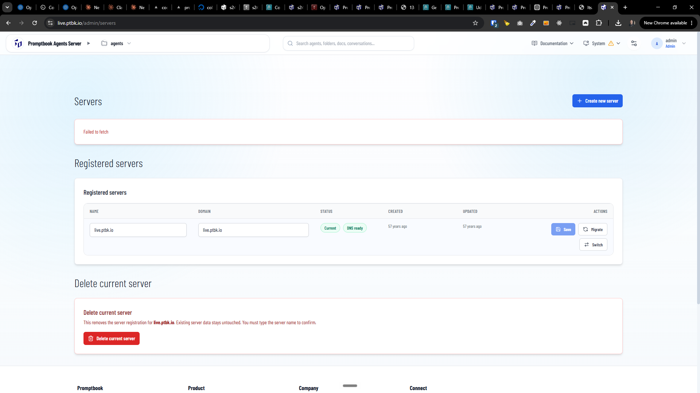

[x] $18.70 36 minutes by Claude Code `fable`

[✨🏖] Fix the projects and server domains

-   When the project is running on domain it breaks the primary domain of the server, for example when the server has domain `agents.example.com` and the agent has project `my-project`, the project should be available on `my-project.agents.example.com` BUT it breaks certificates for all domains including the main one and the server stays inaccessible from the web and broken
-   It also fails - breaks the certificates when yoy add new server on `/admin/servers`
    
-   **It is extremely important to keep the server working and accessible from the web regardless of some new domain failing to get the certificate or some project failing to run, the server should be accessible from the web and the main domain should be working**
-   This is the context `https://chatgpt.com/share/6a5e1aa0-65d8-83eb-ae96-47516a0d23e6` of the problem
-   You can look at the broken server https://s24.ptbk.io/ or ssh into the VPS `s24.ptbk.io` and check how it is broken
-   Every agent can start the `dev` of its projects and expose it to the user
-   Every project that can be run either by the will of the agent or from the project profile page by the user
-   Every project can run as its pm2 process on the agents server
-   For every project, a domain is assigned, for example when the server has domain `agents.example.com` and the agent has project `my-project`, the project should be available on `my-project.agents.example.com`
-   Following logic is handled by the Agents server and the agent or user just triggers it:
    -   Managing the ports and assigning them to the projects
    -   Managing the pm2 processes and starting/stopping them
    -   Managing the static server if static server is used for the project
    -   Managing the reverse proxy and assigning the domain to the project
    -   Managing the SSL certificates for the project domain
-   In the `/admin/servers` also show the subdomains if the server has any subdomains assigned to the projects
-   When running `install.sh` script it configures the server domain for the first time, then the agents server can manage the subdomains for the projects automatically, without any manual configuration of the reverse proxy or SSL certificates
    -   Either through self-update, through the `install.sh` script or projects
-   Keep in mind the DRY _(don't repeat yourself)_ principle.
-   Do a proper analysis of the current functionality of agent projects before you start fixing or implementing
-   You are working with the [Agents Server](apps/agents-server) with agent projects (`/agents/<agentId>/projects`)
-   Add the changes into the [changelog](changelog/_current-preversion.md)

