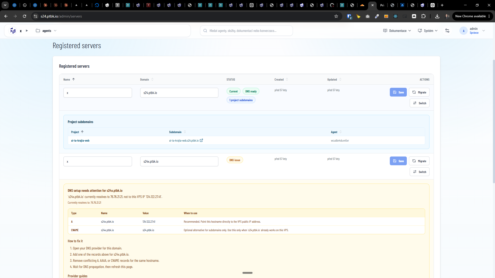

[x] (2 attempts) by OpenAI Codex `gpt-5.5` (ChatGPT account) - Implementation ~$0.6995 an hour; Testing 16 minutes; Fixing ~$0.4939 34 minutes; Testing 25 minutes

[✨🏖] Allow to assign custom domain of any order to the project

-   Keep in mind the DRY _(don't repeat yourself)_ principle.
-   Do a proper analysis of the current functionality of agent projects before you start implementing.
-   You are working with the [Agents Server](apps/agents-server) with pages `/admin/projects` and `/admin/servers`
-   Add the changes into the [changelog](changelog/_current-preversion.md)

