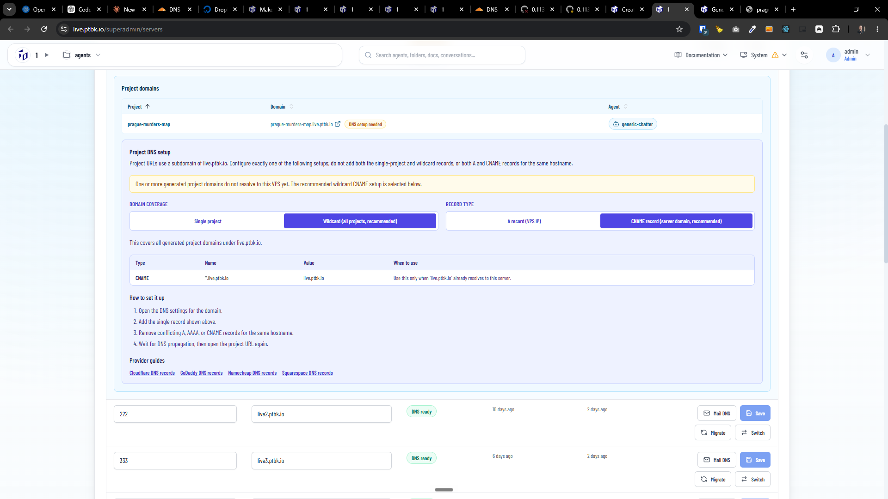

[x] by OpenAI Codex `gpt-5.6-terra` (ChatGPT account) - Implementation ~$1.48 an hour; Testing 29 minutes

[✨🏖] Project is run either as `dev` or static not both

-   Allow also to stop/run projects from projects list
-   Now you have two distinct options: - You can run the server as a static server. - You can run a dev script.
-   But this doesn't make sense! The project either has a `package.json` file with a defined `dev` script, and in this situation, when running the project, just run this dev script, or if the project doesn't have `package.json` or the `package.json` doesn't have the `dev` script, the implicit assumption is that the project is a static project and in this situation, just run the static server.
-   Keep in mind the DRY _(don't repeat yourself)_ principle.
-   Do a proper analysis of the current functionality of agent projects before you start implementing.
-   You are working with the [Agents Server](apps/agents-server) with project page

**Current situation:**

---

[x] by OpenAI Codex `gpt-5.6-terra` (ChatGPT account) - Implementation ~$1.33 an hour; Testing 29 minutes

---

[^]

[✨🏖] Fix projects listing and DNS instructions in `/superadmin/servers`

-   When showing instructions how to configure the DNS records, you are missing that the agent server can have projects.
-   Now you show the instructions only when the project exists, but show it also preventively and for each server suggest the wildcard for all possible future projects
-   Keep in mind the DRY _(don't repeat yourself)_ principle.
-   Do a proper analysis of the current functionality of agent projects before you start implementing.
-   You are working with the [Agents Server](apps/agents-server) with project page and `/superadmin/servers`

**Current situation:**

For example for project `book-cheatsheet-a4.lts1.ptbk.io` this record isnt enough:

`lts1.ptbk.io A 167.172.180.231`

There should be also record for `book-cheatsheet-a4.lts1.ptbk.io` like:

`book-cheatsheet-a4.lts1.ptbk.io CNAME lts1.ptbk.io`

Or wildcard record for all subdomains of `lts1.ptbk.io` like _(this should be the preferred solution)_:

`*.lts1.ptbk.io CNAME lts1.ptbk.io`

