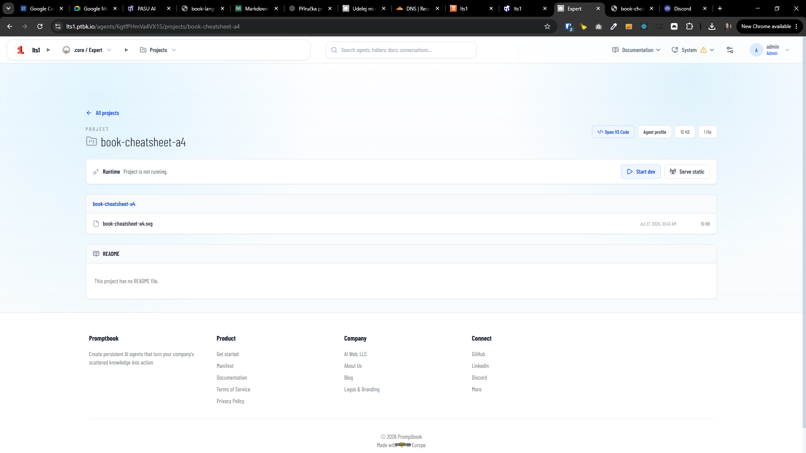
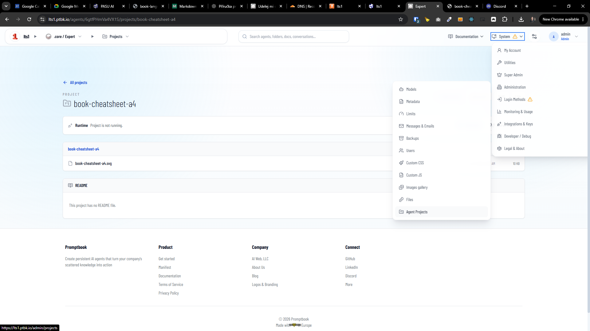

[ ]

[✨🏖] Project is run either as `dev` or static not both

-   @@@@@@@@@@@@@@@@@@@@@@@@@@@@@@@@@@@
-   Allow also to stop/run projects from projects list
-   Keep in mind the DRY _(don't repeat yourself)_ principle.
-   Do a proper analysis of the current functionality of agent projects before you start implementing.
-   You are working with the [Agents Server](apps/agents-server) with project page

**Current situation:**

---

[ ]

[✨🏖] Fix projects listing and DNS instructions in `/admin/servers`

-   @@@@@@@@@@@@@@@@@@@@@@@@@@@@@@@@@@@
-   The agent should be shown as some nice UI chip or agent name with link not just raw agent ID
-   Keep in mind the DRY _(don't repeat yourself)_ principle.
-   Do a proper analysis of the current functionality of agent projects before you start implementing.
-   You are working with the [Agents Server](apps/agents-server) with project page

**Current situation:**

For example for project `	book-cheatsheet-a4.lts1.ptbk.io` this record isnt enough:

`lts1.ptbk.io A 167.172.180.231`

There should be also record for `book-cheatsheet-a4.lts1.ptbk.io` like:

`book-cheatsheet-a4.lts1.ptbk.io CNAME lts1.ptbk.io`

Or wildcard record for all subdomains of `lts1.ptbk.io` like _(this should be the preferred solution)_:

`*.lts1.ptbk.io CNAME lts1.ptbk.io`

