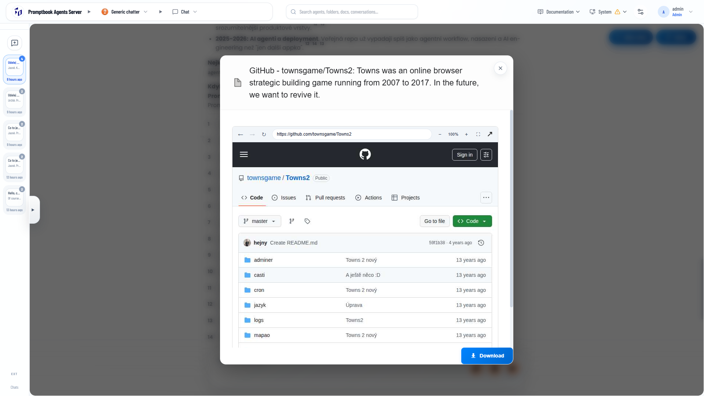
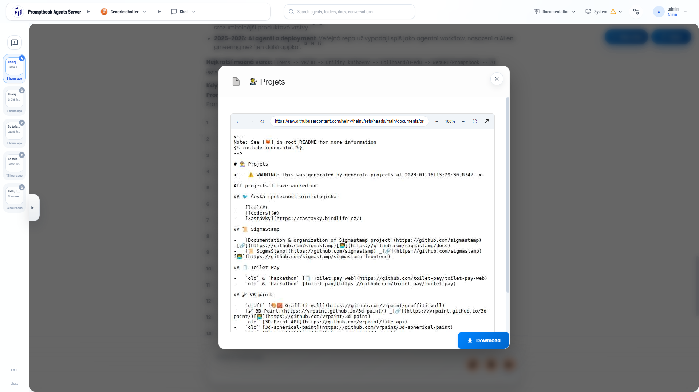
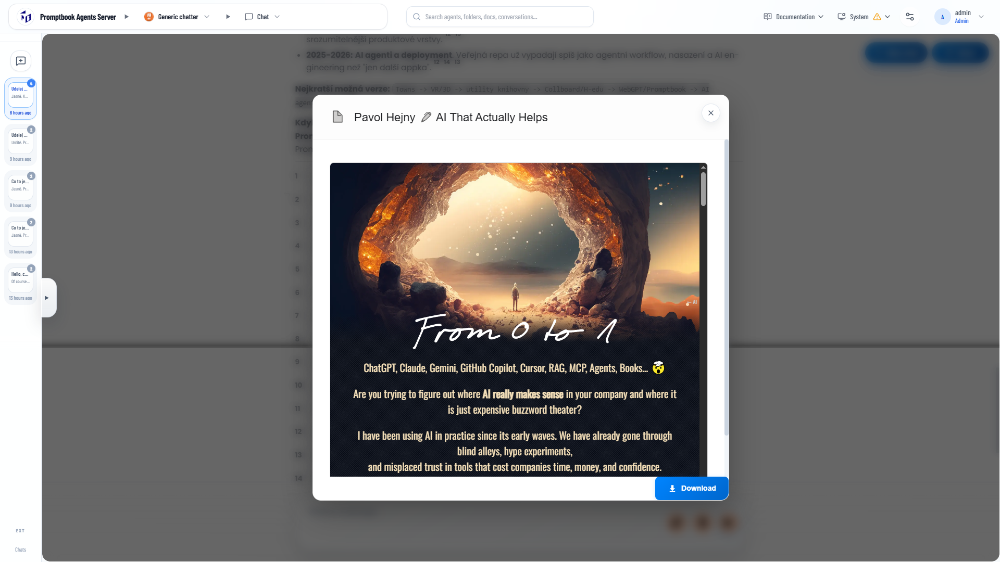

[x] (2 attempts) $1.34 6 hours by Claude Code `fable`

[✨🐶] Enhance the live browser session

-   When the user clicks on the knowledge chip, they are seeing the live browser session transmitted from the agent server.
-   User can't control this browser, the clicks are transmitted from the web to the running headless browser on the server. The user can see the live session
-   But the control is very basic and bit clunky.
-   Get inspiration from the Chrome remote desktop, Anydesk, Teamviewer, and other remote desktop software. The user should be able to control the browser session in a more natural way.
-   It should be able to do all the actions like:
    -   Hovering
    -   Navigating
    -   Clicking
    -   Double-clicking
    -   Selecting text
    -   Typing
    -   Watching video
    -   Scrolling
    -   Zooming
    -   Dragging
    -   All the actions which are possible in a normal browser session, Or at least what is reasonably achievable
-   The window should be sized dynamically.
-   But keep in mind that the purpose of the Promptbook agent server isn't the replacement of the Chrome remote desktop or AnyDesk. This is a secondary feature which should work well, have a great UI and UX, but it shouldn't bring extremely heavy things into the entire code base and app.
-   If there are some third-party libraries which can help you to achieve these functionalities, use them.
-   Also allow to put the browser session into a full screen mode, so the user can see the whole browser window and not only the small preview window.
-   Keep in mind the DRY _(don't repeat yourself)_ principle.
-   Do a proper analysis of the current functionality before you start implementing.
-   You are working with the [Agents Server](apps/agents-server)
-   Add the changes into the [changelog](changelog/_current-preversion.md)

---

[x] ~$0.4348 an hour by OpenAI Codex `gpt-5.5`

[✨🐶] Enhance the live browser session

-   When the user clicks on the knowledge chip, they are seeing the live browser in popup
-   But the UI of this popup is bit ugly because its wrap in wrap
-   The full size of the popup should be the browser session
-   Dont forget to add the close button to the popup, so the user can close it when they want
-   Also keep in mind to allow putting the browser session into a full screen mode
-   Keep in mind the DRY _(don't repeat yourself)_ principle.
-   Do a proper analysis of the current functionality before you start implementing.
-   You are working with the [Agents Server](apps/agents-server)

