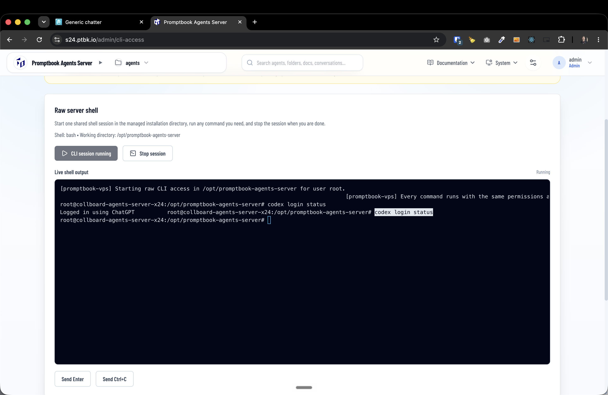
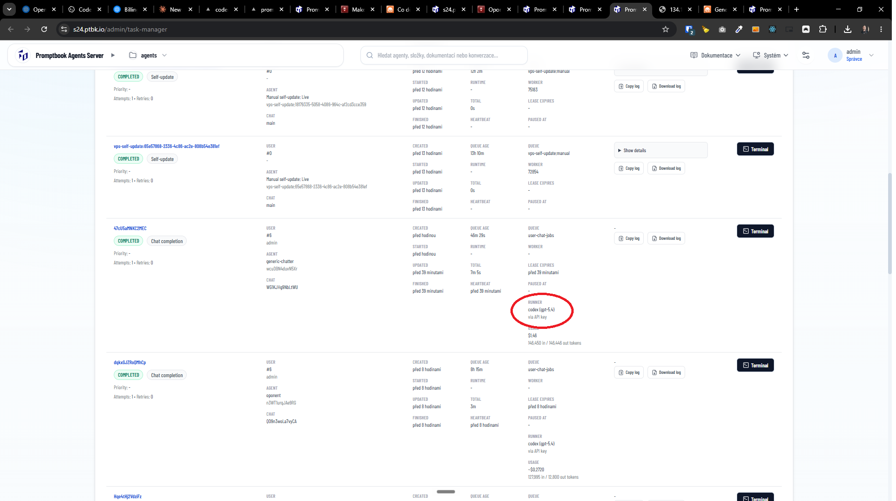
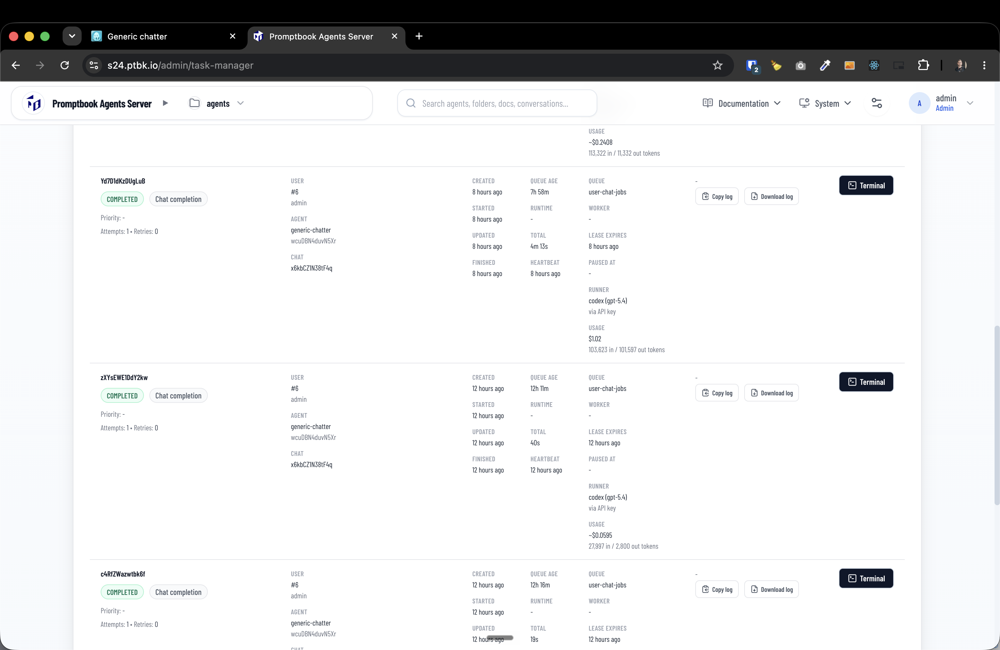

[x] ~$0.4243 an hour by OpenAI Codex `gpt-5.5`
[x] $4.25 7 hours by Claude Code `claude-opus-4-8`
[.] Failed by `fable` and stashed

---

[x] $23.05 5 hours by Claude Code `fable`

[✨😺] If the codex is logged in to the ChatGPT account on the server. Use this ChatGPT account, not the token usage via the API key.

```console
root@collboard-ptbk-preview:~# codex login status
Not logged in
```

<- In this situation the codex is not logged in to the ChatGPT account on the server. Use the token usage via the API key. _(this is currently working as expected)_

```console
root@collboard-agents-server-x24:~# codex login status
Logged in using ChatGPT
```

<- In this situation the codex is logged in to the ChatGPT account on the server. Use this ChatGPT account, not the token usage via the API key.

-   You are working with the [Agents Server](apps/agents-server)
-   Show wheather the codex was used via the ChatGPT account or API key in the task details
-   Show also the usage in the task details
-   Keep in mind the DRY _(don't repeat yourself)_ principle, reusen the existing code for computing the usage and displaying the usage

---

[x] ~$0.3883 an hour by OpenAI Codex `gpt-5.5`

---

[x] $7.13 an hour by Claude Code `claude-opus-4-8`

[✨😺] If Agents server is using the `openai-codex` harness and the `codex` on the agents server VPS is logged in to the ChatGPT account on the server, use this ChatGPT account, not the token usage via the API key

```console
root@collboard-ptbk-preview:~# codex login status
Not logged in
```

<- In this situation the codex is not logged in to the ChatGPT account on the server. Use the token usage via the API key. _(this is currently working as expected)_

```console
root@collboard-agents-server-x24:~# codex login status
Logged in using ChatGPT
```




<- In this situation the codex is logged in to the ChatGPT account on the server. Use this ChatGPT account, not the token usage via the API key.

-   Currently, there is a bug that the API key is always used despite the codex is logged in.
    -   
    -   
-   You are working with the [Agents Server](apps/agents-server)
-   Keep in mind the DRY _(don't repeat yourself)_ principle
-   You have implemented this task multiple times, but the bug is still here. Try to think deeper about why this is happening.

