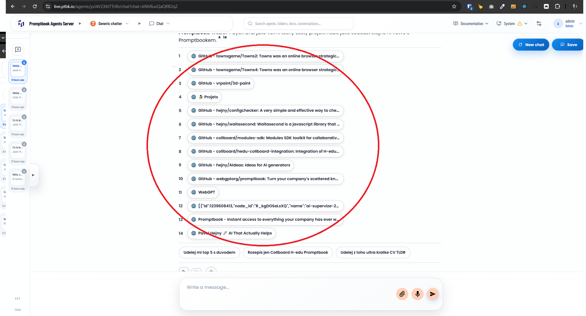
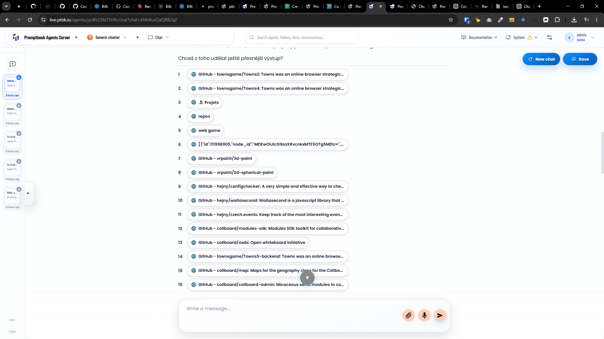
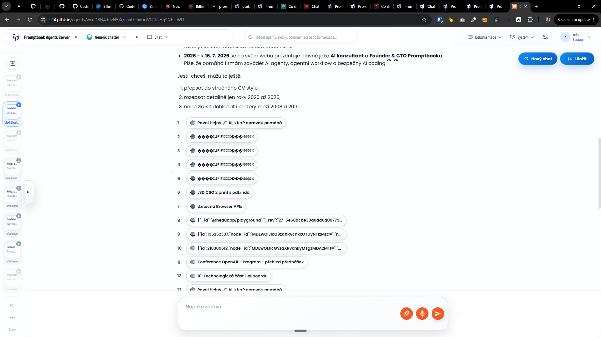
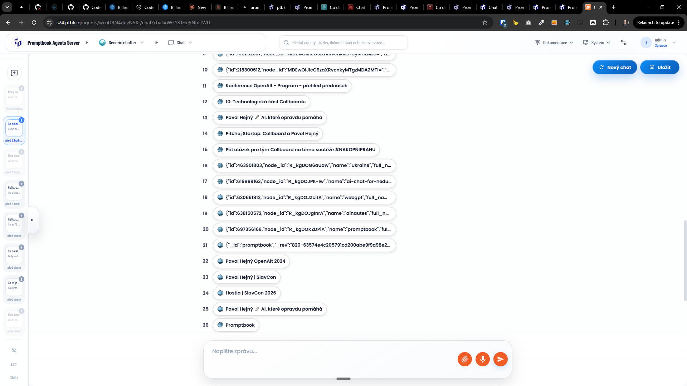

[x] by `gpt-5.5` commited manually

[✨🙍] Show the sources in some nicer way

-   When the agent replies to the user, it can show the sources in the chip bellow the message
-   Some chips are great but some are ugly and not very readable, for example the sources with long URLs
    -   "🌐[{"id":1239608413,"node_id":"R_kgDOSeLsXQ","name":"ai-supervize-2026-05-15" - show something more meaningful
    -   "����JFIF��� " - show something more meaningful
-   Keep in mind the DRY _(don't repeat yourself)_ principle.
-   Do a proper analysis of the current functionality before you start implementing.
-   You are working with the [Agents Server](apps/agents-server)
-   Add the changes into the [changelog](changelog/_current-preversion.md)

