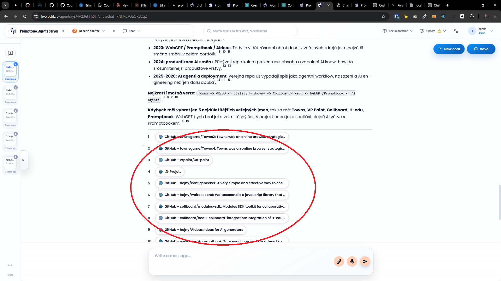
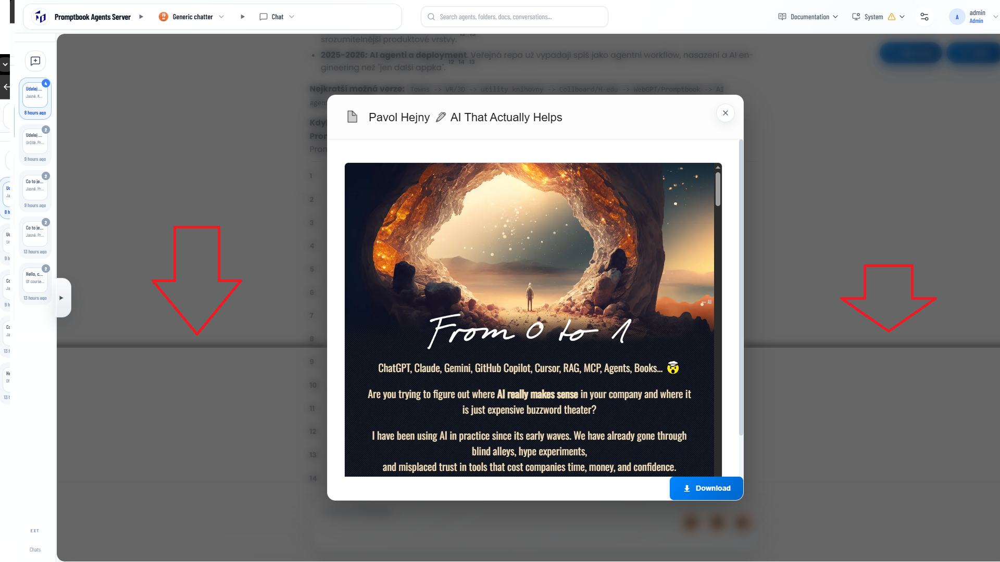

[ ]

[✨🎖] Fix Chat blinking

-   When the chat is being rerendered (for example the new messages are added) the component blinks
-   Espetially the sources chips
- Its probably the loading of the source titles, cache them
-   Also when the popup is opened there is ugly horizontal line across the page
-   Do a proper analysis of the current functionality before you start implementing.
-   You are working with the [Agents Server](apps/agents-server)

