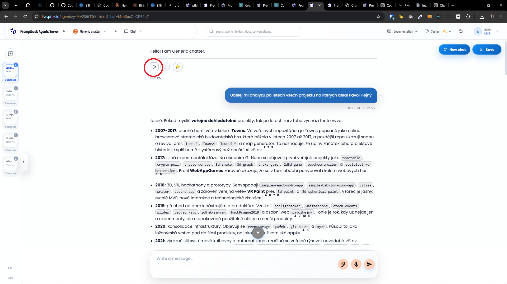

[-]

[✨➡️] foo

-   *(@@@??? Maybe just wait for some on-premise self installed STT model)*
-   Keep in mind the DRY _(don't repeat yourself)_ principle.
-   Do a proper analysis of the current functionality before you start implementing.
-   You are working with the [Agents Server](apps/agents-server)
-   Add the changes into the [changelog](changelog/_current-preversion.md)

