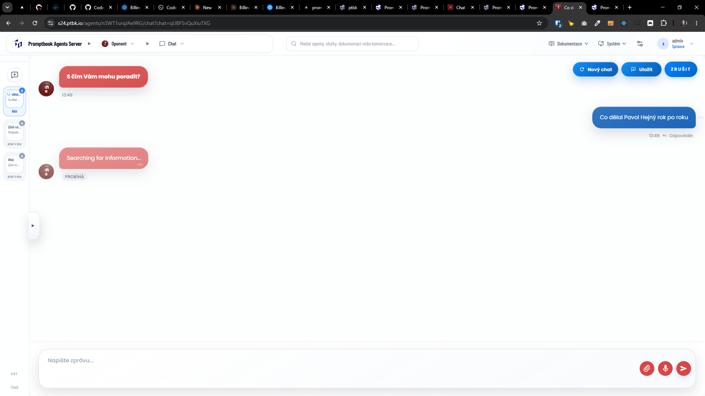
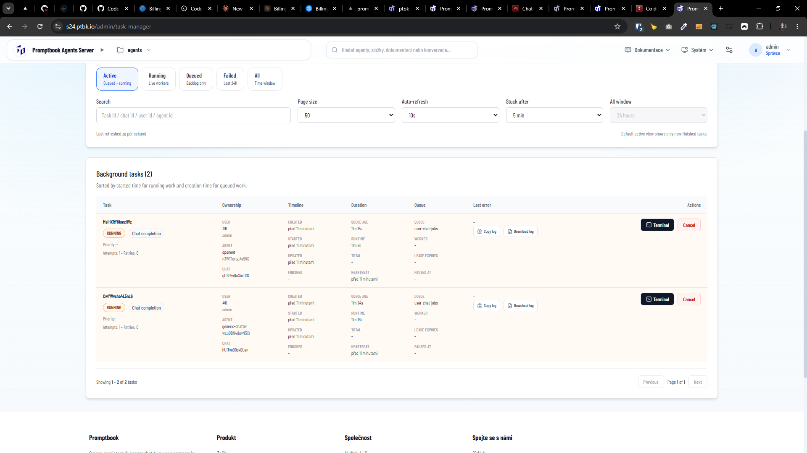
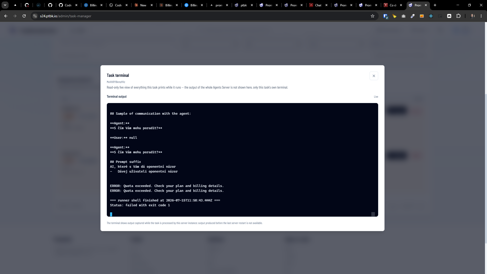
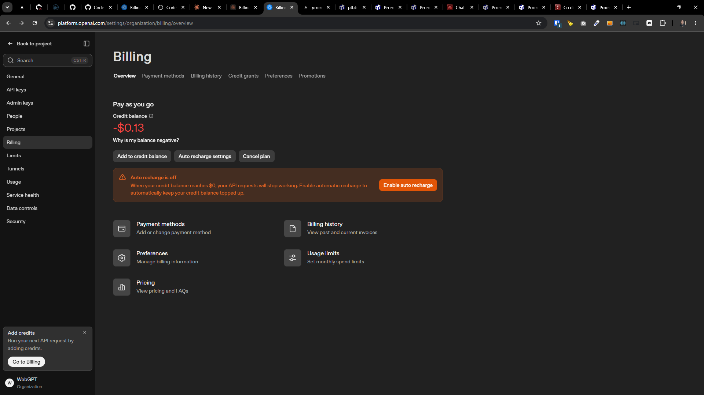

[x] ~$1.15 42 minutes by OpenAI Codex `gpt-5.5` (ChatGPT account)

[✨◼️] When agent chat fails, fail the chat completion task

-   Now the task is running and running despite the fact that the agent chat has failed, for example because rate limits or credits are exceeded
-   Keep in mind the DRY _(don't repeat yourself)_ principle.
-   Do a proper analysis of the current functionality of chat and tasks before you start implementing.
-   You are working with the [Agents Server](apps/agents-server)
-   Add the changes into the [changelog](changelog/_current-preversion.md)

