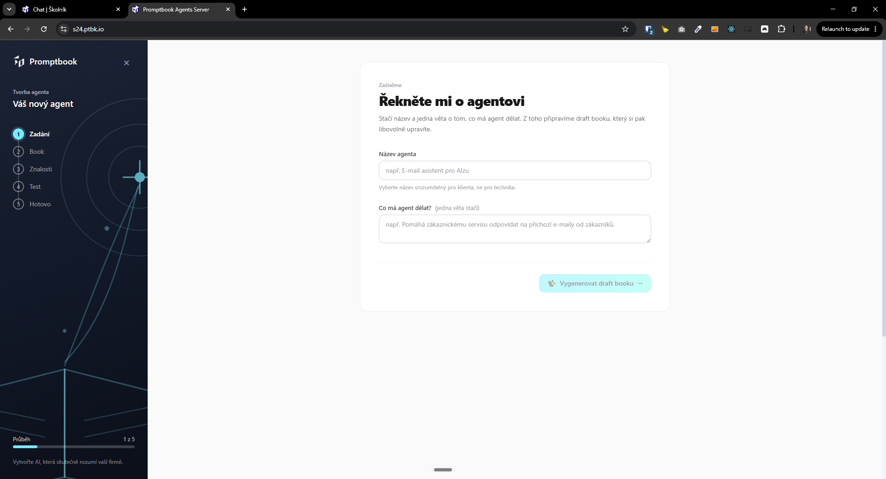

[x] ~$0.5409 an hour by OpenAI Codex `gpt-5.5` (ChatGPT account)

[✨🟦] There should be a way to return to the classic book editor when using the Mango editor

-   Some small button to exit the Mango editor and open the classic book editor 
-   Similar to the classic wizard
- When there is some work done in the Mango wizard, it brings the partially created book to the Classic Book Editor. 
-   Keep in mind the DRY _(don't repeat yourself)_ principle.
-   Do a proper analysis of the current functionality before you start implementing.
-   You are working with the [Agents Server](apps/agents-server)
-   Add the changes into the [changelog](changelog/_current-preversion.md)

