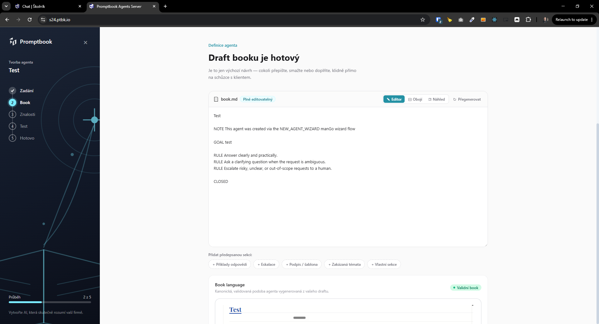
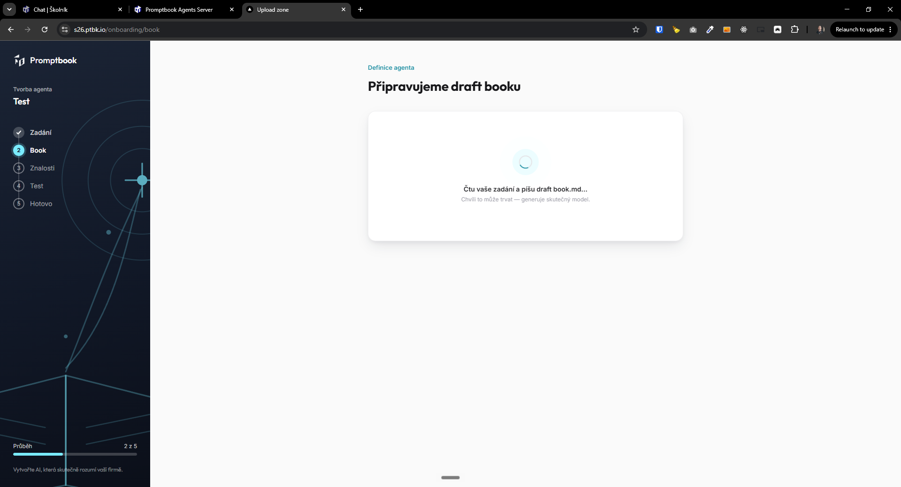
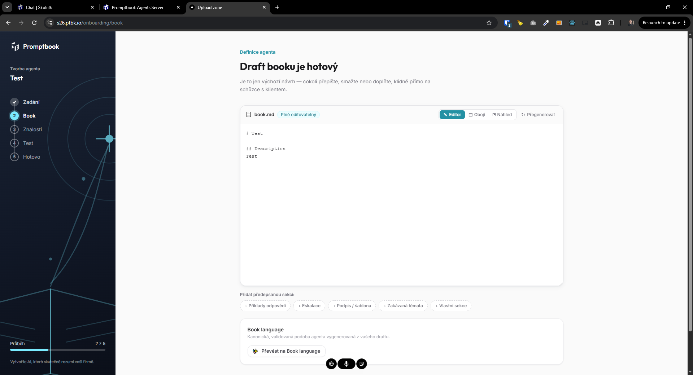
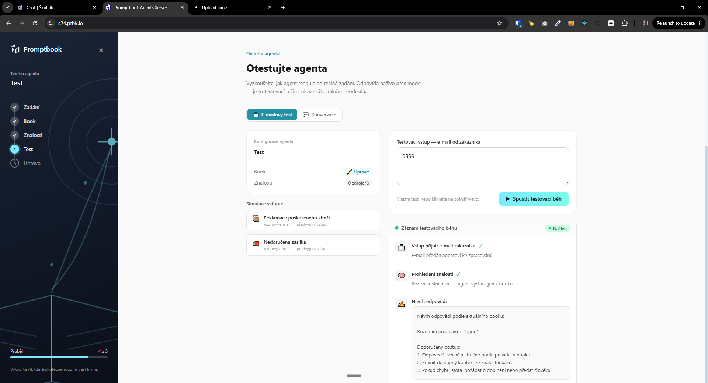

[ ]

[✨🙄] Use AI agent in the mango wizard not just simple templating

-   The wizard will be taken from `C:/Users/me/work/promptbook-experiments-and-landing-pages/agents-server/src/routes/onboarding`
-   Take the nessesary files from [this folder](C:/Users/me/work/promptbook-experiments-and-landing-pages/agents-server/src/routes/onboarding)
-   When creating book draft use AI agent from (`C:/Users/me/work/promptbook-experiments-and-landing-pages/agents-server/src/routes/onboarding`) not use basic templating
-   Do the same thing in step 4
-   Keep in mind the DRY _(don't repeat yourself)_ principle.
-   Do a proper analysis of the current functionality before you start implementing.
-   You are working with the [Agents Server](apps/agents-server)

