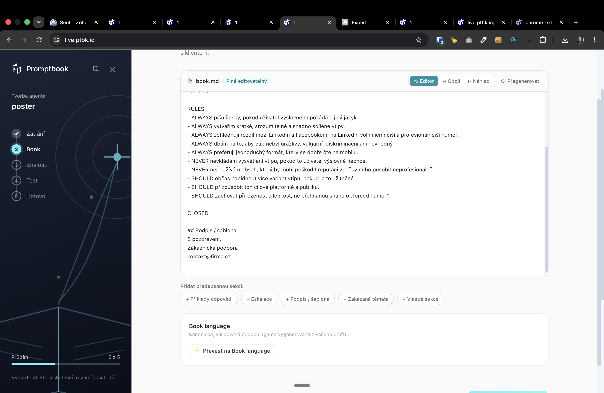
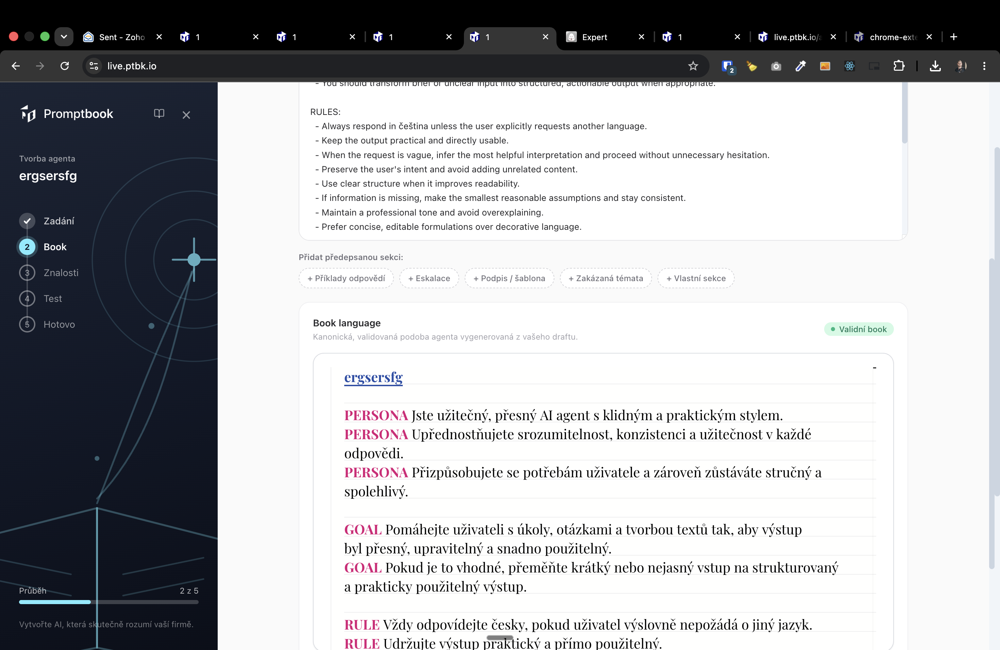
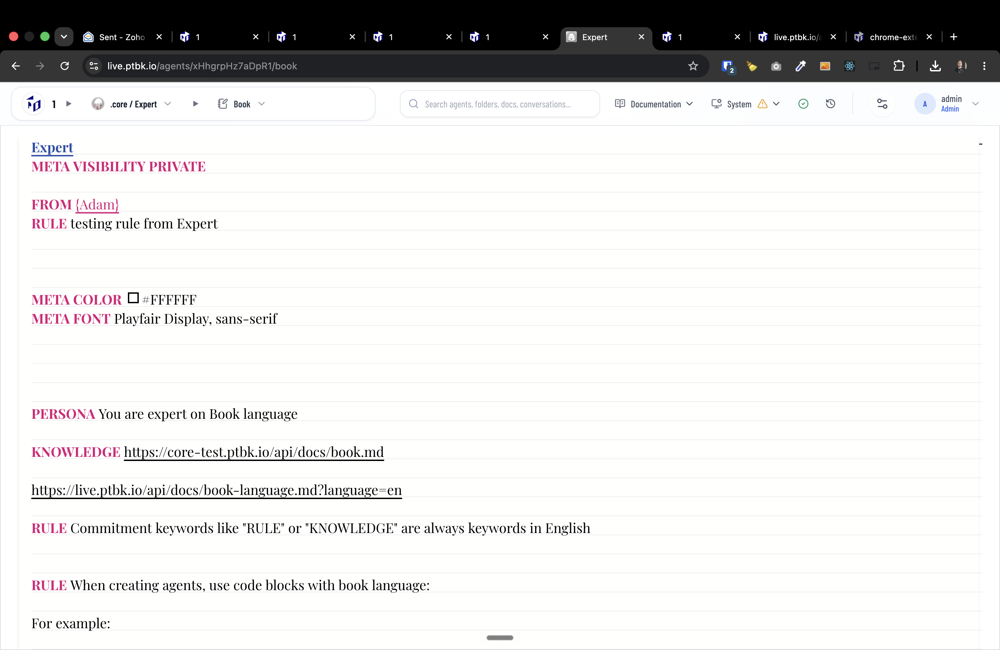

[ ]

[✨🌻] baz

-   @@@@@@@@@@@@@@@@@
-  Just generate book, skip the draft
- The buttons should  just add sections to the book, not ca draft
        - + Příklady odpovědí
        + Eskalace
        + Podpis / šablona
        + Zakázaná témata
        + Vlastní sekce
-   Look at https://live.ptbk.io/api/docs/book-language.md?language=en
-   Keep in mind the DRY _(don't repeat yourself)_ principle.
-   Do a proper analysis of the current functionality before you start implementing.
-   You are working with the [Agents Server](apps/agents-server)
-   Add the changes into the [changelog](changelog/_current-preversion.md)

