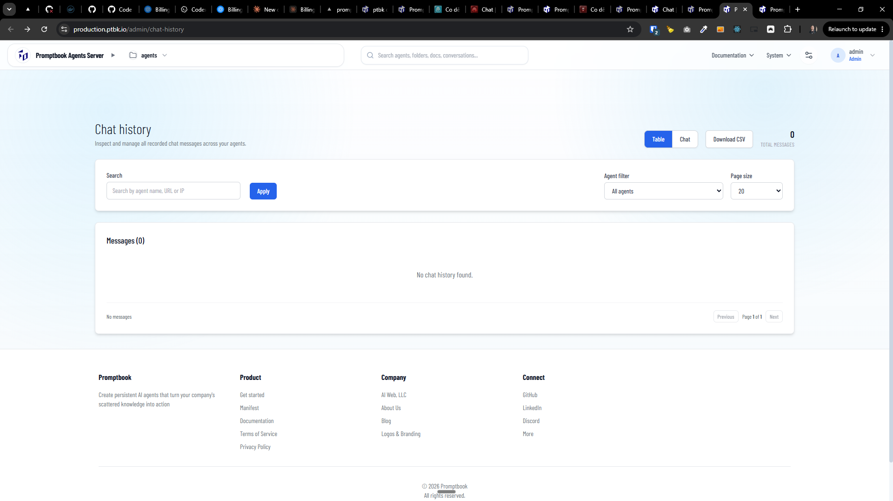
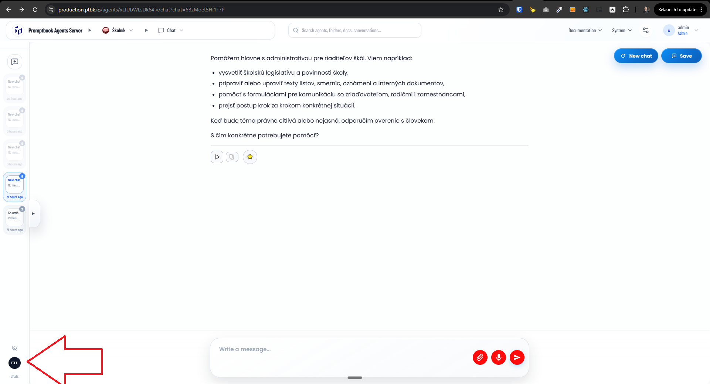
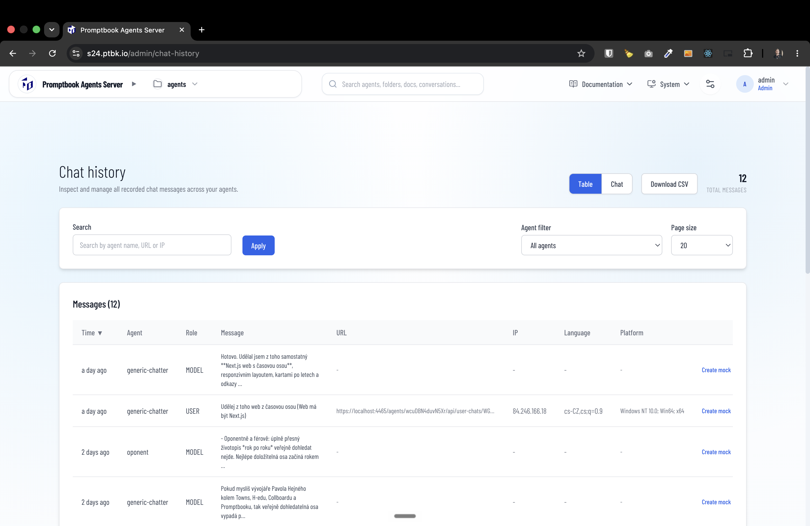
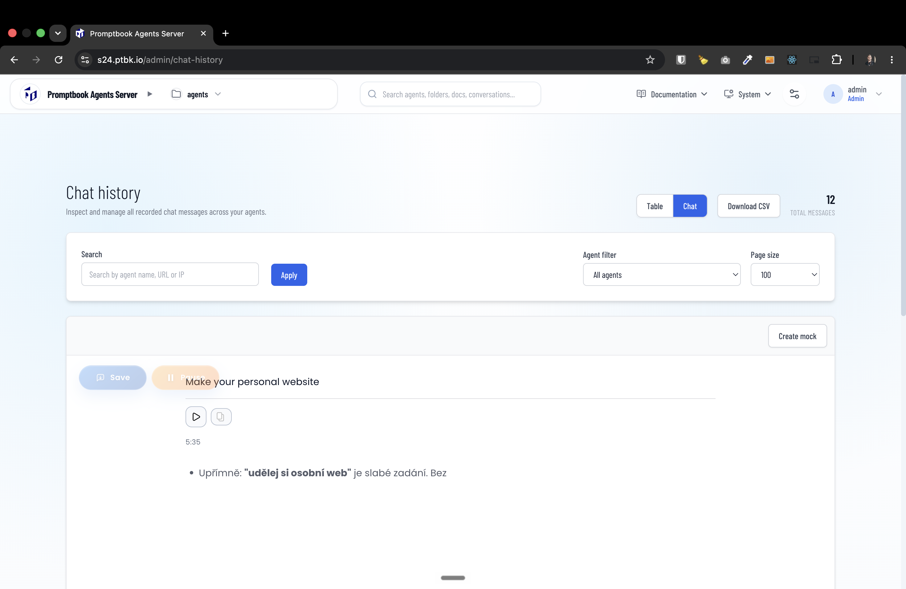

[x] (2 attempts) $2.37 17 hours by Claude Code `fable`

[✨🐌] Chat history (`/admin/chat-history`) isnt working, fix it

-   Every chat should be recorded in the chat history
-   Add button to create a mock (`/system/utilities/mocked-chats`) from that chat
-   Add button to link to that chat completion task
    -   Create a special page for each task (link also from task manager)
    -   Show there all the details you can see in the task manager `/admin/task-manager`
-   Keep in mind the DRY _(don't repeat yourself)_ principle.
-   Do a proper analysis of the current functionality before you start implementing.
-   You are working with the [Agents Server](apps/agents-server)
-   Add the changes into the [changelog](changelog/_current-preversion.md)

**Together with this task do:**

-   When a superadmin is looking on external chats, allow to see the chats from all users that happened on the server
-   Reuse the same history data for this
-   When seeing the chat from external user you can not see the textarea input, only the freezed chat
-   Also add a button to create a mock (`/system/utilities/mocked-chats`) from that chat
-   Also add a button with link to the chat history (`/admin/chat-history`) admin page
-   Theese buttons are only visible for superadmins when viewing the external chats from other users

---

[x] (2 attempts) $0.00 5 hours by Claude Code `claude-opus-4-8`

[✨🐌] Chat history (`/admin/chat-history`) Should be separated by each chat 

- Now every chat is mixed in one pile. 
- You should be able to see chats by chat threads. 
-  When you are looking at the table CSV view, allow seeing both all the chat messages mixed together and filter by agent or filter by agent and chat thread.
-  When you are looking as chat view, do not mix chat threads together.
-  In the chat view, the chat should always be in the bubble mode, even if in controls you have turned on the article mode.
-  In the table view, show rendered Markdown.
-  When linking to the chat history, always link to the most detailed view.
-   Keep in mind the DRY _(don't repeat yourself)_ principle.
-   Do a proper analysis of the current functionality before you start implementing.
-   You are working with the [Agents Server](apps/agents-server)

