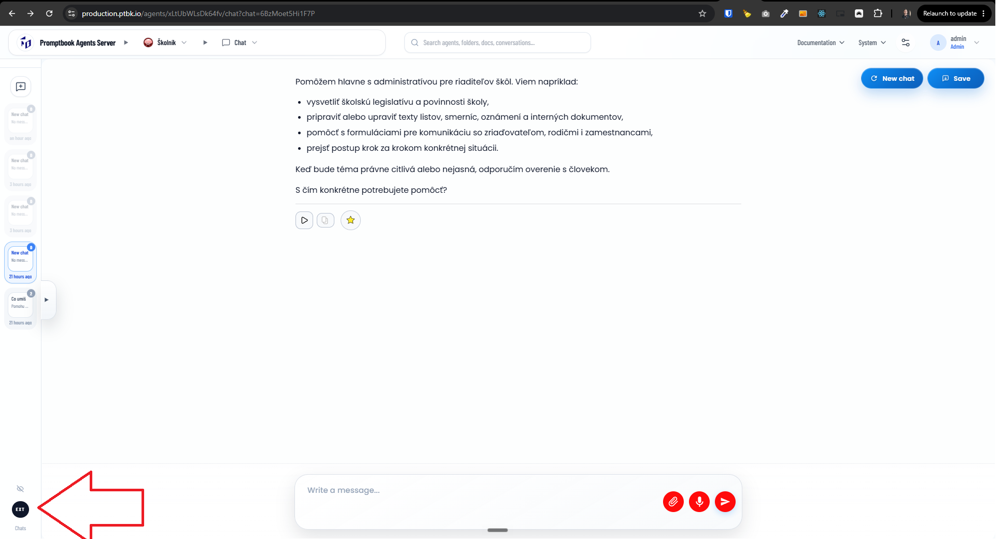

[ ]

[✨🏟] When a superadmin is looking on external chats, allow to see the chats from all users that happened on

-   The chat is from another user. The chat should be frozen in a similar way to the chat from the API.
-   But link to the user who did the chat.
-   Also link to the chat history.
-   Keep in mind the DRY _(don't repeat yourself)_ principle.
-   Do a proper analysis of the current functionality before you start implementing.
-   You are working with the [Agents Server](apps/agents-server) with agent chat
-   Add the changes into the [changelog](changelog/_current-preversion.md)

