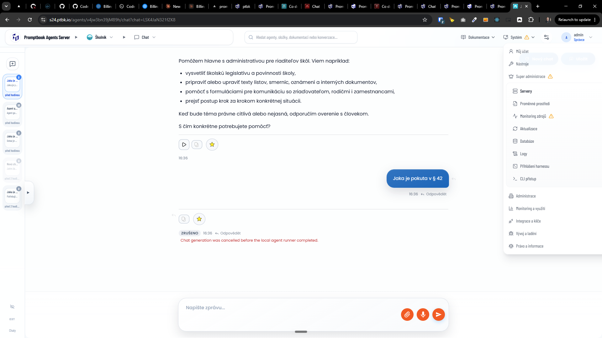

[x] $7.67 an hour by Claude Code `claude-opus-4-8`

[✨🎪] For superadmin create a admin page to manage internal s3

-   Keep in mind the DRY _(don't repeat yourself)_ principle.
-   Do a proper analysis of the current functionality before you start implementing.
-   You are working with the [Agents Server](apps/agents-server)
-   Add the changes into the [changelog](changelog/_current-preversion.md)

---

[x] 👇 was "use `openai-codex`" respected

---

[ ] use `openai-codex`

[✨🎪] Add file browser to Internal S3 viewer

-   Do a proper analysis of the current functionality before you start implementing.
-   Also fix the `/admin/files` page
-   Difference between `/admin/internal-s3` and `/admin/files` pages:
    -   `/admin/internal-s3` page is for superadmin to manage internal s3 which is global for entire VPS and available only for superadmin
    -   `/admin/files` page is for normal admin of each server to manage files for specific server and available for normal admin of each server
-   You are working with the [Agents Server](apps/agents-server) with `/admin/internal-s3` and `/admin/files` pages
-   When you are superadmin, interlink between `/admin/internal-s3` and `/admin/files` pages via tabs _(simmilar to lonking of `/admin/environment` | `/admin/metadata` | `/admin/limits`)_
-   Keep in mind the DRY _(don't repeat yourself)_ principle.
    -   Share code between `/admin/internal-s3` and `/admin/files` pages as much as possible to avoid code duplication
    -   Reuse the tabs component
-   Add the changes into the [changelog](changelog/_current-preversion.md)

