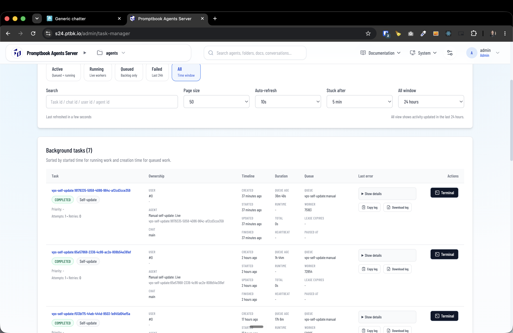

[ ]

[✨𓀍] Fix the self-update total time

-   Now it says "Total time: 0 seconds" when the self-update is done, but it is bullshit. It should report the real total time of the self-update.
-   Keep in mind the DRY _(don't repeat yourself)_ principle.
-   Do a proper analysis of the current functionality before you start implementing.
-   You are working with the [Agents Server](apps/agents-server) with tasks `/admin/task-manager`

