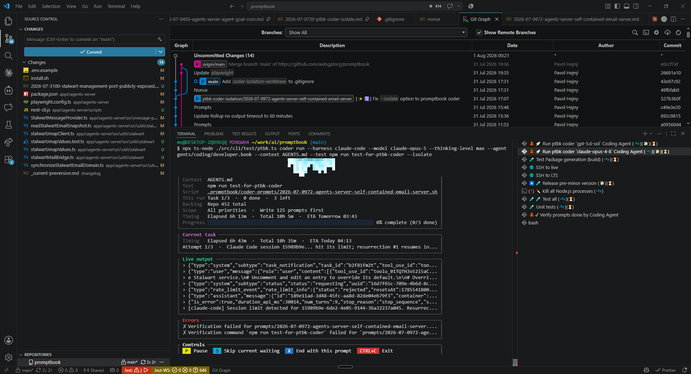
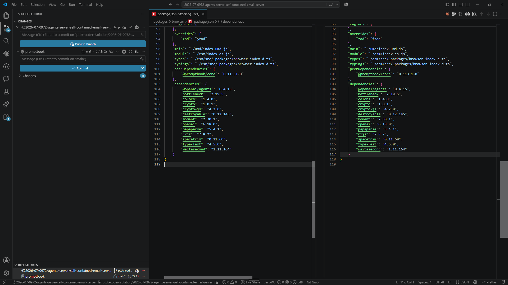

[x] by Claude Code `claude-opus-5` thinking `max` - Implementation $22.49 an hour; Testing 28 minutes

[✨🛐] Add `--isolate` option to promptbook coder

```bash
ptbk coder run --harness github-copilot --model gpt-5.4 --thinking-level xhigh --agent agents/coding/developer.book --context AGENTS.md --isolate
```

-   When using isolate, it will create a temporary worktree, the worktree will have its own isolated environment.
-   Temporary worktree folder should be inside the temporary folder of the Promptbook coder `.promptbook/coder-isolation-worktrees/<task-name>`, where `<task-name>` is the name of the task, for example `.promptbook/coder-isolation-worktrees/2026-07-0700-ptbk-coder-timing`.
-   After the task is implemented and verified, automatically merge into the original branch from where the coder is running, and delete the worktree
-   If the merge fails, instead of `[x]` the task do `[!]` and into the original worktree commit just information that merge failed, and the user should manually merge the changes from the worktree into the original branch and delete the worktree manually. Do not delete the worktree in this case. Do not terminate the coder, just continue with the next task.
-   These temporary worktrees will have branches `ptbk-coder-isolation/<task-name>` and will be deleted after the task is completed and merged into the original branch. If the merge fails, the worktree will not be deleted, and the user should manually merge the changes from the worktree into the original branch and delete the worktree manually.
-   Keep in mind the DRY _(don't repeat yourself)_ principle.
-   Do a proper analysis of the current functionality of `ptbk coder` and related functionality before you start implementing.
-   You are working with [`ptbk coder`](src/cli/cli-commands/coder/run.ts)
-   Update the [`ptbk coder` landing website](apps/coder-landing)
-   Add the changes into the [changelog](changelog/_current-preversion.md)

---

[x] by Claude Code `claude-opus-5` thinking `max` - Implementation $10.92 42 minutes; Testing 35 minutes

[✨🛐] Fix `--isolate` option to promptbook coder

```bash
ptbk coder run --harness github-copilot --model gpt-5.4 --thinking-level xhigh --agent agents/coding/developer.book --context AGENTS.md --isolate
```

-   **The isolation is already implemented but results in error**, when using `ptbk coder` without `--isolate`it works fine, but when using `--isolate` it results in error, and the coder is not able to create the worktree and run the task.
-   When using isolate, it will create a temporary worktree, the worktree will have its own isolated environment.
-   Temporary worktree folder should be inside the temporary folder of the Promptbook coder `.promptbook/coder-isolation-worktrees/<task-name>`, where `<task-name>` is the name of the task, for example `.promptbook/coder-isolation-worktrees/2026-07-0700-ptbk-coder-timing`.
-   After the task is implemented and verified, automatically merge into the original branch from where the coder is running, and delete the worktree
-   If the merge fails, instead of `[x]` the task do `[!]` and into the original worktree commit just information that merge failed, and the user should manually merge the changes from the worktree into the original branch and delete the worktree manually. Do not delete the worktree in this case. Do not terminate the coder, just continue with the next task.
-   These temporary worktrees will have branches `ptbk-coder-isolation/<task-name>` and will be deleted after the task is completed and merged into the original branch. If the merge fails, the worktree will not be deleted, and the user should manually merge the changes from the worktree into the original branch and delete the worktree manually.
-   Keep in mind the DRY _(don't repeat yourself)_ principle.
-   Do a proper analysis of the current functionality of `ptbk coder` and related functionality before you start implementing.
-   You are working with [`ptbk coder`](src/cli/cli-commands/coder/run.ts)
-   Update the [`ptbk coder` landing website](apps/coder-landing)
-   Add the changes into the [changelog](changelog/_current-preversion.md)

```console
me@DESKTOP-2QD9KQQ MINGW64 ~/work/ai/promptbook (main)
$ npx ts-node ./src/cli/test/ptbk.ts coder run --harness claude-code --model claude-opus-5 --thinking-level max --agent agents/coding/developer.book --context AGENTS.md --test oding/developer.book --context AGENTS.md --test npm run test-for-ptbk-coder --isolate
✔ Claude Code 2.1.220 is up to date.

┌ Session ─────────────────────────────────────────────────────────────────────────────────────┐
│ State     LOADING  Checking the working tree...                                              │
│ Runner   claude-code  ·  claude-opus-5  ·  thinking max                                      │
│ Context  AGENTS.md                                                                           │
│ Test     npm run test-for-ptbk-coder                                                         │
│ This run Task 1/3  ·  0 done  ·  3 left                                                      │
│ Backlog  Repo 451 total                                                                      │
│ Scope    All priorities  ·  Write 125 prompts first                                          │
│ Timing   Elapsed 1m  ·  Total estimating...  ·  ETA after first completion                   │
│ Progress ░░░░░░░░░░░░░░░░░░░░░░░░░░░░░░░░░░░░░░░░░░░░░░░░░░░░░░░░░░░░ 0% complete (0/3 done) │
└──────────────────────────────────────────────────────────────────────────────────────────────┘
┌ Queue ───────────────────────────────────────────────────────────────────────────────────────┐
│ Checking the working tree...                                                                 │
└──────────────────────────────────────────────────────────────────────────────────────────────┘
┌ Live output ─────────────────────────────────────────────────────────────────────────────────┐
│ No live agent output yet.                                                                    │
│                                                                                              │
│                                                                                              │
│                                                                                              │
│                                                                                              │
│                                                                                              │
│                                                                                              │
│                                                                                              │
└──────────────────────────────────────────────────────────────────────────────────────────────┘
┌ Controls ────────────────────────────────────────────────────────────────────────────────────┐
│  P  Pause   S  Skip current waiting   X  End with this prompt   CTRL+C  Exit                 │
└──────────────────────────────────────────────────────────────────────────────────────────────┘
Tip: `ptbk coder run` used your default Git config because the coding-agent identity environment variables are incomplete.
For cleaner commit history, set `CODING_AGENT_GIT_NAME`, `CODING_AGENT_GIT_EMAIL`, and either `CODING_AGENT_GIT_SIGNING_KEY` or `CODING_AGENT_GPG_KEY_ID`.
Error
Error: Preparing worktree (new branch 'ptbk-coder-isolation/2026-07-0972-agents-server-self-contained-email-server')

Updating files:   5% (449/8972)
Updating files:   6% (539/8972)
Updating files:   6% (543/8972)
Updating files:   7% (629/8972)
Updating files:   9% (808/8972)
Updating files:  10% (898/8972)
Updating files:  11% (987/8972)
Updating files:  12% (1077/8972)
Updating files:  17% (1526/8972)
Updating files:  18% (1615/8972)
Updating files:  19% (1705/8972)
Updating files:  19% (1713/8972)
Updating files:  20% (1795/8972)
Updating files:  25% (2243/8972)
Updating files:  26% (2333/8972)
Updating files:  27% (2423/8972)
Updating files:  28% (2513/8972)
error: unable to create file apps/agents-server/src/utils/speech-to-text/SpeechToTextFailoverRecognition/createSpeechToTextFailoverRecognitionProviderStartOptions.ts: Filename too long
Updating files:  36% (3230/8972)
Updating files:  37% (3320/8972)
Updating files:  37% (3383/8972)
Updating files:  37% (3396/8972)
Updating files:  38% (3410/8972)
Updating files:  38% (3433/8972)
error: unable to create file documents/github/discussions/polls-promptbook-asking-community/158-should-be-knowledge-actions-and-available-granularly-for-each-template-andor-persona.md: Filename too long
Updating files:  44% (3948/8972)
Updating files:  45% (4038/8972)
Updating files:  45% (4057/8972)
Updating files:  46% (4128/8972)
Updating files:  48% (4307/8972)
Updating files:  48% (4374/8972)
Updating files:  49% (4397/8972)
Updating files:  50% (4486/8972)
Updating files:  50% (4543/8972)
Updating files:  51% (4576/8972)
Updating files:  60% (5384/8972)
Updating files:  60% (5420/8972)
Updating files:  60% (5428/8972)
Updating files:  60% (5448/8972)
Updating files:  60% (5467/8972)
Updating files:  61% (5473/8972)
Updating files:  61% (5499/8972)
Updating files:  61% (5545/8972)
Updating files:  62% (5563/8972)
Updating files:  62% (5565/8972)
Updating files:  62% (5588/8972)
Updating files:  62% (5645/8972)
Updating files:  63% (5653/8972)
Updating files:  63% (5698/8972)
Updating files:  64% (5743/8972)
Updating files:  64% (5756/8972)
Updating files:  64% (5814/8972)
Updating files:  65% (5832/8972)
Updating files:  66% (5922/8972)
Updating files:  67% (6012/8972)
Updating files:  68% (6101/8972)
Updating files:  68% (6102/8972)
Updating files:  68% (6162/8972)
Updating files:  69% (6191/8972)
Updating files:  69% (6222/8972)
Updating files:  70% (6281/8972)
Updating files:  70% (6307/8972)
Updating files:  71% (6371/8972)
Updating files:  72% (6460/8972)
Updating files:  73% (6550/8972)
Updating files:  73% (6562/8972)
Updating files:  74% (6640/8972)
Updating files:  75% (6729/8972)
Updating files:  76% (6819/8972)
Updating files:  77% (6909/8972)
Updating files:  77% (6911/8972)
Updating files:  78% (6999/8972)
Updating files:  79% (7088/8972)
Updating files:  81% (7268/8972)
Updating files:  82% (7358/8972)
Updating files:  83% (7470/8972)
Updating files:  84% (7537/8972)
Updating files:  85% (7627/8972)
Updating files:  86% (7716/8972)
Updating files:  87% (7806/8972)
Updating files:  87% (7808/8972)
Updating files:  88% (7896/8972)
Updating files:  89% (7986/8972)
Updating files: 100% (8972/8972), done.
fatal: Could not reset index file to revision 'HEAD'.
    at ChildProcess.finishWithCode (C:\Users\me\work\ai\promptbook\src\utils\execCommand\$execCommand.ts:93:29)
    at ChildProcess.emit (node:events:518:28)
    at ChildProcess.emit (node:domain:489:12)
    at Process.ChildProcess._handle.onexit (node:internal/child_process:293:12)

me@DESKTOP-2QD9KQQ MINGW64 ~/work/ai/promptbook (main)
$
```

---

[ ]

[✨🛐] Fix `--isolate` option to promptbook coder

```bash
ptbk coder run --harness github-copilot --model gpt-5.4 --thinking-level xhigh --agent agents/coding/developer.book --context AGENTS.md --isolate
```

-   **The isolation is already implemented but it not work as supposed** @@@@@@@
-   When using isolate, it will create a temporary worktree, the worktree will have its own isolated environment.
-   Temporary worktree folder should be inside the temporary folder of the Promptbook coder `.promptbook/coder-isolation-worktrees/<task-name>`, where `<task-name>` is the name of the task, for example `.promptbook/coder-isolation-worktrees/2026-07-0700-ptbk-coder-timing`.
-   After the task is implemented and verified, automatically merge into the original branch from where the coder is running, and delete the worktree
-   If the merge fails, instead of `[x]` the task do `[!]` and into the original worktree commit just information that merge failed, and the user should manually merge the changes from the worktree into the original branch and delete the worktree manually. Do not delete the worktree in this case. Do not terminate the coder, just continue with the next task.
-   These temporary worktrees will have branches `ptbk-coder-isolation/<task-name>` and will be deleted after the task is completed and merged into the original branch. If the merge fails, the worktree will not be deleted, and the user should manually merge the changes from the worktree into the original branch and delete the worktree manually.
-   Keep in mind the DRY _(don't repeat yourself)_ principle.
-   Do a proper analysis of the current functionality of `ptbk coder` and related functionality before you start implementing.
-   You are working with [`ptbk coder`](src/cli/cli-commands/coder/run.ts)
-   Update the [`ptbk coder` landing website](apps/coder-landing)
-   Add the changes into the [changelog](changelog/_current-preversion.md)



