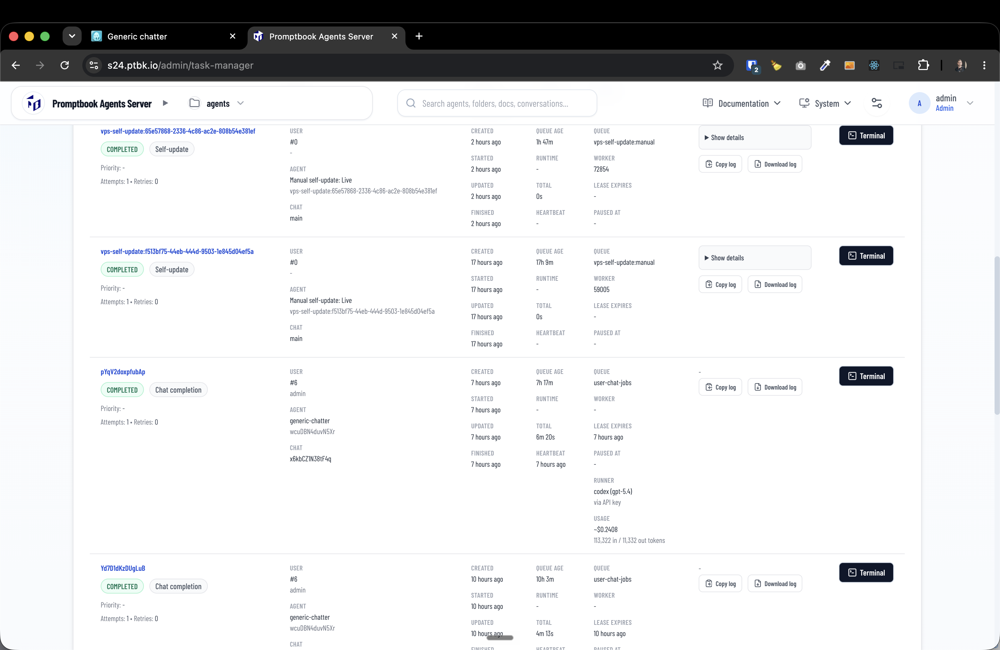

[x] 👇 was "use `claude`" respected

---

[ ] use `claude`

[✨🆗] The tasks in task manager should be sorted by finished time

-   Now it always shows the self-update task on the top of the list, even if there is a newer chat completion task. The tasks should be sorted by finished time, so the newest finished task is on the top of the list.
-   Keep in mind the DRY _(don't repeat yourself)_ principle.
-   Do a proper analysis of the current functionality before you start implementing.
-   You are working with the [Agents Server](apps/agents-server) with tasks `/admin/task-manager`

