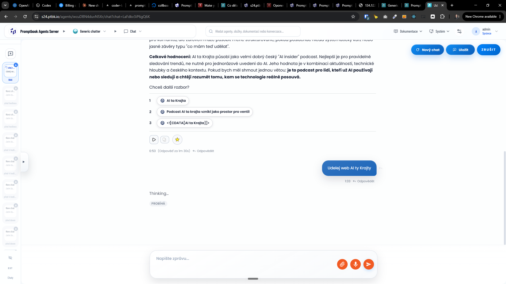

[x] by Claude Code `claude-opus-4-8` - Implementation $7.86 an hour; Testing 25 minutes

---

[x] by OpenAI Codex `gpt-5.6-terra` thinking `xhigh` - Implementation ~$1.07 30 minutes; Testing 7 minutes - _(commiting manually)_

[✨🟪] Show progress what is agent doing

-   Now there are just generic thinking messages.
-   Before the UI knows what the agent is really doing, show these generic syncing messages, and after that report the real progress the agent is doing at a time.
-   This should be very brief, like one line, ideally only a few words, not some advanced technical reports or checklists.
-   Get inspiration from, for example, ChatGPT or Claude, reporting what it is doing when the thinking is set up to high.
-   Keep in mind the DRY _(don't repeat yourself)_ principle.
-   Do a proper analysis of the current functionality before you start implementing.
-   You are working with the [Agents Server](apps/agents-server) with chat
-   Add the changes into the [changelog](changelog/_current-preversion.md)

---

[ ]

[✨🟪] Show progress what is agent doing

-   Now there are just single Not a very informative message.
-   Do the showing of progress in some better way.
-   Before the UI knows what the agent is really doing, show these generic thinking messages, and after that report the real progress the agent is doing at a time.
-   Get inspiration from, for example, ChatGPT or Claude, reporting what it is doing when the thinking is set up to high.
-   Keep in mind the DRY _(don't repeat yourself)_ principle.
-   Do a proper analysis of the current functionality before you start implementing.
-   You are working with the [Agents Server](apps/agents-server) with chat
-   Add the changes into the [changelog](changelog/_current-preversion.md)
