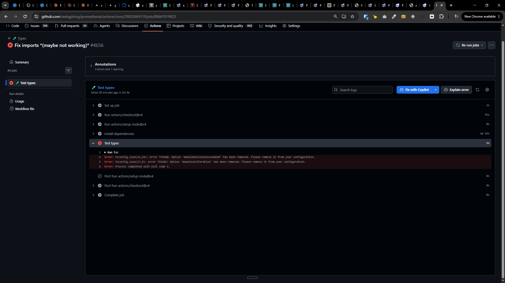

[x] 👇 was "use `gpt-5.5`" respected

---

[ ] use `gpt-5.5`

[✨📏] Fix test types

```console
Run tsc
Error: tsconfig.json(14,29): error TS5108: Option 'moduleResolution=node10' has been removed. Please remove it from your configuration.
Error: tsconfig.json(17,9): error TS5102: Option 'downlevelIteration' has been removed. Please remove it from your configuration.
Error: Process completed with exit code 1.
```


