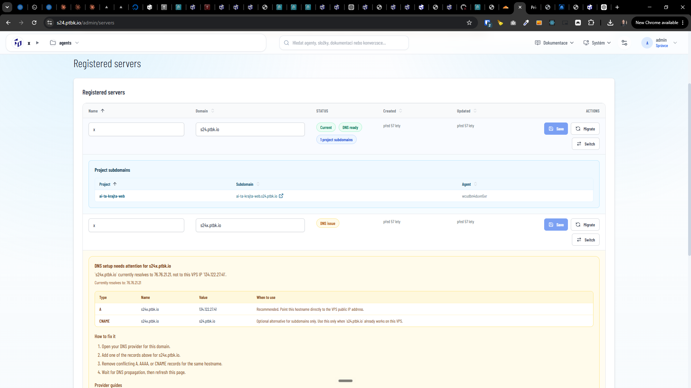

[ ]

[✨𓀝] Show the instructions how to setup DNS records for projects

-   When there is not configured DNS records for the server, there are instructions shown to the user how to setup DNS records for the server
-   But for the projects, there are no instructions shown to the user how to setup DNS records for the project
-   It can be confusing for the user, because the user see the project like `ai-ta-krajta-web.s24.ptbk.io` but it is not working because the DNS records are not configured for the domain
-   Show both variants for single project-specific domain 4th order like `ai-ta-krajta-web.s24.ptbk.io` and for wildcard domain like `*.s24.ptbk.io`
-   When showing alternative variants like `ai-ta-krajta-web.s24.ptbk.io` and `*.s24.ptbk.io` or A recodr and CNAME record, it should be clear that the user can choose one of the variants, not both *(maybe as a tabs)*
-   Keep in mind the DRY _(don't repeat yourself)_ principle.
-   Do a proper analysis of the current functionality before you start implementing.
-   You are working with the [Agents Server](apps/agents-server)
-   Add the changes into the [changelog](changelog/_current-preversion.md)

