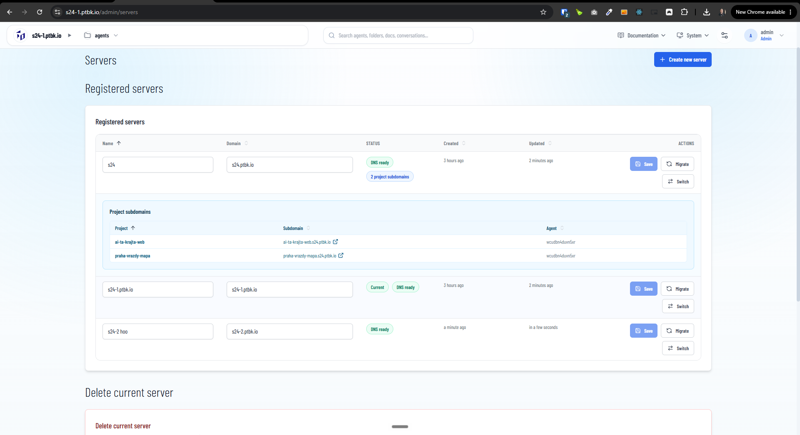
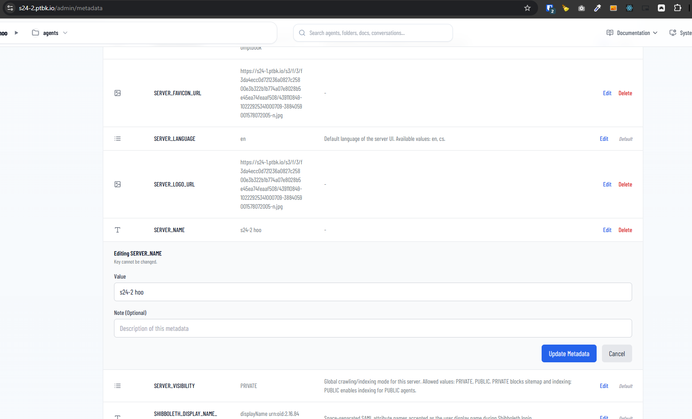

[ ]

[✨😈] Fix the servers changing name

-   @@@

-   There are two things:
    1. Entire VPS
    2. Each server
-   On one VPS there can be multiple servers and each server has its own domain
-   Most things (like agents, projects, metadata, etc.) are bound to each server and some things (like environment variables, superadmin, etc.) are bound to entire VPS
-   Update of the VPS is done for entire VPS
-   Purpose of this is to be able to run multiple clients on one VPS and each client can have its own server with its own domain and settings
-   The entire VPS is managed by superadmin and each server is managed by normal admin of that server _(or superadmin can also manage each server)_
-   Superadmin has always name `admin` and password hardcoded in environment variables
-   Things which are for entire VPS are available and manageable only for superadmin and things which are for each server should be available for normal admin of each server
-   Environment variabiles are bound to entire VPS, Metadata are bound to each server
-   Keep in mind the DRY _(don't repeat yourself)_ principle.
-   Do a proper analysis of the current functionality before you start implementing.
-   You are working with the [Agents Server](apps/agents-server) mainly with page `/admin/servers`
-   Add the changes into the [changelog](changelog/_current-preversion.md)
