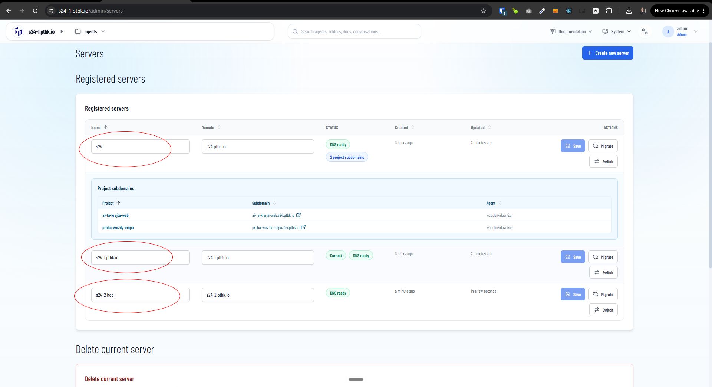

[x] (2 attempts) by OpenAI Codex `gpt-5.6-terra` (ChatGPT account) - Implementation ~$0.8866 29 minutes; Testing 5 minutes; Fixing ~$0.4130 19 minutes; Testing 9 minutes

[✨😈] Fix the servers changing name

-   It should be possible to change server name from the `/superadmin/servers`

-   There are two things:
    1. Entire VPS
    2. Each server
-   On one VPS there can be multiple servers and each server has its own domain
-   Most things (like agents, projects, metadata, etc.) are bound to each server and some things (like environment variables, superadmin, etc.) are bound to entire VPS
-   **When the name is changed from the Super Admin Panel. It should change the `SERVER_NAME` metadata of this particular server.**
-   But be aware of the situation that you can be switched to a different server on the same VPS, and you are changing the metadata of a different server than you are currently on. This is a bit of a special situation because nowhere else in the agents server, this situation where you are changing the metadata of a different server can happen. 
-   Environment variabiles are bound to entire VPS, Metadata are bound to each server
-   Keep in mind the DRY _(don't repeat yourself)_ principle.
-   Do a proper analysis of the current functionality before you start implementing.
-   You are working with the [Agents Server](apps/agents-server) mainly with page `/admin/servers`
-   Add the changes into the [changelog](changelog/_current-preversion.md)

