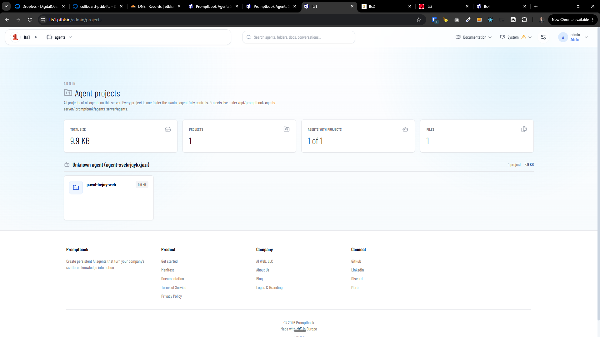

[ ] !

[✨®️] Project should be scoped to server not to entire VPS

-   There are two things:
    1. Entire VPS
    2. Each server
-   On one VPS there can be multiple servers and each server has its own domain
-   Most things (like agents, projects, metadata, etc.) are bound to each server and some things (like environment variables, superadmin, etc.) are bound to entire VPS
-   **But currently projects are shown VPS-wide, fix it**
-   Keep in mind the DRY _(don't repeat yourself)_ principle.
-   Do a proper analysis of the current functionality before you start implementing.
-   You are working with the [Agents Server](apps/agents-server) mainly with page `/admin/servers`
-   Add the changes into the [changelog](changelog/_current-preversion.md)

