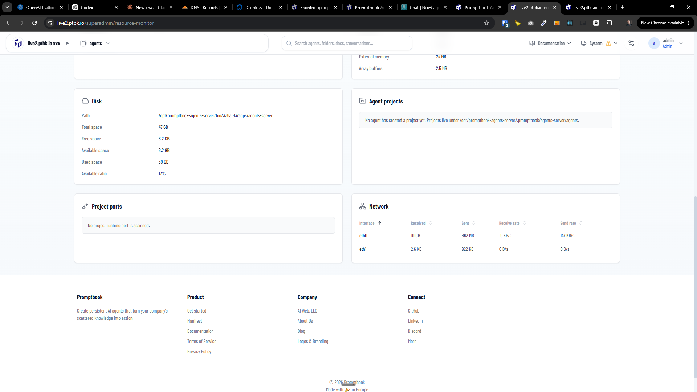
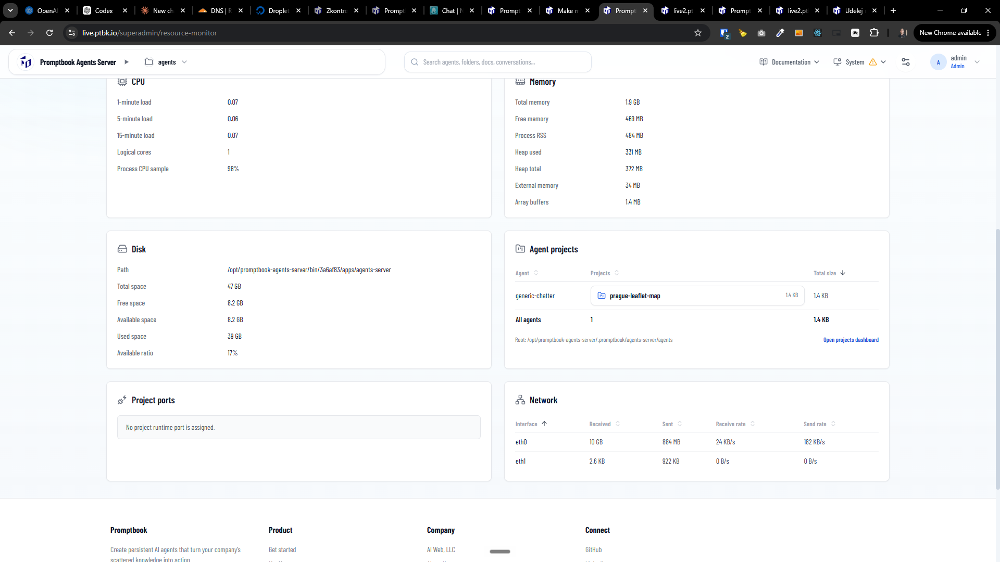
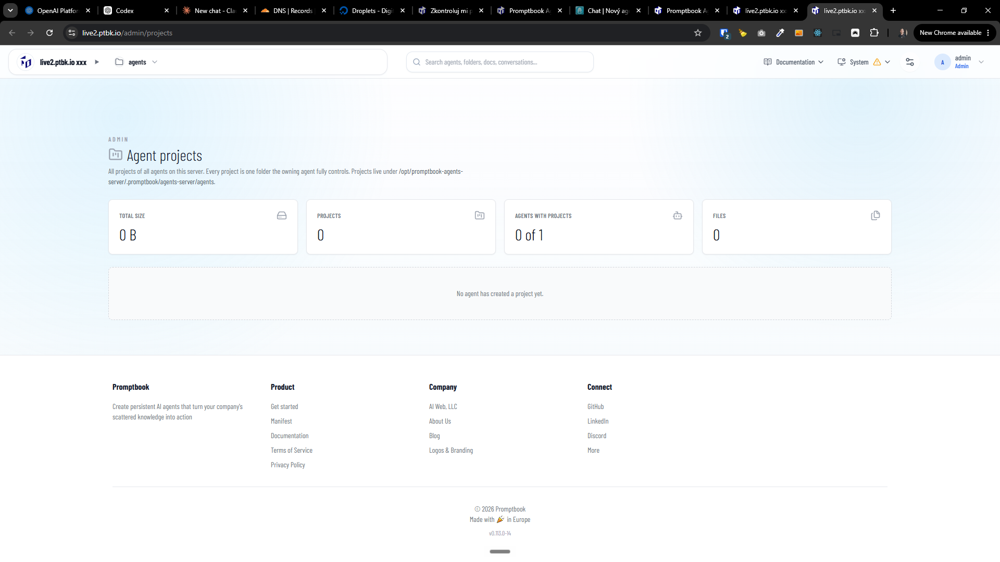
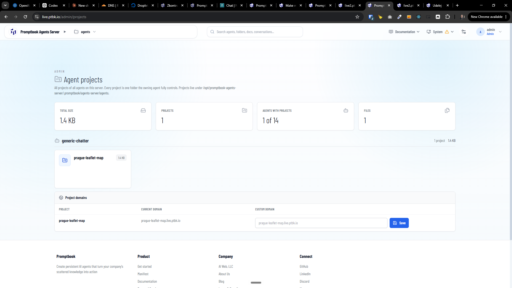
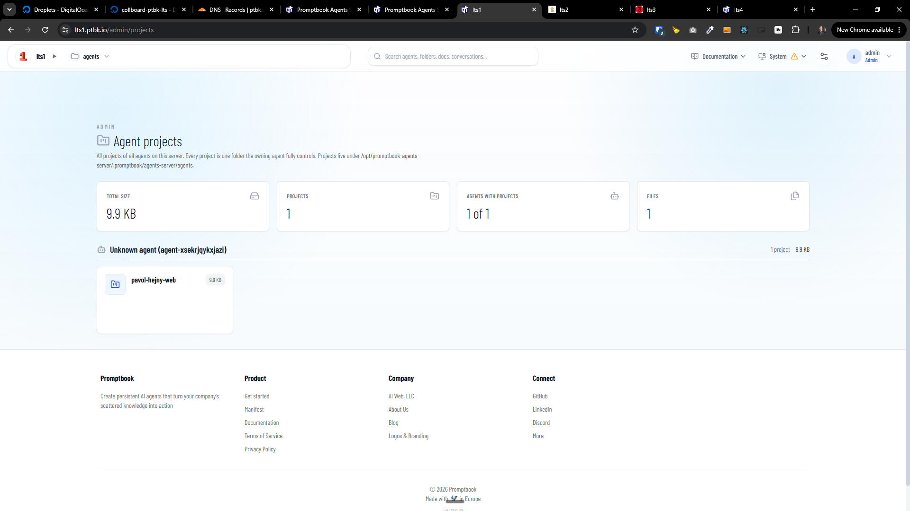

[x] ~$0.9828 an hour by OpenAI Codex `gpt-5.5` (ChatGPT account)

---

[x] by OpenAI Codex `gpt-5.6-luna` (ChatGPT account) - Implementation ~$0.9282 31 minutes; Testing 36 minutes

[✨®️] Project should be scoped to server not to entire VPS

-   There are two things:
    1. Entire VPS - For superadmin show just info about project size VPS-wide on `/superadmin/resource-monitor`
        - 
        - 
    2. Each server - For admins, the server projects are shown in `/admin/projects`, For project which are also on current server, show the link to the project, for foreign project, show the link to the server where the project is running.
        - 
        - 
-   On one VPS there can be multiple servers and each server has its own domain
-   Most things (like agents, projects, metadata, etc.) are bound to each server and some things (like environment variables, superadmin, etc.) are bound to entire VPS
-   Keep in mind the DRY _(don't repeat yourself)_ principle.
-   Do a proper analysis of the current functionality before you start implementing.
-   You are working with the [Agents Server](apps/agents-server) mainly with page `/admin/servers`
-   Add the changes into the [changelog](changelog/_current-preversion.md)

