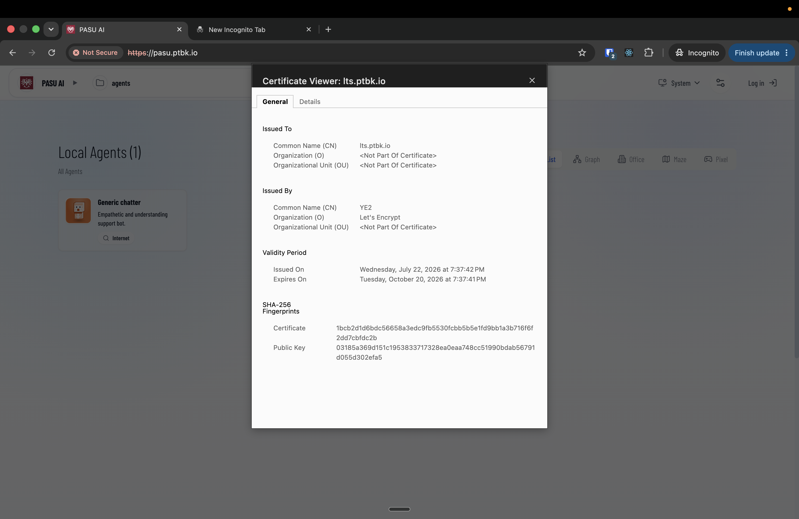

[ ] !!!!

[✨🔙] Agents server must manage certificates automatically

- Handle the situation When the server is created before the DNS is configured, in the moment when the server is created, the certificate cannot be obtained. After some time, the DNS is fixed, and the agent server should automatically detect this situation and obtain that certificate later when the certificate can be obtained. 
- Also handle automatic renewal of certificates which are going to expire. 
- Agent server should automatically manage its certificates for all assigned domains, regardless if this domain is for the server or for the project. 
-   **It is extremely important to keep the server working and accessible from the web regardless of some new domain failing to get the certificate or some project failing to run, the server should be accessible from the web and the main domain should be working**
-   Keep in mind the DRY _(don't repeat yourself)_ principle.
-   Do a proper analysis of the current functionality before you start implementing.
-   You are working with the [Agents Server](apps/agents-server)
-   Add the changes into the [changelog](changelog/_current-preversion.md)

