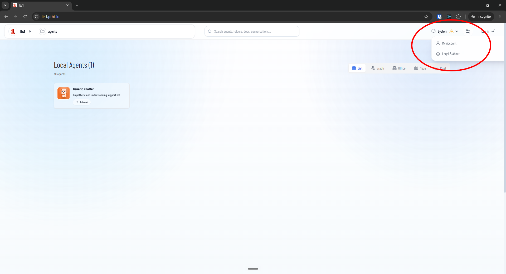

[ ] !

[✨😫] Do not show warnings which are supposed for the admins or super admins. 

-   It can be warning from resouce monitor, misconfigured login methods (Shibboleth), or other warnings which are for admin or superadmin but definitely not for normal users. 
- Do not even show the system item in a menu when the user is not logged in. 
- But also keep sure that for users which shouldn't have information about the warnings, the information isn't available through the API, even if it's not shown anymore. 
-   Keep in mind the DRY _(don't repeat yourself)_ principle.
-   Do a proper analysis of the current functionality before you start implementing.
-   You are working with the [Agents Server](apps/agents-server)
-   Add the changes into the [changelog](changelog/_current-preversion.md)

