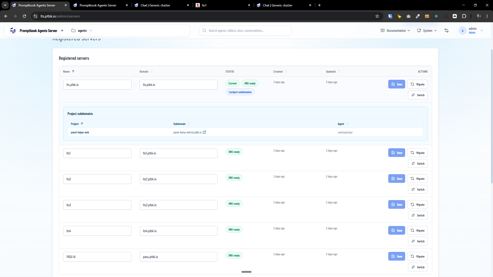
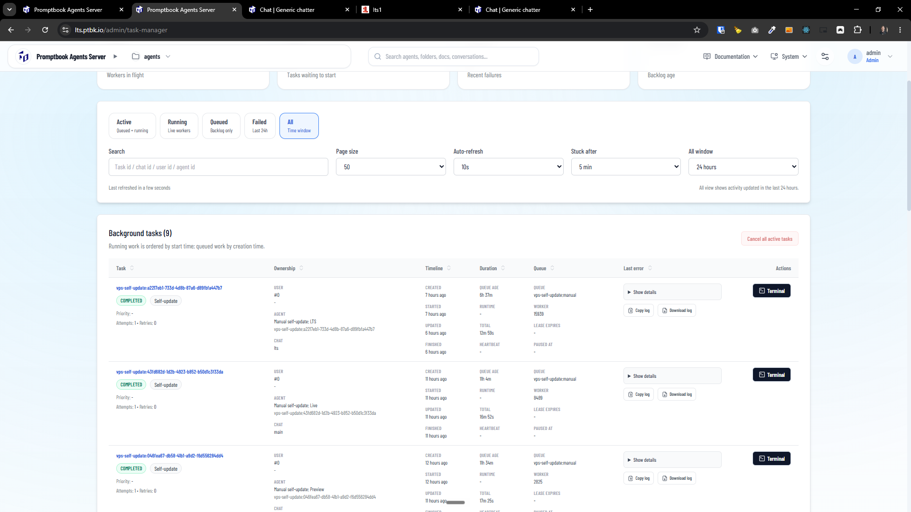
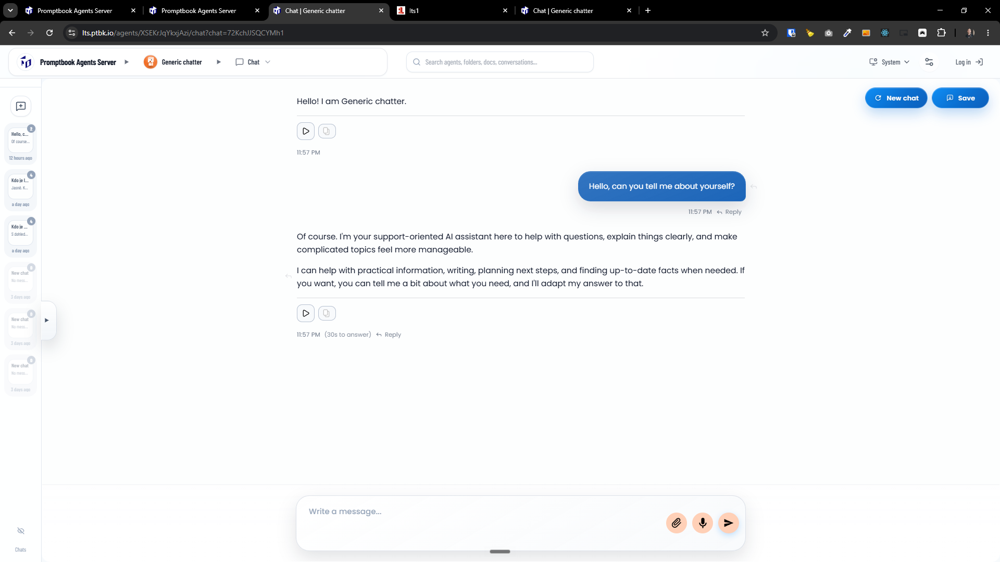
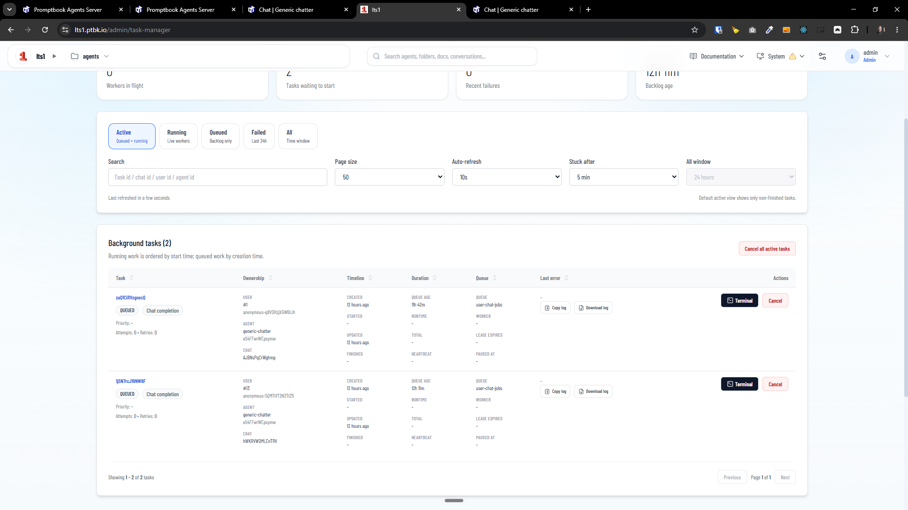
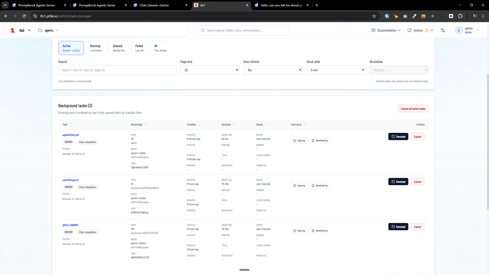
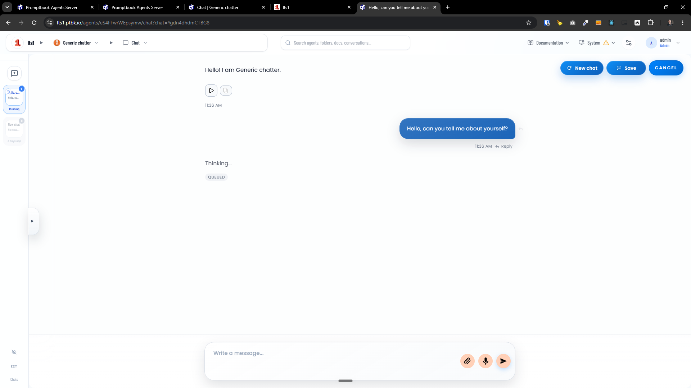
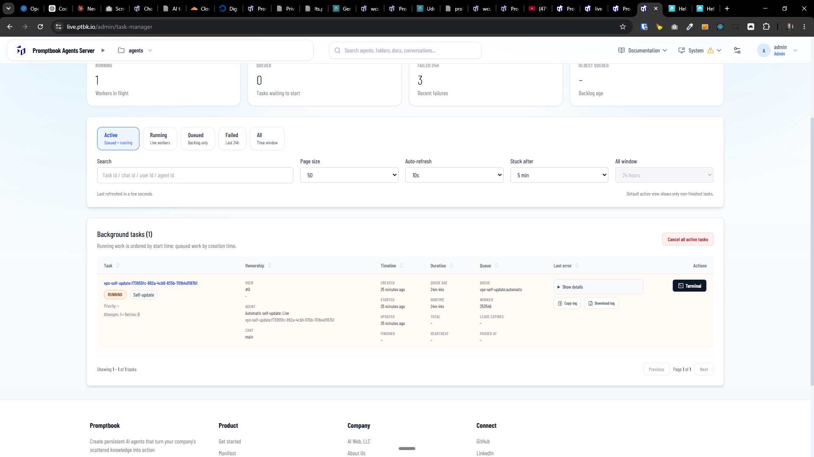
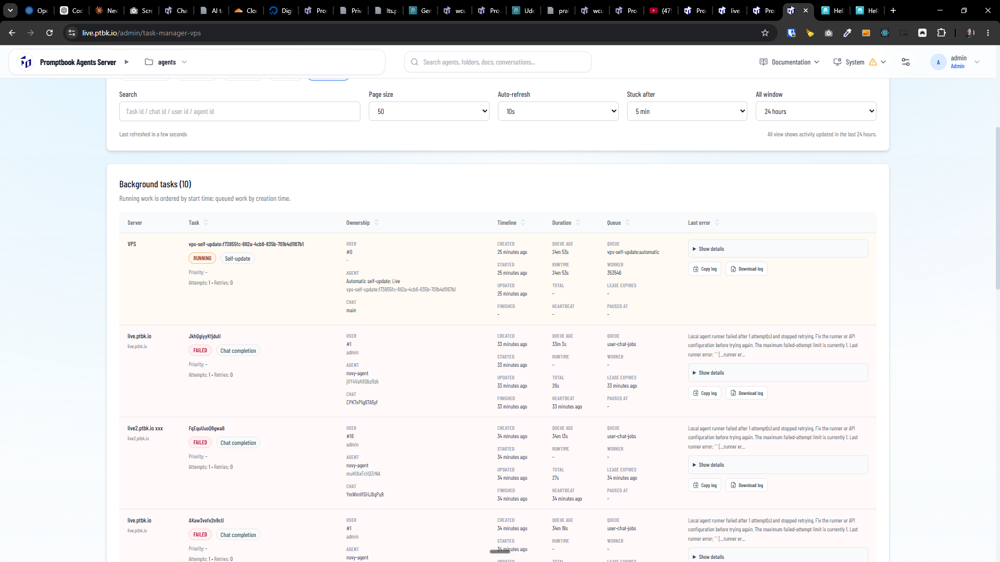

[x] by Claude Code `claude-opus-4-8` - Implementation $3.10 13 minutes; Testing 28 minutes

[✨☀️] When VPS has multiple servers, the tasks are running only for the first server and not for the other servers

-   For example when you have one VPS with servers `lts.example.com` and `lts1.example.com` and `lts2.example.com`, the chat completion tasks are running only for the first server `lts.example.com` and not for the second server `lts1.example.com`. The tasks should run for all servers on the VPS.
-   When you write a chat message to an agent on the server `lts.example.com`, then it answers correctly, but when you write a chat message to an agent on the server `lts1.example.com`, the answer and its chat completion task is pending indefinitely and never runs. The tasks should run for all servers on the VPS.
-   Keep in mind the DRY _(don't repeat yourself)_ principle.
-   Not the task manager is scoped to each server, do also a variant of the task manager which is scoped to entire VPS and shows all tasks for all servers on the VPS aviable for superadmin in superadmin dashboard.
-   Interlink theese two task managers via tabs
-   Do a proper analysis of the current functionality before you start implementing.
-   You are working with the [Agents Server](apps/agents-server)
-   Add the changes into the [changelog](changelog/_current-preversion.md)

---

[ ]

- @@@@@@@@@@@@@
-  **This server**
-  **All servers (VPS)** is not showing all the things like terminal button
- The `/admin/task-manager-vps` should be `/superadmin/task-manager`

