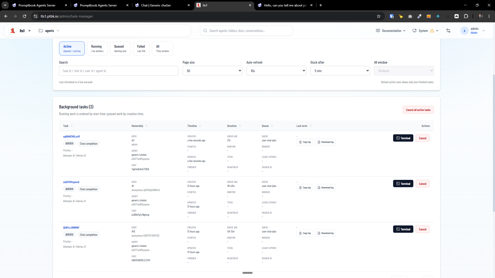
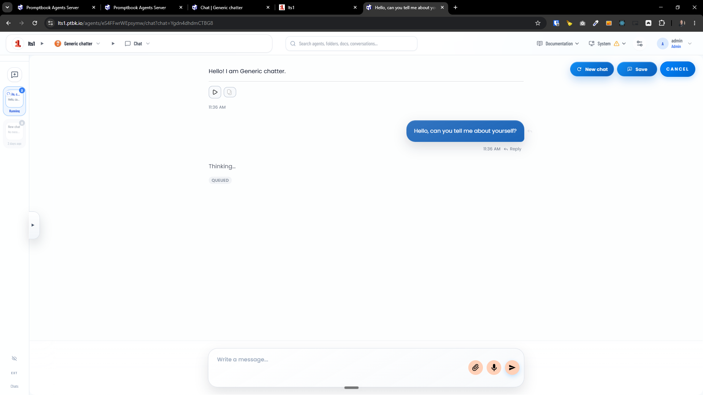

[x] by Claude Code `claude-opus-4-8` - Implementation $6.53 6 hours; Testing 28 minutes

[✨🤔] The tasks in the task manager should be linked to the corresponding page or chat. 

-   For example, the chat completion task should have a button which is linking to this chat thread in the chat history.
- To also the reverse linking from the chat history to the task manager 
- For the server update task, link to the update page. 
- This should be a universal pattern. Every task is doing something in the agent server, and every task should have a button link and also the reverse linking from the page to the task in task manager.
- Every task should have its own page, which is showing only this task. 
-   Keep in mind the DRY _(don't repeat yourself)_ principle.
-   Do a proper analysis of the current functionality before you start implementing.
-   You are working with the [Agents Server](apps/agents-server)
-   Add the changes into the [changelog](changelog/_current-preversion.md)

