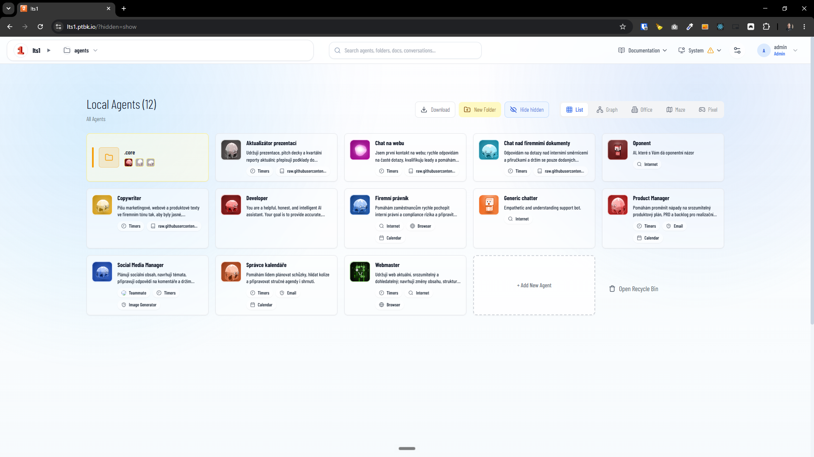
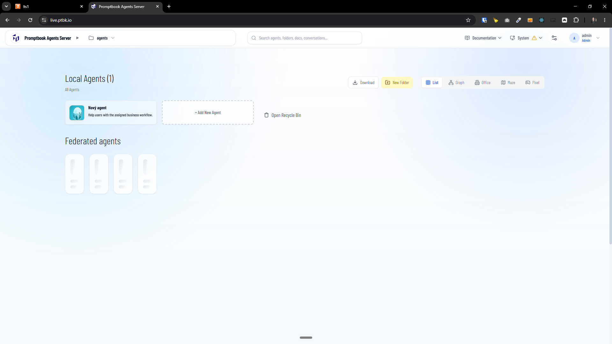

[x] by Claude Code `claude-opus-4-8` - Implementation $14.90 3 hours; Testing 28 minutes

[✨🥸] When the default agents are missing on the server, ask the admin if he wants to create them.

-   When the new server is created, there is a question if you want to install default agents. Allow doing similar things ex-post.
-   There are two types of default agents:
    -   Normal default agents, which are used for showcasing how Promptbook works and what agents are capable of.
    -   Core default agents, which are used as a base for every other agent.
-   If the core agents are missing or any of the core agents is missing, show on the home page and also in the admin panel a warning that the core agents are missing. They should be editable, and allow the user to click a single button to (re)instate them.
-   If the normal default agents are missing or any of the normal default agents is missing, show on the home page a information that the normal default agents are missing. They should be editable, and allow the user to click a single button to (re)instate them.
-   Create a new admin page which will be called Core Agents, which should keep track of whether all core agents are present, and also, for each core agent, there should be an explanation of why this core agent exists.
-   It can happen in a situation where the agents are edited when the agents are present, but they are differing from the default agents from the repository. Don't worry, this is OK. Just in the admin page for the core agents, show that there is a difference, but do not worry about this. Do not warn about this.
-   This question should be available only for the admins of the server, not for regular users.
-   Default agents are in this repository in `agents/default/` core default agents in `agents/default/.core`
-   Keep in mind the DRY _(don't repeat yourself)_ principle.
    -   We use the logic of creating the default agents when creating the server, and when creating them exposed, we also use the logic of the normal default agents and core default agents.
-   Do a proper analysis of the current functionality before you start implementing.
-   You are working with the [Agents Server](apps/agents-server)
-   Add the changes into the [changelog](changelog/_current-preversion.md)

