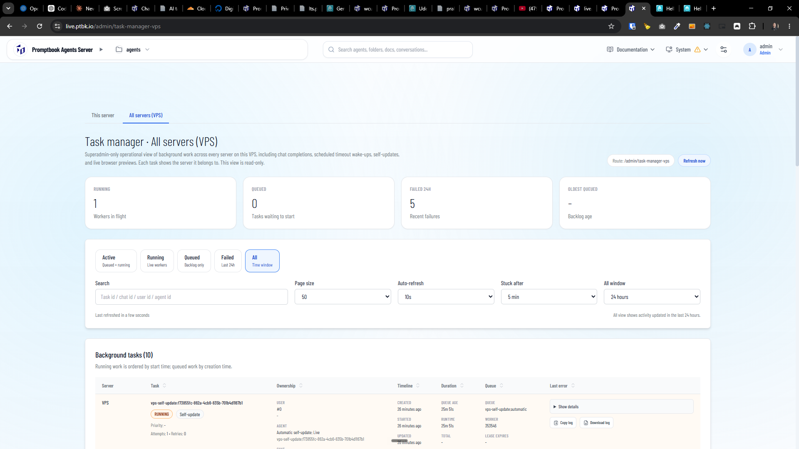
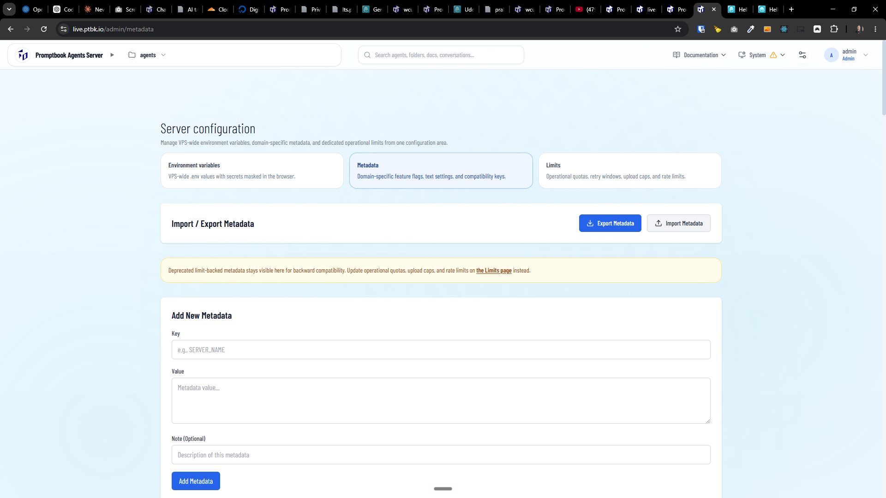

[x] by OpenAI Codex `gpt-5.6-luna` (ChatGPT account) - Implementation ~$0.5618 38 minutes; Testing 32 minutes

[✨🎾] Enhance the tab style across the agent server admin pages.

-   The tab style should be consistent and visually appealing across all admin pages in the agent server.
-   Use the visual style from the task managers
-   For example:
    -   `/admin/task-manager` has good looking tab style
    -   `/admin/metadata` has ugly looking tab style
-   Keep in mind the DRY _(don't repeat yourself)_ principle.
    -   Create some reusable component for this tab style. Do not repeat the code for the tabs on all the pages which are using the tabs.
-   Do a proper analysis of the current functionality before you start implementing.
-   You are working with the [Agents Server](apps/agents-server)

