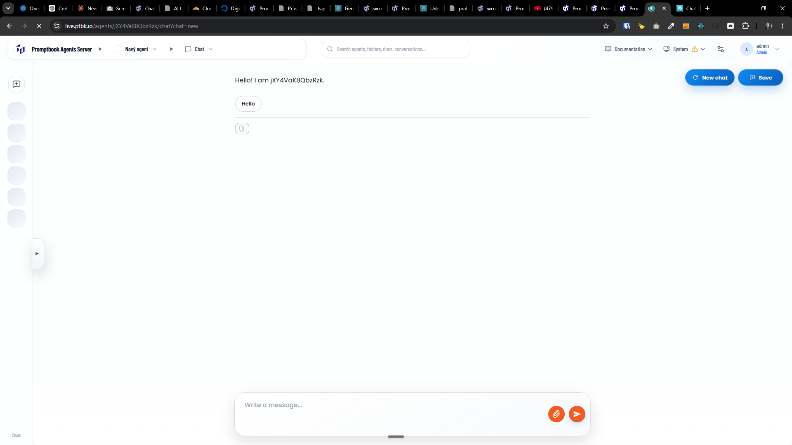

[x] (3 attempts) by OpenAI Codex `gpt-5.6-luna` (ChatGPT account) - Implementation ~$0.5755 28 minutes; Testing 18 minutes; Fixing ~$0.3699 an hour; Testing 20 minutes; Fixing ~$0.9752 an hour; Testing 34 minutes

[✨👶] When the agent chat is only partially loaded the initial message should not show the agent id

-   For example, when you are opening the chat with the agent and the agent is not fully loaded yet, it shows "Hello! I am jXY4VaK8QbzRzk"
-   It shouldnt show "Hello! I am jXY4VaK8QbzRzk" but "Hello! I am Nový agent." or skeleton loading
-   You can show the skeleton loading or the final initial message, not the temporary initial message.
-   Keep in mind the DRY _(don't repeat yourself)_ principle.
-   Do a proper analysis of the current functionality before you start implementing.
-   You are working with the [Agents Server](apps/agents-server)

