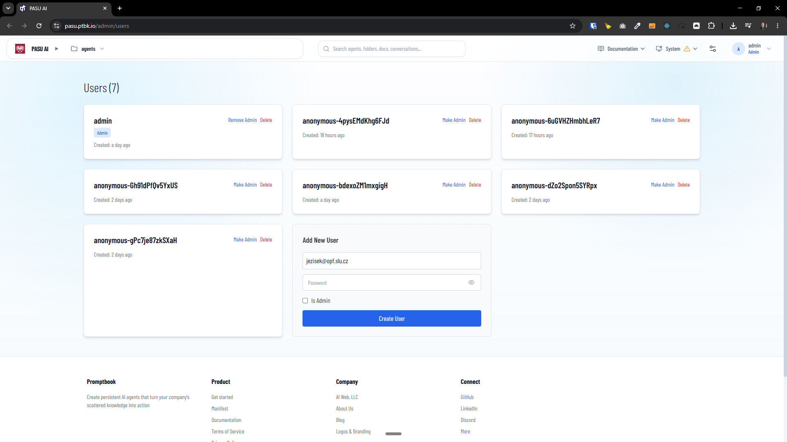
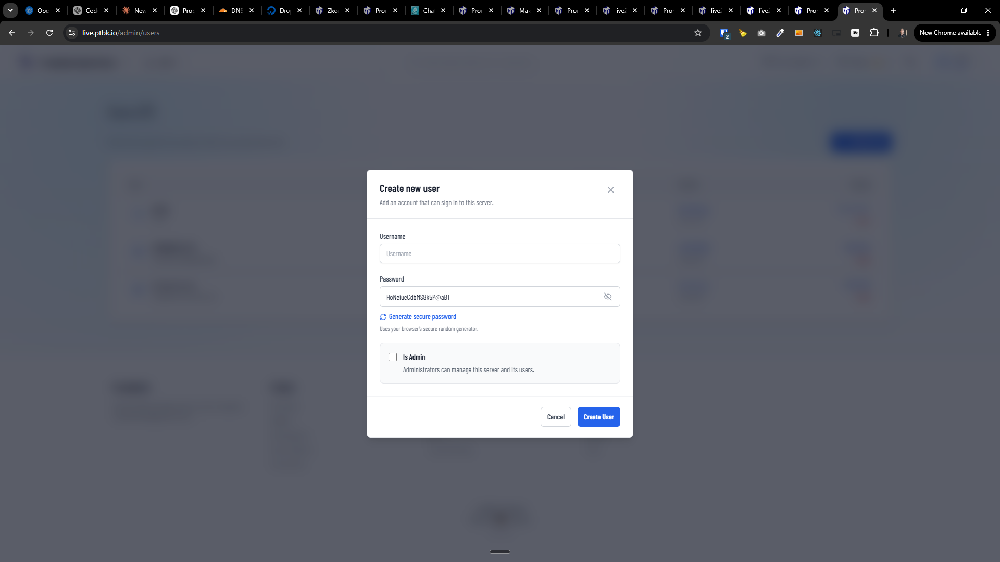

[x] (2 attempts) by OpenAI Codex `gpt-5.6-luna` (ChatGPT account) - Implementation ~$1.19 an hour; Testing 18 minutes; Fixing ~$1.63 2 hours; Testing 29 minutes

[✨😞] Enhance the admin page for managing users.

-   The admin page for managing users should be improved to provide better functionality and user experience.
-   It should show the users in a practical table, not the grid style.
    -   Get inspiration from Task Manager or servers
-   When creating a new user, the UI should be similar to creating a new server.
-   When creating a new user, there should be a built-in secure password generator.
-   Most of the users can be anonymous. Show these anonymous users in some better way and sort them lower.
-   Allow to see for each user their activity, for example, chat history. (Get inspiration from the Task Manager or Chat History. )
    -   Do the interlinking with other admin pages where it makes sense.
-   Keep in mind the DRY _(don't repeat yourself)_ principle.
-   Do a proper analysis of the current functionality before you start implementing.
-   You are working with the [Agents Server](apps/agents-server) with page `/admin/users`
-   Add the changes into the [changelog](changelog/_current-preversion.md)

---

[ ]

[✨😞] Enhance the password generator in page `/admin/users`

-   The password generator should be in its own popup and own compontent
- Allow to generate secure password with the following options:
    -   Length of the password
    -   Include uppercase letters
    -   Include lowercase letters
    -   Include numbers
    -   Include special characters
- By default it should be set up securely, for example, 16 characters, with uppercase, lowercase, numbers and special characters.
-   Keep in mind the DRY _(don't repeat yourself)_ principle.
-   Do a proper analysis of the current functionality before you start implementing.
-   You are working with the [Agents Server](apps/agents-server) with page `/admin/users`

