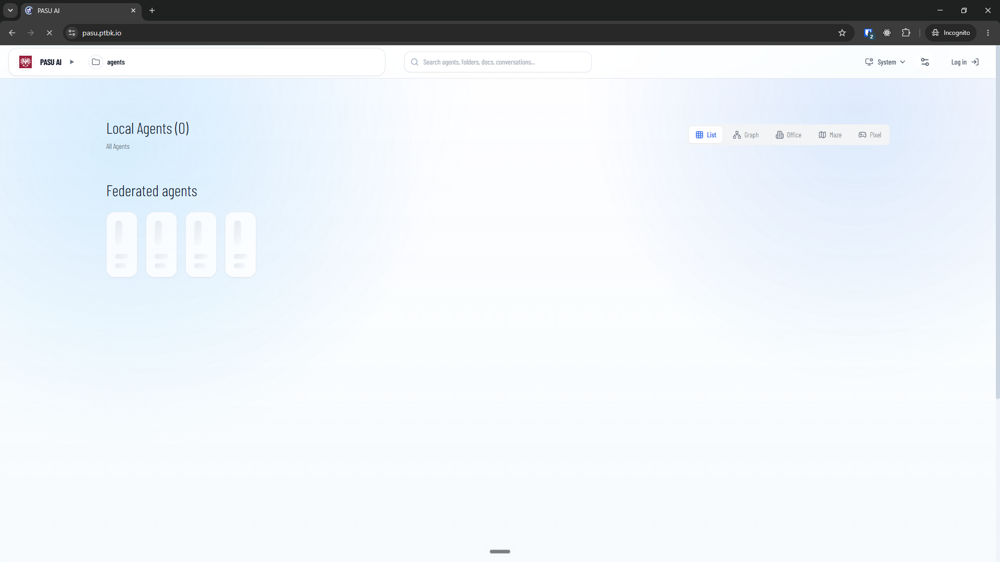
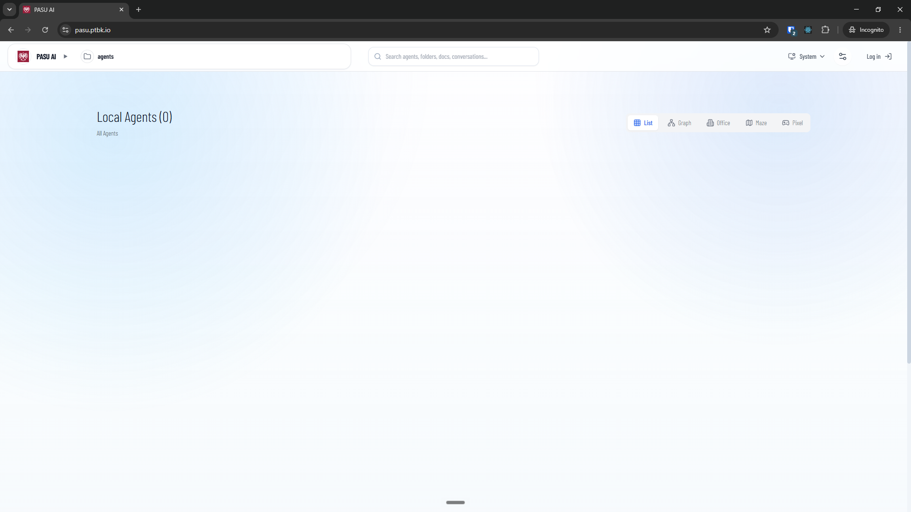

[x] by OpenAI Codex `gpt-5.6-luna` (ChatGPT account) - Implementation ~$0.4437 26 minutes; Testing 29 minutes

[✨💉] Enhance loading of the home page

-   When the home page is loading, it shortly blinks "Federated agents"
-   But when there are no federated servers and agents, it quickly disappears.
-   This is confusing for the user
-   Show nothing at first, and when the home page is fully loaded, show the "Federated agents" only if there are federated servers and agents.
-   Keep in mind the DRY _(don't repeat yourself)_ principle.
-   Do a proper analysis of the current functionality before you start implementing.
-   You are working with the [Agents Server](apps/agents-server)

