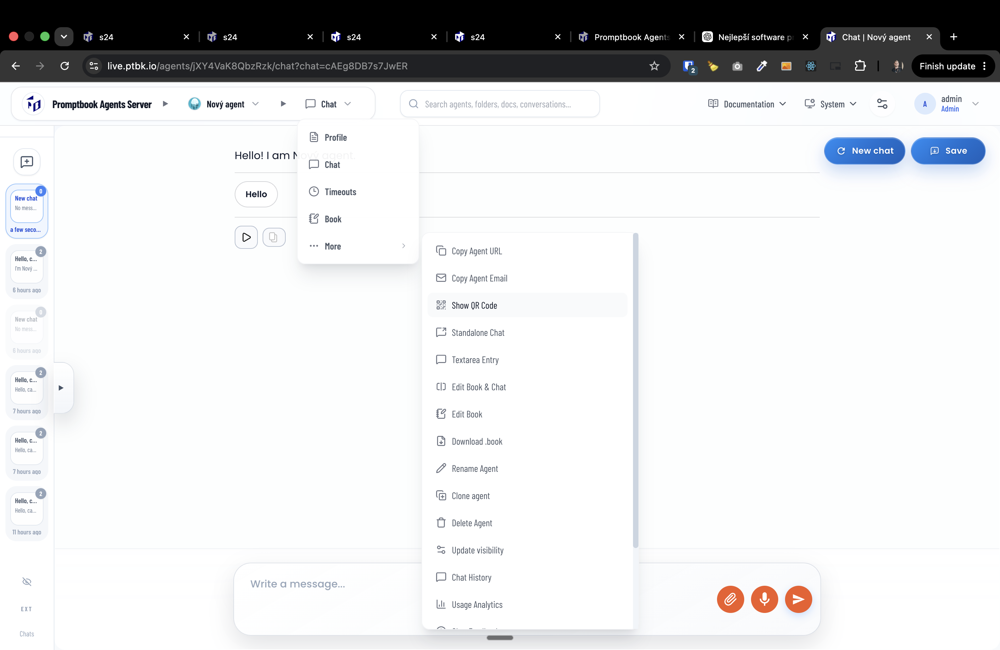
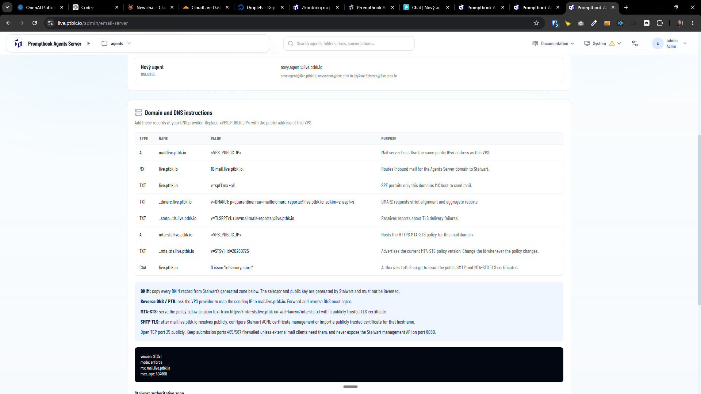

[x] by OpenAI Codex `gpt-5.6-sol` (ChatGPT account) - Implementation ~$3.96 3 hours; Testing 33 minutes

[✨☪️] Agent server should contain its own email server.

-   Use the Stalwart Mail Server
-   Email server will manage both inbound and outbound emails.
-   Every agent should have its own email address and should be able to respond to emails.
    The email of the agent should be in the format of `<agent-name>@agents-server.com` or `<agent-id>@agents-server.com` ( Both formats should work.)
-   When a user sends an email to the valid server domain but the email user (the agent) doesn't exist, it should respond by telling "Sorry, the agent you are trying to reach does not exist. Please check the email address and try again." and list all the public agents on this server.
-   Normalize the email addresses to match the agent names. For example, if the agent name is "John Doe", the email address should be "john.doe@agents-server.com" or "johndoe@a".
-   Also ignore the "+" in the email address. For example, if the agent name is "John Doe", the email address should be "john.doe@agents-server.com" or "john.doe+test@agents-server.com" or "johndoe+test@agents-server.com" should work. The same applies to all email addresses.
-   Agent replies to all participants and by the email address he was sent to. For example, if the email was sent to "john.doe+test@agents-server.com" the agent should reply to all participants and the "from" email address should be "john.doe+test@agents-server.com" and not "john.doe@agents-server.com"
-   As the name of the email "from" name should be the agent name. For example, if the agent name is "John Doe", the email "from" name should be "John Doe <john.doe@agents-server.com>"
-   When the email is received, it should create its own chat thread for this email.
-   This chat thread is available through the external chats or the chat history for the admins
    -   Similar to compatible API calls
    -   There should be some spetial flag that this chat thread is from email and not from the external chats.
    -   Also create ad-hoc user for the sender "from" of the email. This ad-hoc user should work similarly to the ad-hoc users from the anonymous browser chats. The ad-hoc user email should be normalized in a same way as the agent email addresses. Ignore the "+" in the email address and also ignore the name of the email address. For example, if the email is sent from "John Doe <john.doe+test@gmail.com>", the ad-hoc user email should be "john.doe@gmail.com".
-   Create a super admin page to manage the email server for the entire VPS.
-   Create an admin page to manage the email server for each server.
-   In the Domain and DNS instructions, add the records and instructions on how to properly configure DNS records for the emails.
-   Show instructions to con figure both the MX records and SPF, DKIM, DMARC records,... all the things needed for the email server to work properly and spam free.
-   The agents email adress should be in his context menu and the QR code
    -   
    -   There is already shown an agent's email, but this email is not doing anything. It just exists without any implementation, and the implementation you are doing now
-   Keep in mind the DRY _(don't repeat yourself)_ principle.
-   Do a proper analysis of the current functionality before you start implementing.
-   You are working with the [Agents Server](apps/agents-server)
-   Add the changes into the [changelog](changelog/_current-preversion.md)

---

[ ] !!!

[✨☪️] When showing how to configure the DNS records, show it in some standard way across the agent server.  

-    Now there are instructions how to configure the DNS records in two separate places on the agent server, shown in two different ways.
-   You can definitelly show the DNS records in both places
    -   Just reuse the same component for both places
    - Use the component from `/superadmin/servers`
-   Keep in mind the DRY _(don't repeat yourself)_ principle.
-   Do a proper analysis of the current functionality of email server and DNS records management before you start implementing.
-   You are working with the [Agents Server](apps/agents-server)  with `/admin/email-server` and  with `/superadmin/servers`

