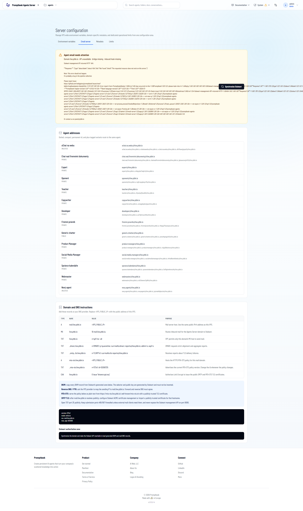

[ ] use `gpt-5.6-sol`

[✨☪️] Fix the Agents server email server.

-   Agents server has the Stalwart Mail Server
    -   Email server is managing  both inbound and outbound emails.
-  DNS records are set up properly. 
- But there is some error and the email server is not working.
-   Keep in mind the DRY _(don't repeat yourself)_ principle.
-   Do a proper analysis of the current functionality before you start implementing.
-   You are working with the [Agents Server](apps/agents-server) with `/admin/email-server`
-   Add the changes into the [changelog](changelog/_current-preversion.md)

```
Agent email needs attention
Domain live.ptbk.io · API unavailable · bridge missing · inbound hook missing

Stalwart management API returned HTTP `404`.

**Response:** `{"type":"about:blank","status":404,"title":"Not Found","detail":"The requested resource does not exist on this server."}`
```



**And when I click on "Synchronize Stalwart":**

# Application Error Report

## Human Summary

A server exception occurred while loading Promptbook Agents Server.

An error occurred in the Server Components render. The specific message is omitted in production builds to avoid leaking sensitive details. A digest property is included on this error instance which may provide additional details about the nature of the error. - the server for Promptbook Agents Server logged this failure.

## Correlation

-   Server: `Promptbook Agents Server`
-   Variant: `advanced`
-   Digest: `2815706166`
-   Next.js digest: `2815706166`
-   Reported at (UTC): `2026-07-28T17:28:16.810Z`

## Request Context

-   Page URL: `https://live.ptbk.io/admin/email-server`

## Exception

-   Name: `Error`

### Message

```text
An error occurred in the Server Components render. The specific message is omitted in production builds to avoid leaking sensitive details. A digest property is included on this error instance which may provide additional details about the nature of the error.
```

### Stack Trace

```text
Error: An error occurred in the Server Components render. The specific message is omitted in production builds to avoid leaking sensitive details. A digest property is included on this error instance which may provide additional details about the nature of the error.
```

## Raw Report Payload

```json
{
    "variant": "advanced",
    "serverName": "Promptbook Agents Server",
    "digest": "2815706166",
    "nextDigest": "2815706166",
    "errorName": "Error",
    "errorMessage": "An error occurred in the Server Components render. The specific message is omitted in production builds to avoid leaking sensitive details. A digest property is included on this error instance which may provide additional details about the nature of the error.",
    "errorStack": "Error: An error occurred in the Server Components render. The specific message is omitted in production builds to avoid leaking sensitive details. A digest property is included on this error instance which may provide additional details about the nature of the error.",
    "pageUrl": "https://live.ptbk.io/admin/email-server",
    "reportedAt": "2026-07-28T17:28:16.810Z"
}
```
