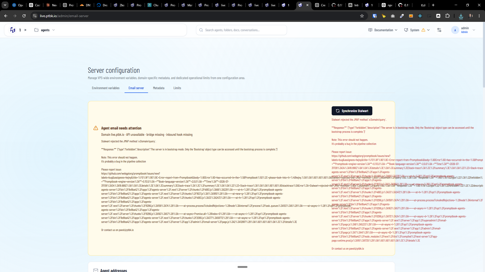

[x] Stuck in isolation / verification loop and committed manually

[✨☪️] Fix the Agents server email server.

-   Agents server has the Stalwart Mail Server
    -   Email server is managing both inbound and outbound emails.
-   DNS records are set up properly.
-   But there is some error and the email server is not working.
-   The email server (Stalwart) should be self-contained on the same VPS as the Agents server, and should not depend on any external services or configuration. It should be fully self-contained and work out of the box when the Agents server is installed on a VPS. It should not require any external configuration or services to work. The Installation script should set up the email server automatically and correctly, and it should work out of the box without any additional configuration or setup.
-   Keep in mind the DRY _(don't repeat yourself)_ principle.
-   Do a proper analysis of the current functionality before you start implementing.
-   You are working with the [Agents Server](apps/agents-server) with `/admin/email-server`, the Stalwart Mail Server and install script
-   Add the changes into the [changelog](changelog/_current-preversion.md)

**The error after pressing "Synchronize Stalwart" is:**

```json
{"type":"forbidden","description":"The server is in bootstrap mode. Only the 'Bootstrap' object type can be accessed until the bootstrap process is complete."
```


