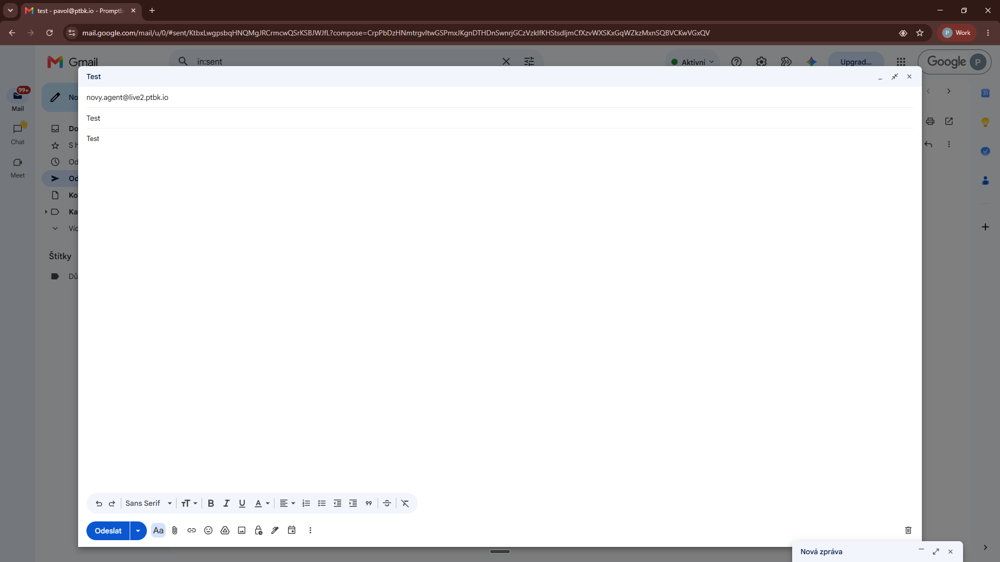
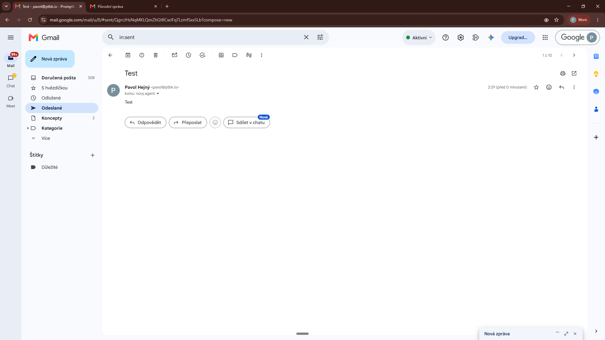
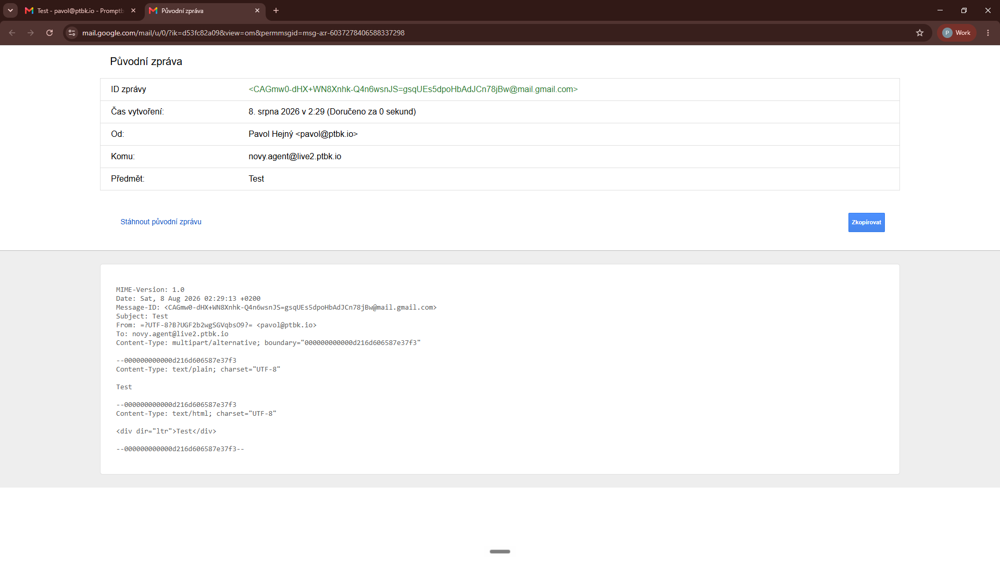
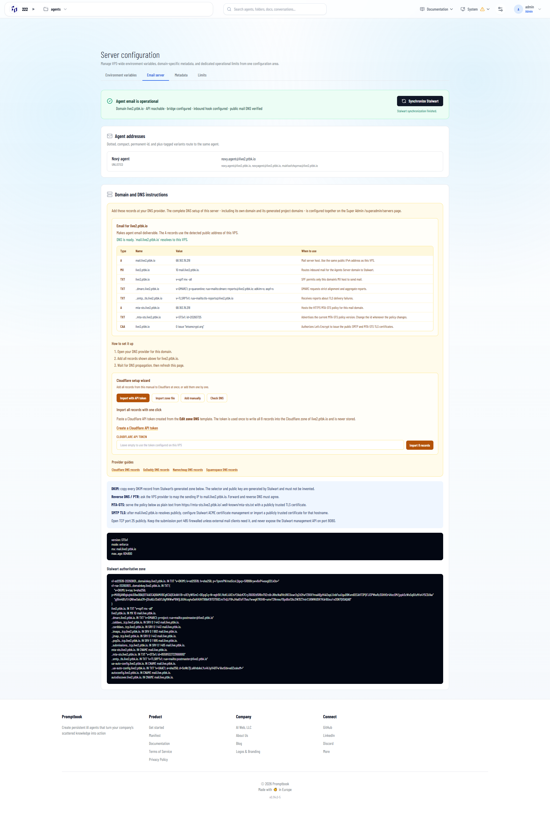
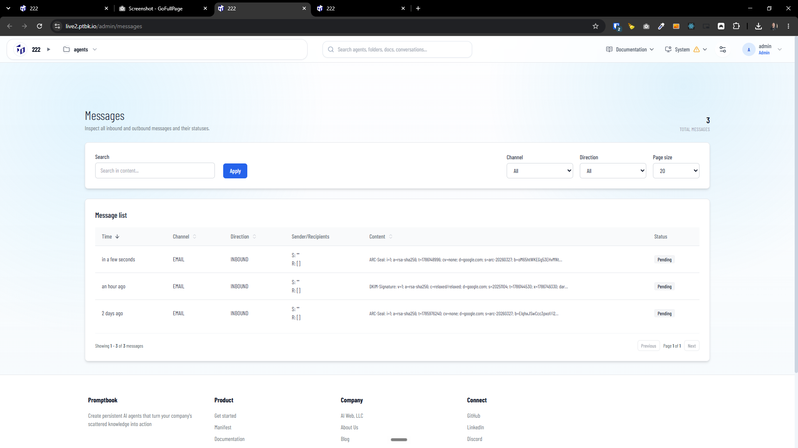
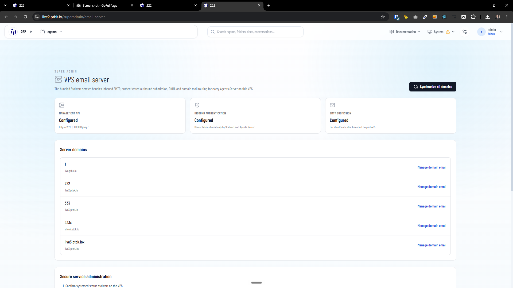

[x] by Claude Code `claude-opus-5` thinking `max` - Implementation 2.05 30 minutes; Testing 16 minutes

[✨☪️] Fix the Agents server email server.

-   It seems that the email server receives something, but the emails are garbled and nothing is processed.
    -   See the screenshots.
-   Agents server has the Stalwart Mail Server
    -   Email server is managing both inbound and outbound emails.
-   But there is some error and the email server is not working.
-   The email server (Stalwart) should be self-contained on the same VPS as the Agents server, and should not depend on any external services or configuration. It should be fully self-contained and work out of the box when the Agents server is installed on a VPS. It should not require any external configuration or services to work. The Installation script should set up the email server automatically and correctly, and it should work out of the box without any additional configuration or setup.
-   Keep in mind the DRY _(don't repeat yourself)_ principle.
-   Do a proper analysis of the current functionality before you start implementing.
-   You are working with the [Agents Server](apps/agents-server) with `/admin/email-server`, the Stalwart Mail Server and install script and the `live.ptbk.io` server
-   You can send testing emails or SSH into the server `live.ptbk.io` to analyze the problem
-   Add the changes into the [changelog](changelog/_current-preversion.md)

**The error when i try to send email:**

