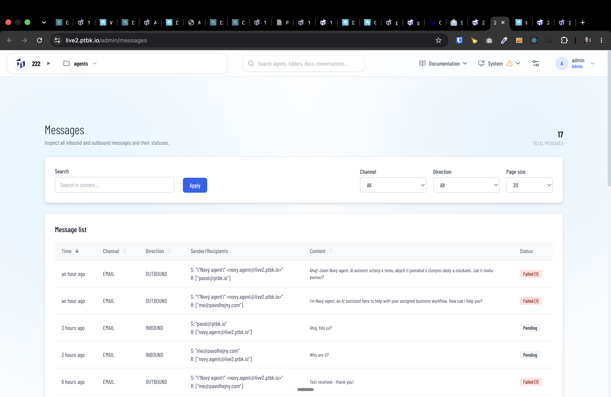
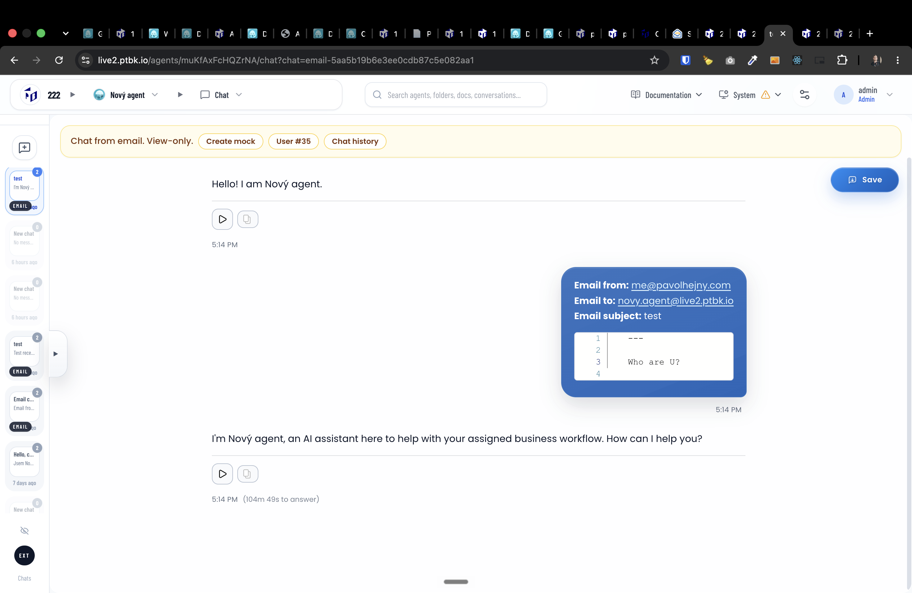

[ ]

[✨☪️] Fix the outbound emails and enhance messages dashboard.

-   The outbound emails are failed.
-   But there is no information about what the fail is, the error message, or any other useful information. Fix it and also add there the complete log about the error.
-   Also, when showing sender/recipients, format it in some better way.
-   For some reason, the inbound emails are successfully received and being processed, but they are still being shown as pending.
-   Keep in mind the DRY _(don't repeat yourself)_ principle.
-   Do a proper analysis of the current functionality before you start implementing.
-   You are working with the [Agents Server](apps/agents-server) with `/admin/messages` and the Stalwart Mail Server
-   You can send testing emails or SSH into the server `live.ptbk.io` to analyze the problem
-   Add the changes into the [changelog](changelog/_current-preversion.md)

