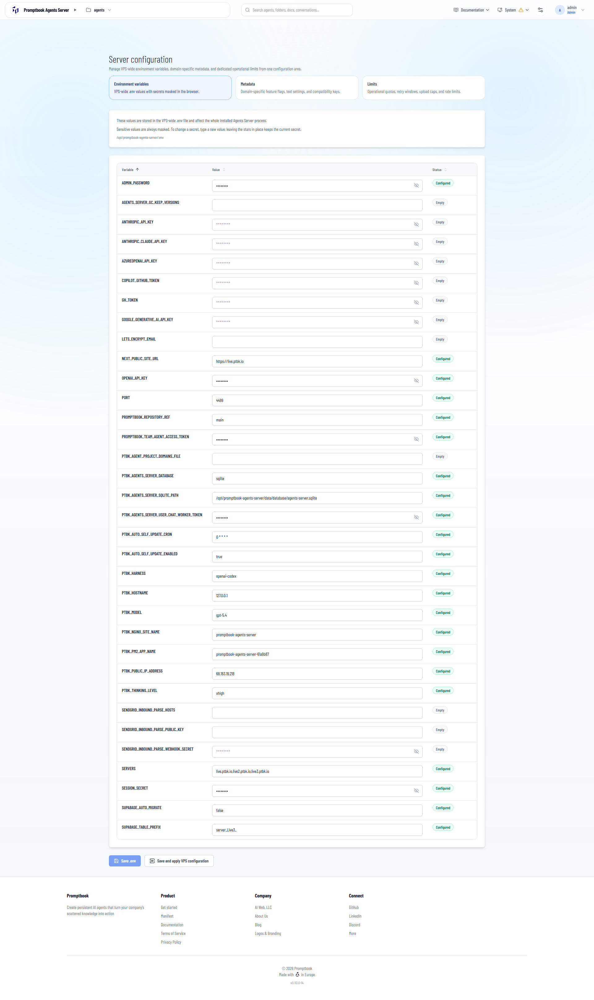

[ ] !

[✨𓀇] When editing the environment variables, allow adding arbitrary environment variables. 

- For example, when I want to add environment variable `FOO` ( Which is not used by the agent server), allow the super admin to do it. 
- There should also be shown all the variables which are used in the agent server. 
    - For example `ELEVENLABS_API_KEY` is used in the agent server, but it is not there
- Editing the environment variables as available only for super admins. 
-   Keep in mind the DRY _(don't repeat yourself)_ principle.
-   Do a proper analysis of the current functionality before you start implementing.
-   You are working with the [Agents Server](apps/agents-server) with `/superadmin/environment`
-   Add the changes into the [changelog](changelog/_current-preversion.md)

