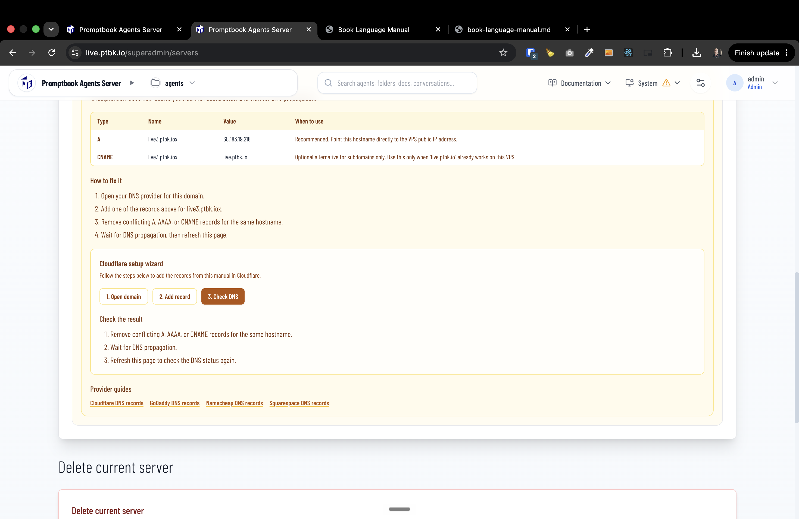

[x] by OpenAI Codex `gpt-5.6-terra` (ChatGPT account) - Implementation ~$0.6760 24 minutes; Testing 9 minutes

[✨⛈] When showing the manual how to configure DNS records, add there some wizard for Cloudflare. 

-   Keep in mind the DRY _(don't repeat yourself)_ principle.
-   Do a proper analysis of the current functionality before you start implementing.
-   You are working with the [Agents Server](apps/agents-server)
-   Add the changes into the [changelog](changelog/_current-preversion.md)

---

[ ]

[✨⛈] When showing the manual how to configure DNS records, add there some wizard for Cloudflare. 

- The purpose of the wizard is to not force the user to do the setup of each DNS record one at a time, but to do it via some batch export-import or some smart connection to Cloudflare. 
-   Keep in mind the DRY _(don't repeat yourself)_ principle.
-   Do a proper analysis of the current functionality before you start implementing.
-   You are working with the [Agents Server](apps/agents-server)
-   Add the changes into the [changelog](changelog/_current-preversion.md)

