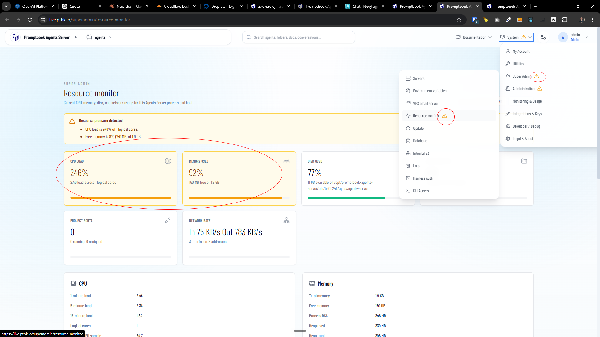
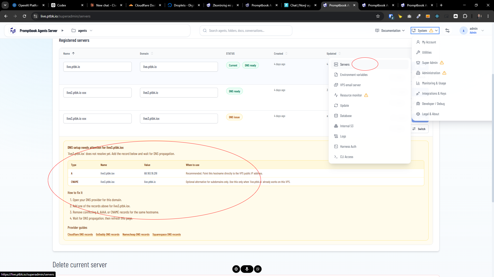
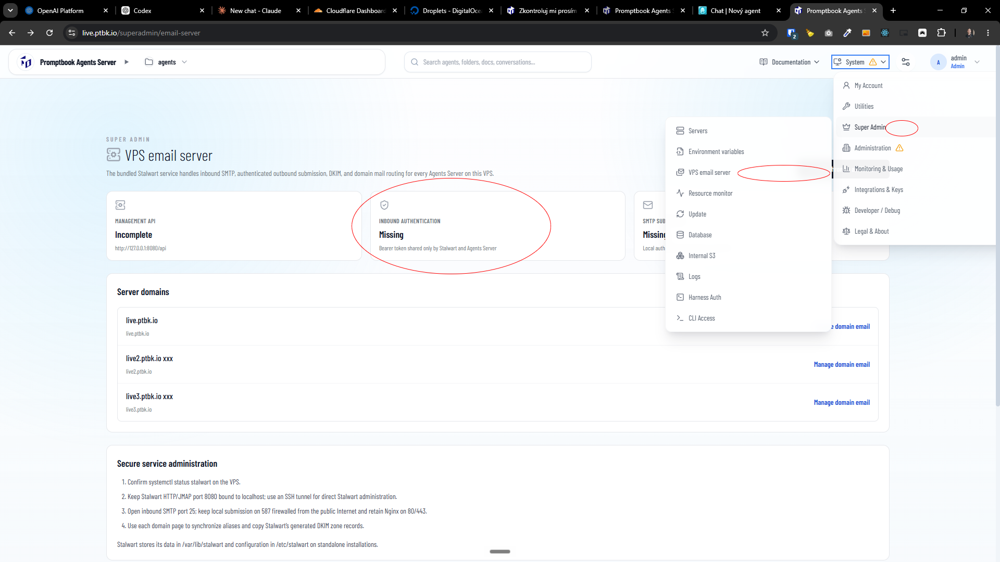
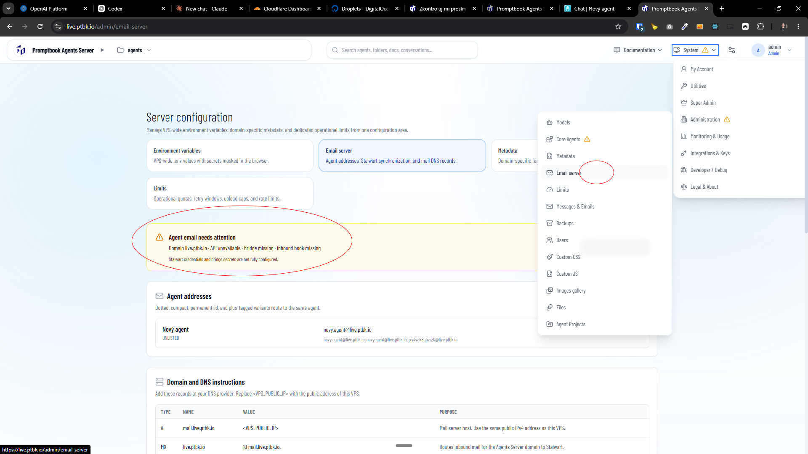

[x] by OpenAI Codex `gpt-5.6-terra` (ChatGPT account) - Implementation ~$1.78 32 minutes; Testing 9 minutes

[✨⭕️] When there is a warning on some admin or super admin page, this warning should be shown also as an exclamation mark alongside the menu item. 

-   It should be a universal pattern which is already present on some pages, for example on resource monitor or core agents, but on some pages, for example DNS records on servers, not 
-  The warning should be shown only for the admins and super admins, not for normal users.
-   Keep in mind the DRY _(don't repeat yourself)_ principle.
-   Do a proper analysis of the current functionality before you start implementing.
-   You are working with the [Agents Server](apps/agents-server)
-   Add the changes into the [changelog](changelog/_current-preversion.md)

