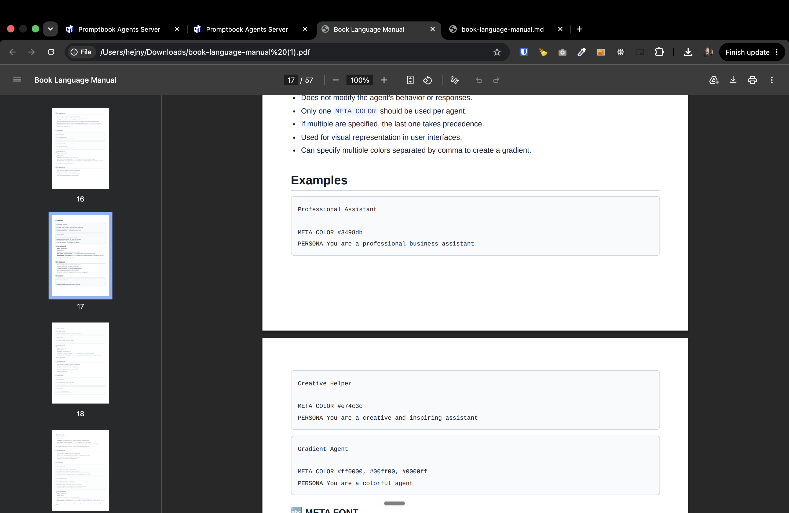

[x] by OpenAI Codex `gpt-5.6-terra` (ChatGPT account) - Implementation ~$1.43 an hour; Testing 9 minutes

[✨🚵] Improve the Book language manual

-   Now the book language manual is very generic, It is generated for every server the same, despite the agents on the server and use commitments.
-   Customize the book language manual for the server, so it is generated with the agents on the server and their use commitments.
-   When you show examples, show the examples with the agents on the server and their use commitments.
-   Prioritize the commitments which are actually used by the agents on the server, and show them first in the manual.
-   There should be just one button which will There should be just one button which will say "download manual".
    -On the right side of this button should be a small arrow, which will open more options like: - Format of the export - PDF/markdown - Language - Which agents should be baked into this manual - By default, it should export to PDF, current language of the user, and all agents should be baked into this manual. - When you unselect all the agents here, the exported manual will be effectively exactly the same for every server (excluding metadata like date of export)
-   Downloading to PDF is a little bit broken. It somehow works, but the PDF looks awful.
-   Keep in mind the DRY _(don't repeat yourself)_ principle.
-   Do a proper analysis of the current functionality before you start implementing.
-   You are working with the [Agents Server](apps/agents-server) with the Book language documentation

**Current situation:**


[The generated Book language documentation](https://pasu.ptbk.io/api/docs/book-language.md)

---

[x] by Claude Code `claude-opus-5` thinking `max` - Implementation $9.12 7 hours; Testing 29 minutes

[✨🚵] Improve the Book language manual

-   When I choose that I want manual in Czech language. It is in English. Fix it.
-   Remove the "Execution and compilation model" section
-   Do not put deprecated commitments into the book language manual, like`TEMPLATE` commitment shouldn't be there at all.
-   Low level commitments like `MODEL` should be at the end of the manual, and should be in a separate section called "Low level commitments"
-   Also put there a checkbox whether the user wants to put there low-level commitments. This checkbox should be by default off.
-   Put some Promptbook branding into the PDF manual
-   Syntax highlight the book language in the PDF manual, use BookEditor component for this
-   Better page wrappings in PDF export - 
-   Keep in mind the DRY _(don't repeat yourself)_ principle.
-   Do a proper analysis of the current functionality before you start implementing.
-   You are working with the [Agents Server](apps/agents-server) with the Book language documentation

---

[ ]

[✨🚵] Improve the Book language manual

-   The `@Foo` and `{Foo foo}` notation is not parameter notation but referencing another agent
-   Primitives and constructs reference
    -   "Horizontal separator" -> Rename to "Multiple agent"
    -   "Code fences: - add "```"
    -   The `@Foo` and `{Foo foo}` notation is not parameter notation but referencing another agent
-   Do not list "Commitment keywords currently recognized" instead create linked table of contents
-   Do not expose the internal implementations of the commitments
    -   Do not expose unimplemented commitments - "Implemented commitments" / "Placeholder commitments" shouldt be there at all
    -   "Commitment groups" doesn't make sense, do just "Number of commitments"
-   Enhance the contents of each commitment:

**For example do not this:**

```
⚖️ RULE
Status: Implemented
Aliases: RULES
Semantics: Add behavioral rules the agent must follow.
Type schema ( createTypeRegex ): /^\s*(?<type>RULE)\b/gim
Block schema ( createRegex ): /^\s*(?<type>RULE)\b\s+(?<contents>.+)$/gim
Used in selected agents: 42 occurrences
Adds behavioral constraints and guidelines that the agent must follow.
Key aspects
All rules are treated equally regardless of singular/plural form.
Rules define what the agent must or must not do.
Examples
Customer Support Agent
PERSONA You are a helpful customer support representative
RULE Always ask for clarification if the user's request is ambiguous
RULE Be polite and professional in all interactions
RULES Never provide medical or legal advice
WRITING RULES Maintain a friendly and helpful tone
Educational Tutor
PERSONA You are a patient and knowledgeable tutor
RULE Break down complex concepts into simple steps
RULE Always encourage students and celebrate their progress
RULE If you don't know something, admit it and suggest resources
WRITING SAMPLE Let's work through this step by step, and we will keep it simple all the way
through.
```

**But instead this:**

-   Do not expose internals like "Status: Implemented" or how the parsing works
-   Just one description
-   In examples do not show other commitments, except `GOAL` and `CLOSED`
-   In examples do not use aliases

```
⚖️ RULE
Aliases: RULES

Adds behavioral constraints and guidelines that the agent must follow.
Key aspects
All rules are treated equally regardless of singular/plural form.
Rules define what the agent must or must not do.
Examples
Customer Support Agent
GOAL Provide accurate and helpful information to customers
RULE Always ask for clarification if the user's request is ambiguous
RULE Be polite and professional in all interactions
CLOSED
```

**For example do not this:**

```
📝 NOTE
Status: Implemented
Aliases: NOTES , COMMENT , NONCE , TODO
Semantics: Add developer-facing notes without changing behavior or output.
Type schema ( createTypeRegex ): /^\s*(?<type>NOTE)\b/gim
Block schema ( createRegex ): /^\s*(?<type>NOTE)\b\s+(?<contents>.+)$/gim
Used in selected agents: 27 occurrences
Adds comments for documentation without changing agent behavior.
Key aspects
Does not modify the agent's behavior or responses.
Multiple NOTE , NOTES , COMMENT , and NONCE commitments are aggregated for debugging.
All four terms work identically and can be used interchangeably.
Useful for documenting design decisions and reminders.
Content is preserved in metadata for inspection.
Examples
Customer Support Bot
NOTE This agent was designed for customer support scenarios
COMMENT Remember to update the knowledge base monthly
PERSONA You are a helpful customer support representative
KNOWLEDGE Company policies and procedures
RULE Always be polite and professional
Research Assistant
NONCE Performance optimized for quick response times
NOTE Uses RAG for accessing latest research papers
PERSONA You are a knowledgeable research assistant
ACTION Can help with literature reviews and citations
WRITING RULES Present information in academic format
```

**But instead this:**

```
📝 NOTE
Aliases: NOTES , COMMENT , NONCE , TODO
Adds comments for documentation without changing agent behavior.
Key aspects
Does not modify the agent's behavior or responses.
Multiple NOTE , NOTES , COMMENT , and NONCE commitments are aggregated for debugging.
All four terms work identically and can be used interchangeably.
Useful for documenting design decisions and reminders.
Content is preserved in metadata for inspection.
Examples
Customer Support Bot
NOTE This agent was designed for customer support scenarios
NOTE Remember to update the knowledge base monthly
CLOSED
```

etc.

-   In "End-to-end examples" link "Commitments used" to each of the commitment sections in the manual, so the user can click on it and go to that section in the manual.
-   Link items in "Generated from:" to this Promptbook repository
-   Keep in mind the DRY _(don't repeat yourself)_ principle.
-   Do a proper analysis of the current functionality before you start implementing.
-   You are working with the [Agents Server](apps/agents-server) with the Book language documentation
