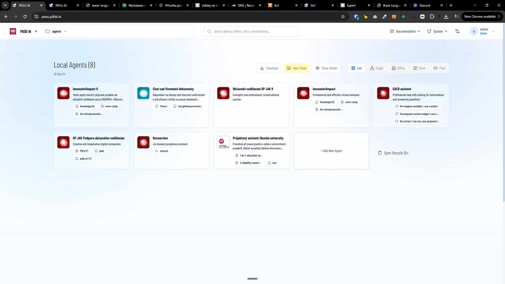
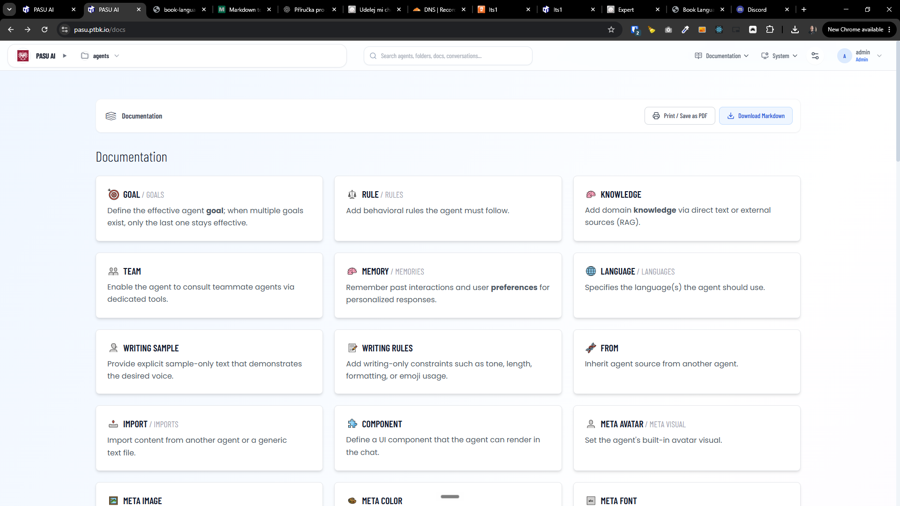
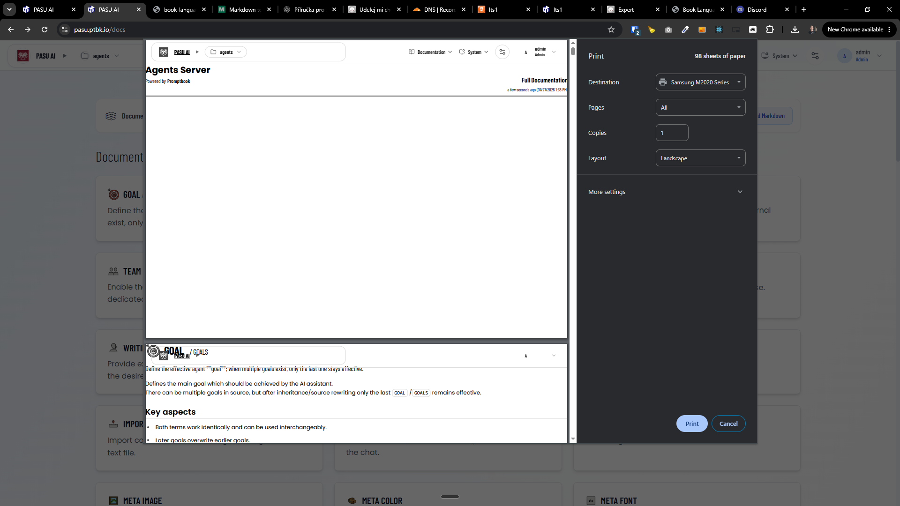

[x] by OpenAI Codex `gpt-5.6-terra` (ChatGPT account) - Implementation ~$1.43 an hour; Testing 9 minutes

[✨🚵] Improve the Book language manual

- Now the book language manual is very generic, It is generated for every server the same, despite the agents on the server and use commitments. 
- Customize the book language manual for the server, so it is generated with the agents on the server and their use commitments.
- When you show examples, show the examples with the agents on the server and their use commitments.
- Prioritize the commitments which are actually used by the agents on the server, and show them first in the manual.
- There should be just one button which will There should be just one button which will say "download manual".
-On the right side of this button should be a small arrow, which will open more options like:
    - Format of the export - PDF/markdown
    - Language
    - Which agents should be baked into this manual 
    - By default, it should export to PDF, current language of the user, and all agents should be baked into this manual.
    - When you unselect all the agents here, the exported manual will be effectively exactly the same for every server (excluding metadata like date of export)
-   Downloading to PDF is a little bit broken. It somehow works, but the PDF looks awful. 
-   Keep in mind the DRY _(don't repeat yourself)_ principle.
-   Do a proper analysis of the current functionality before you start implementing.
-   You are working with the [Agents Server](apps/agents-server) with the Book language documentation

**Current situation:**

[The generated Book language documentation](https://pasu.ptbk.io/api/docs/book-language.md)

