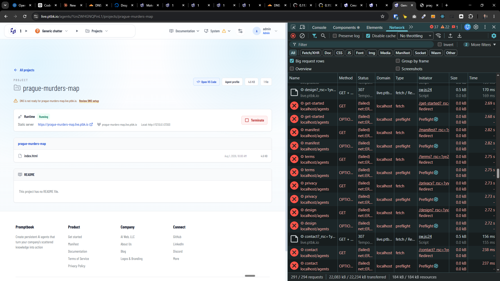
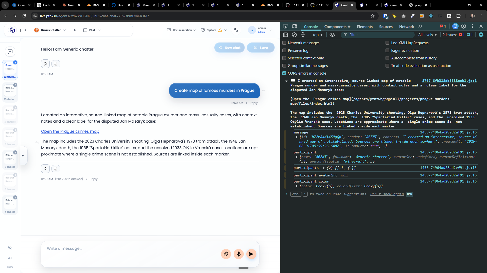

[x] by OpenAI Codex `gpt-5.6-terra` (ChatGPT account) - Implementation ~$0.8645 33 minutes; Testing 9 minutes

---

[x] by OpenAI Codex `gpt-5.6-luna` thinking `max` (ChatGPT account) - Implementation ~$1.20 37 minutes; Testing 36 minutes

[✨🥖] When the agent references the project, show it as a nice looking standardized chip

-   When the user clicks on this chip, it should show two options:
    -   Open the project in a new tab
    -   Open the project page in a new tab
-   It should also show the status whether the project is running or not.
-   Do not lint the internal prokect file like `/agents/yznzwhgnqpinl1/projects/prague-murders-map/files/index.html` but project URL like `https://prague-murders-map.live.ptbk.io/`
-   Keep in mind the DRY _(don't repeat yourself)_ principle.
-   Do a proper analysis of the current functionality before you start implementing.
-   You are working with the [Agents Server](apps/agents-server) with chat
-   Add the changes into the [changelog](changelog/_current-preversion.md)

