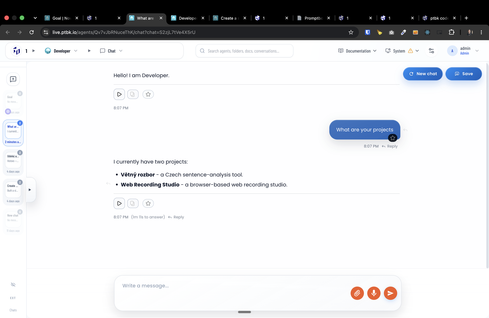
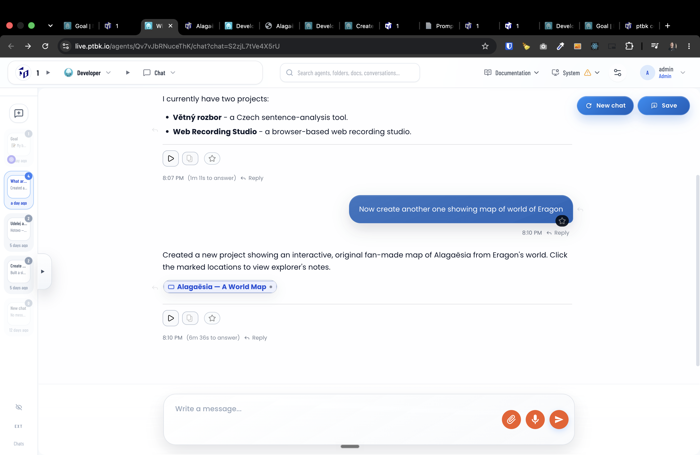
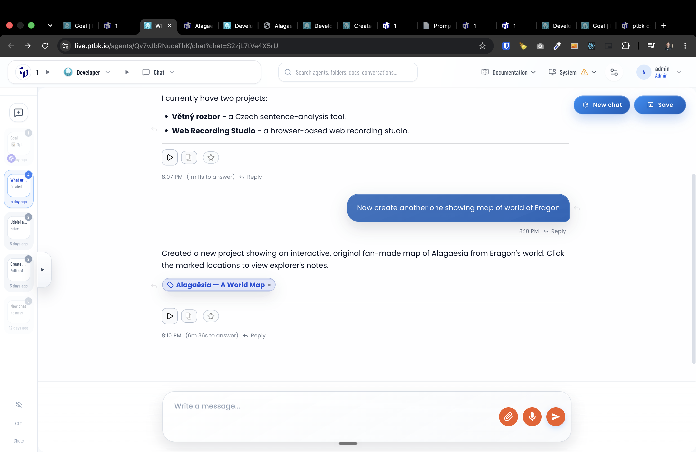
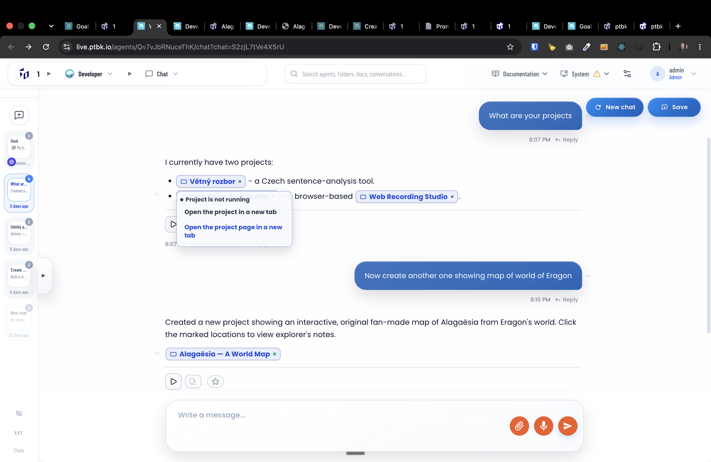

[x] by OpenAI Codex `gpt-5.6-terra` (ChatGPT account) - Implementation ~$0.8645 33 minutes; Testing 9 minutes
[x] by OpenAI Codex `gpt-5.6-luna` thinking `max` (ChatGPT account) - Implementation ~$1.20 37 minutes; Testing 36 minutes

---

[x] by Claude Code `claude-opus-5` thinking `max` - Implementation $4.23 5 hours; Testing 19 minutes

[✨🥖] When the agent references the project, show it as a nice looking standardized chip

-   When the user clicks on this chip, it should show two options:
    -   Open the project in a new tab
    -   Open the project page in a new tab
-   Also when agent references the project, it should show the project name and not the project URL. For example, instead of showing `https://prague-murders-map.live.ptbk.io/` it should show `Prague Murders Map` in a nice looking chip.
-   It should also show the status whether the project is running or not.
-   Do not lint the internal prokect file like `/agents/yznzwhgnqpinl1/projects/prague-murders-map/files/index.html` but project URL like `https://prague-murders-map.live.ptbk.io/`
-   Keep in mind the DRY _(don't repeat yourself)_ principle.
-   Do a proper analysis of the current functionality before you start implementing.
-   You are working with the [Agents Server](apps/agents-server) with chat
-   Add the changes into the [changelog](changelog/_current-preversion.md)

---

[x] by OpenAI Codex `gpt-5.6-terra` thinking `max` (ChatGPT account) - Implementation ~.29 an hour; Testing 24 minutes

[✨🥖] When the agent references the project, show it as a nice looking standardized chip

-   When the user clicks on this chip, it should show two options:
    -   Open the project in a new tab
    -   Open the project page in a new tab
-   Now this should theoretically work, but the icon on a chip is not showing up, and the chip does nothing, Icon is just rotating like it should open something, but nothing is shown.
-   Also, when the agent is referencing some of his older projects, the chip is not shown at
-   Also when agent references the project, it should show the project name and not the project URL. For example, instead of showing `https://prague-murders-map.live.ptbk.io/` it should show `Prague Murders Map` in a nice looking chip.
-   It should also show the status whether the project is running or not.
-   Do not lint the internal prokect file like `/agents/yznzwhgnqpinl1/projects/prague-murders-map/files/index.html` but project URL like `https://prague-murders-map.live.ptbk.io/`
-   Keep in mind the DRY _(don't repeat yourself)_ principle.
-   Do a proper analysis of the current functionality before you start implementing.
-   You are working with the [Agents Server](apps/agents-server) with chat
-   Add the changes into the [changelog](changelog/_current-preversion.md)

---

[ ]

[✨🥖] Allow to start/stop projects from the chip

-   When the user clicks on this chip, it should show two options:
    -   Open the project in a new tab
    -   Open the project page in a new tab
-   The icons are broken now. It shows empty, probably broken, or you can go see the screenshots.
-   There should be the favicon of the project or the temporary icon of the project there.
-   When the chip menu is opened, there should be a red or green dot whether the project is running.
-   There should be an option to start or stop the project directly from this chip menu.
-   Also, always allow opening the project when the project is not running. Automatically run it when user opens the project in a new tab.
-   Do a proper analysis of the current functionality before you start implementing.
-   You are working with the [Agents Server](apps/agents-server) with chat
-   Add the changes into the [changelog](changelog/_current-preversion.md)

